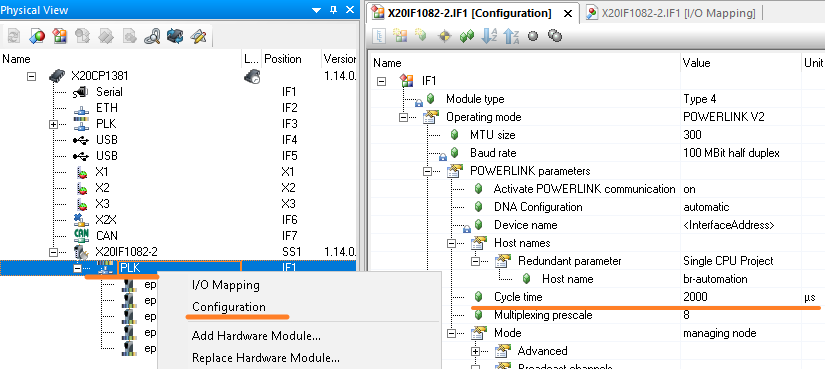
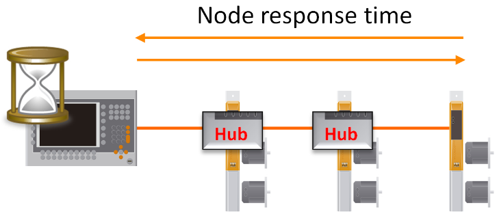

[TOC]
```toc
```

# 常见参数 - 同步段

## POWERLINK在 Automation Studio中的循环周期
- 
### AS参数配置
- 


## Response Timeout
- Poll 响应超时参数（CN从站参数）
- Poll response 超时参数，当一个站点使用PReq帧进行轮询时，它需要一定的时间才能使用PRes帧进行响应。
- 此Poll response timeout 定义了时间的最大值（μs），也就是 MN将等待一个被轮询从站的PRes帧的时间。
- 必须考虑网络拓扑，电缆延迟和Hub层级的关系。
- 下图可见此参数在一个POWERLINK通信中所处的位置。
- 
- 需要注意，如果Hub层级比较多，需要注意Hub的影响
- 每过一次Hub都增加一个过Hub的时间，以贝加莱的驱动器为例，过一次驱动器的PLK Hub需要消耗0.96μs。
- 下图中，主站与末端的CN从站通信，则需要过两个Hub来回各两次，需要多消耗0.96μs * 4 = 3.84μs。
- 
- 若使用第三方交换机，过一次交换机的延迟时间可能为3μs，则一个Line型，10个从站的PLK网络，主站与末端的CN从站通信，则需要过9个Hub来回各两次，需要多消耗3μs * 18 = 54μs，远超过默认的25μs.

### AS参数配置
- 


## Loss of SoC tolerance
- MN 参数
- CN监控由MN发送的SoC帧的精度。如果SoC未在规定的容忍范围内接收到，则视为丢失。
- 因此，应该根据MN的性能来设置“Loss of SoC tolerance”参数。
- 如果通信质量较差，过滑环，有随机干扰，可以考虑增加此参数，将默认的2，改为更大的数值。
- 运动控制中，如果通信质量较差，可能会报出6002报警，将此参数调大能规避。
### AS参数配置


# 常见参数 - 异步段
## Asynchronous timeout
- MN主站参数
- 异步超时参数 当一个站收到来自MN的发送异步数据的许可时，在发送SoA和接收来自各自站的ASnd之间存在一定的延 迟。
- 此 Asynchronous Timeout 参数定义了最大时间（μs） 也就是发送SoA后，MN将等待接收帧的时间，类似于 PRes超时(Poll Response Timeout)。
- ⚠️此参数的设置取决于网络拓扑结构（长线缆和集线器/交换机会增加延迟，此参数需要增大）。
- 
### AS参数配置
- 

## Asynchronous MTU size
- 主站参数
- 异步MTU48 大小定义了POWERLINK异步阶段的以太网帧允许的最大负载（以字节为单位）。
- 如果要以短周期时间运行网络，则此参数不能设置得过高。
- 最低的设置是300字节（默认参数即是300字节）。
- 另一方面，如果对于特定的应用程序，更大的异步吞吐量更重要，那么应该将参数设置得更高
- 
- 仅调整参数，通过Hardware Configuration Analyzer得到的理论循环时间也会变大
- 

### AS参数配置
- 

## 多异步发送 Asynchronous Slots per cycle
- 为了增加异步阶段的数据吞吐量，可以在一个周期中发送多个异步帧。每个CN仍然必须被MN邀请，但是这必须使用不同类型的帧来完成 - 异步邀请（AInv）。
- MN不使用AInv帧来邀请自己，而是在“扩 展”异步阶段直接发送异步数据。
- 
- 当目标是优化POWERLINK网络上非实时数据的吞吐量时，将使用多个异步发送。 例如，在传输需要大量带宽的图像数据时，就使用了这种优化。

### AS参数配置
- 

# 案例分享
## 拓扑结构复杂，需要更新硬件固件
- 贝加莱硬件模块的固件更新是通过异步段通信，若异步段设置的过小，很有可能难以更新成功
- Response Timeout 调整为 250 μs
- Asynchronous timeout 调整为250 μs
- MTU Size 调整为 1500 （酌情调整）
## Line型网络，从站数量多，使用的不是贝加莱HUB
- 从站响应可能花的时间会长
- Response Timeout 调整为 250 μs
- Asynchronous timeout 调整为250 μs
## 现场PLK通信过滑环，网线质量不好，偶发丢包
- Loss of SoC tolerance设置为Manual，数量调整为10
## 需要通过PLK网络传图片与视频，使用X20HB8815、相机
- MTU Size 调整为 1500
- Asynchronous timeout 调整为250 μs
- Asynchronous Slots per cycle 调整为7