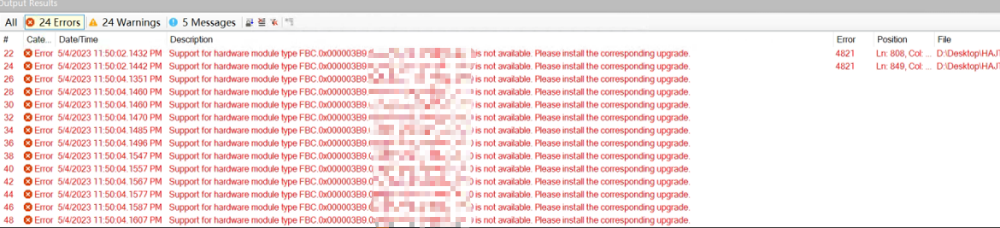
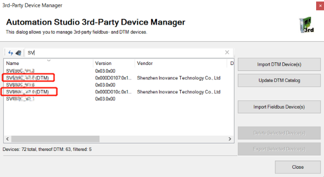

# 现象
- 自己电脑的工程拷贝到其他人电脑后报 EDS 文件缺失，删除并重新导入后还是一样

|版本信息|自己电脑配置|他人电脑配置|
|:-----|:-----|:-----|
|电脑系统|win10|win11|
|AS版本|4.7.7.74|4.7.2.98|
|AR版本|E4.73|E4.73|

报错号：4821
# 解决方式
- 升级 AS 到相同版本
- 删除工程中该伺服 DTM 相关设备
- 重新导入 Fieldbus EDS 后即解决该问题
- 

