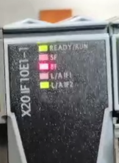
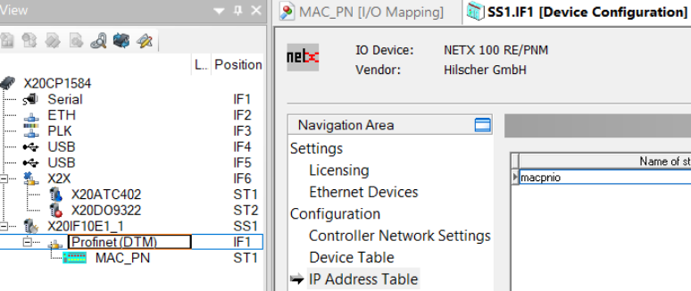
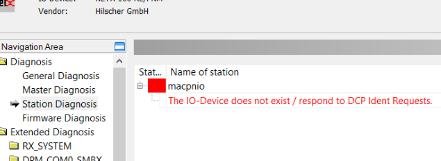

# 现象

PROFINET 通讯，找不到从站，模块 LED 灯是 BF 灯红灯闪烁。

用西门子的工具可以搜索到从站模块

数据通道配置正确

在主站配置处可以看到 IP Address Table 中从站的 Name of station，名称为 **macpnio**

点击 Profinet（DTM）右键，additional 里面选 connection，然后再选 diagnose。看到是从站不存在

西门子工具搜出来的 Name of station 是 **macpnio_a1**

# 解决方式

使用工具，将从站的 Name of station 改成贝加莱识别出来的**macpnio**，就能够正常通信了。
