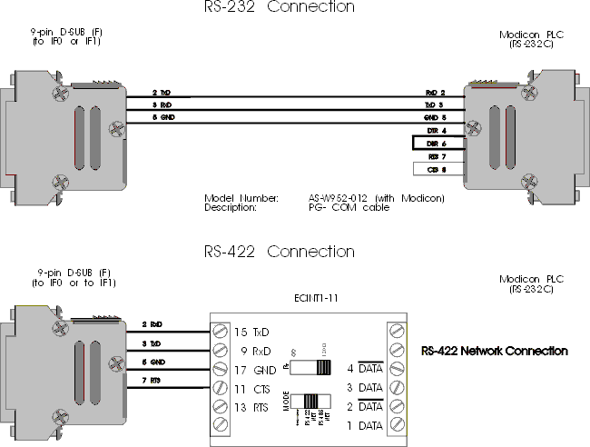
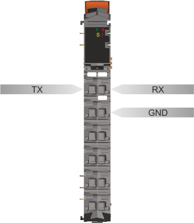

- [ModbusRTU 如何实现通信](#ModbusRTU%20%E5%A6%82%E4%BD%95%E5%AE%9E%E7%8E%B0%E9%80%9A%E4%BF%A1)
- [DRV_mbus 简要说明](#DRV_mbus%20%E7%AE%80%E8%A6%81%E8%AF%B4%E6%98%8E)
- [转换拓扑结构](#%E8%BD%AC%E6%8D%A2%E6%8B%93%E6%89%91%E7%BB%93%E6%9E%84)
- [通信常见设置与报警](#%E9%80%9A%E4%BF%A1%E5%B8%B8%E8%A7%81%E8%AE%BE%E7%BD%AE%E4%B8%8E%E6%8A%A5%E8%AD%A6)
	- [Timeout 参数设置](#Timeout%20%E5%8F%82%E6%95%B0%E8%AE%BE%E7%BD%AE)
	- [接线说明](#%E6%8E%A5%E7%BA%BF%E8%AF%B4%E6%98%8E)

# ModbusRTU 如何实现通信

可使用 `DRV_mbus` 库，实现 ModbusRTU 通信

- 可使用硬件模块：
    - X 20CS1030（RS485）
    - CPU 的 IF 1 口 (RS232)
        - 使用 RS232 转 RS485 转换器

# DRV_mbus 简要说明

|Call|Description|
|---|---|
|MBSOpen()|The MBSOpen() function block configures the interface and initializes the internal structures that are required. Up to 100 devices can be operated simultaneously (see DVFrame).|
|MBSlave()|This FBK operates the ModBus protocol in runtime. It responds to queries from the Modbus master (MBMaster() or MBMCmd() and operates (write / read) the simulated Modbus variables (MB0[x], MB1[x], MB3[x], MB4[x]).|
|MBSClose()|The FBK closes the driver environment, after which the MBSOpen() FBK can be called again.|
|MBMOpen()|The MBMOpen() function block configures the interface and initializes the internal structures that are required. The pConfig parameter can be used to connect a data object in which the PVs, event variables and commands are assigned. Up to 100 devices can be operated simultaneously (see DVFrame).|
|MBMaster()|This FBK operates the Modbus protocol in runtime. The Modbus commands are executed in the sequence in which they are entered in the data object. The function block first sends the Modbus command to the Modbus slave(s) and then waits for a response. If no response or no valid response is received within the defined time (MBMOpen.timeout), an error has occurred (e.g.: no slave with NodeNumber in the network or no connection).|
|MBMClose()|The FBK closes the driver environment, after which the MBMOpen() FBK can be called again.|
|MBMCmd()|This FBK operates the Modbus protocol in runtime. The function block first sends the Modbus command to the Modbus slave(s) and then waits for a response. If no response or no valid response is received within the defined time (MBMOpen.timeout), an error has occurred (e.g.: no slave with NodeNumber in the network or no connection). |

# 转换拓扑结构

# 通信常见设置与报警

## Timeout 参数设置

MBSOpen() 或 MBMOpen() 功能块 timeout 参数建议设置 > 250 ms，否则会报20220 mbERR_NODE_TOUT 错误。

## 接线说明

若使用 RS232 接转换器实现 ModbusRTU 通信，RS232 的 TX, RX, GND 需要都接线，GND 不接会导致通信不上。

