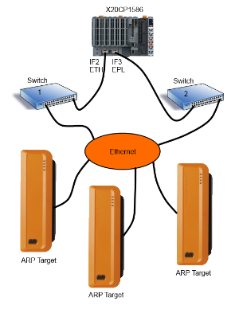
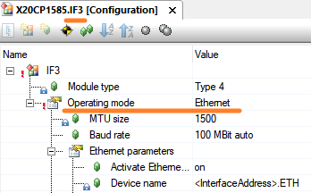
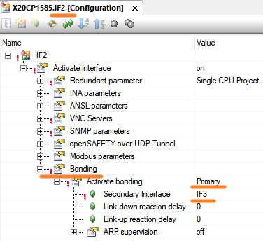
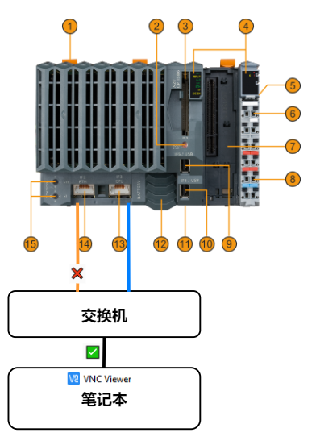

- [需求](#%E9%9C%80%E6%B1%82)
- [实现思路](#%E5%AE%9E%E7%8E%B0%E6%80%9D%E8%B7%AF)
- [实践案例](#%E5%AE%9E%E8%B7%B5%E6%A1%88%E4%BE%8B)
	- [目标](#%E7%9B%AE%E6%A0%87)
	- [配置方式](#%E9%85%8D%E7%BD%AE%E6%96%B9%E5%BC%8F)
	- [实现效果](#%E5%AE%9E%E7%8E%B0%E6%95%88%E6%9E%9C)

# 需求

- 实现以太网冗余
- 例如：访问 PLC 上的 VNC 服务，使用两个以太网口连接同一个交换机，一根网线断了，VNC 通信仍正常。

# 实现思路

- 使用 Bonding 功能
- 可以建立物理上和功能上的冗余网络连接，以实现更好的保护。此功能的目标并不是通过捆绑网络接口 (更大的带宽)来实现更高的吞吐量。
- 一个 Bonding 只被认为是网络中的一个单独的接口。从用户的角度来看，当前哪个绑定接口处于活动状态并不明显。哪一个是活跃的是根据规定的条件 ( 监控方式 )来决定的。可能有两种类型的监督:
    - 物理连接监控： (“上行”和“下行”)。可以为此配置反应时间。
    - ARP 包监控（最多可配置 3 个 IP 地址）。定期监控确定是否至少有一个配置的 IP 地址可以通过活动接口到达。如果无法到达配置的地址，则切换到另一个接口，并对该接口进行监控。可配置时间段的持续时间
- 

# 实践案例

## 目标

- X 20 CP 1585 上运行 VNC Server，实现 ETH 冗余，IF 2 口与 IF 3 口同时连接交换机，PC 访问此 VNC Server，若 IF 2 口的网线断了，对 VNC Server 的访问仍正常。

## 配置方式

- 首先将 IF 3 口从原先的 POWERLINK 模式改为以太网模式
- 
- 在 IF 2 口上配置 VNC Server 服务，并分配 IP 地址（此 IP 即为对外访问的唯一 IP 地址）
- 开启 Bonding 功能，将此 IF 2 口作为 Primary，选择 IF 3 口作为 Secondary Interface
- 

## 实现效果

- 无论 IF2 还是 IF3 哪个口的网线断开，VNC Viewer 显示的画面均正常连续变化
- 
