> Tags: #RS232 #RS485

- [1 B08.050.贝加莱串口通信与对应硬件模块](#_1-b08050%E8%B4%9D%E5%8A%A0%E8%8E%B1%E4%B8%B2%E5%8F%A3%E9%80%9A%E4%BF%A1%E4%B8%8E%E5%AF%B9%E5%BA%94%E7%A1%AC%E4%BB%B6%E6%A8%A1%E5%9D%97)
- [2 贝加莱串口通信模块](#_2-%E8%B4%9D%E5%8A%A0%E8%8E%B1%E4%B8%B2%E5%8F%A3%E9%80%9A%E4%BF%A1%E6%A8%A1%E5%9D%97)
	- [2.1 IF模块](#_21-if%E6%A8%A1%E5%9D%97)
		- [2.1.1 X20IF1020](#_211-x20if1020)
		- [2.1.2 X20IF1030](#_212-x20if1030)
		- [2.1.3 X67IF1121](#_213-x67if1121)
		- [2.1.4 X67IF1121-1](#_214-x67if1121-1)
	- [2.2 X2X模块](#_22-x2x%E6%A8%A1%E5%9D%97)
		- [2.2.1 X20(c)CS1020](#_221-x20ccs1020)
		- [2.2.2 X20(c)CS1030](#_222-x20ccs1030)
	- [2.3 X20CPU](#_23-x20cpu)
- [3 串口简介](#_3-%E4%B8%B2%E5%8F%A3%E7%AE%80%E4%BB%8B)
- [4 UART技术详解](#_4-uart%E6%8A%80%E6%9C%AF%E8%AF%A6%E8%A7%A3)
	- [4.1 UART信号](#_41-uart%E4%BF%A1%E5%8F%B7)
	- [4.2 波特率同步](#_42-%E6%B3%A2%E7%89%B9%E7%8E%87%E5%90%8C%E6%AD%A5)
	- [4.3 波特率误差](#_43-%E6%B3%A2%E7%89%B9%E7%8E%87%E8%AF%AF%E5%B7%AE)
- [5 信号传输](#_5-%E4%BF%A1%E5%8F%B7%E4%BC%A0%E8%BE%93)
	- [5.1 信号衰减](#_51-%E4%BF%A1%E5%8F%B7%E8%A1%B0%E5%87%8F)
		- [5.1.1 衰减的原理](#_511-%E8%A1%B0%E5%87%8F%E7%9A%84%E5%8E%9F%E7%90%86)
		- [5.1.2 克服衰减的方法](#_512-%E5%85%8B%E6%9C%8D%E8%A1%B0%E5%87%8F%E7%9A%84%E6%96%B9%E6%B3%95)
	- [5.2 信号干扰](#_52-%E4%BF%A1%E5%8F%B7%E5%B9%B2%E6%89%B0)
		- [5.2.1 干扰的原理](#_521-%E5%B9%B2%E6%89%B0%E7%9A%84%E5%8E%9F%E7%90%86)
		- [5.2.2 抗干扰的方法](#_522-%E6%8A%97%E5%B9%B2%E6%89%B0%E7%9A%84%E6%96%B9%E6%B3%95)
			- [5.2.2.1 差分传输](#_5221-%E5%B7%AE%E5%88%86%E4%BC%A0%E8%BE%93)
			- [5.2.2.2 双绞线](#_5222-%E5%8F%8C%E7%BB%9E%E7%BA%BF)
			- [5.2.2.3 屏蔽线](#_5223-%E5%B1%8F%E8%94%BD%E7%BA%BF)
	- [5.3 信号反射](#_53-%E4%BF%A1%E5%8F%B7%E5%8F%8D%E5%B0%84)
		- [5.3.1 特征阻抗](#_531-%E7%89%B9%E5%BE%81%E9%98%BB%E6%8A%97)
		- [5.3.2 反射原理](#_532-%E5%8F%8D%E5%B0%84%E5%8E%9F%E7%90%86)
		- [5.3.3 终端电阻](#_533-%E7%BB%88%E7%AB%AF%E7%94%B5%E9%98%BB)
			- [5.3.3.1 RS422](#_5331-rs422)
			- [5.3.3.2 RS485](#_5332-rs485)
- [6 接线](#_6-%E6%8E%A5%E7%BA%BF)
	- [6.1 接线规则](#_61-%E6%8E%A5%E7%BA%BF%E8%A7%84%E5%88%99)
		- [6.1.1 RS232](#_611-rs232)
		- [6.1.2 RS422](#_612-rs422)
		- [6.1.3 RS485](#_613-rs485)
	- [6.2 线缆选择](#_62-%E7%BA%BF%E7%BC%86%E9%80%89%E6%8B%A9)
- [7 诊断](#_7-%E8%AF%8A%E6%96%AD)
	- [7.1 配置原因](#_71-%E9%85%8D%E7%BD%AE%E5%8E%9F%E5%9B%A0)
	- [7.2 接线原因](#_72-%E6%8E%A5%E7%BA%BF%E5%8E%9F%E5%9B%A0)
	- [7.3 电磁干扰](#_73-%E7%94%B5%E7%A3%81%E5%B9%B2%E6%89%B0)
	- [7.4 程序原因](#_74-%E7%A8%8B%E5%BA%8F%E5%8E%9F%E5%9B%A0)
	- [7.5 硬件故障](#_75-%E7%A1%AC%E4%BB%B6%E6%95%85%E9%9A%9C)
	- [7.6 诊断方法](#_76-%E8%AF%8A%E6%96%AD%E6%96%B9%E6%B3%95)

# 1 B08.050.贝加莱串口通信与对应硬件模块

# 2 贝加莱串口通信模块

## 2.1 IF模块

### 2.1.1 X20IF1020

- RS232接口卡，波特率最大为115200bit/s。引脚定义如下图。
 - 9-pin male DSUB connector
- 

| **Pinout** | IF1020引脚定义 |                 |
| ---------- | ---------- | --------------- |
| **Pin**    | **RS232**  |                 |
| 1          | NC         |                 |
| 2          | RxD        | Receive signal  |
| 3          | TxD        | Transmit signal |
| 4          | NC         |                 |
| 5          | GND        | Ground          |
| 6          | NC         |                 |
| 7          | RTS        | Request To Send |
| 8          | CTS        | Clear To Send   |
| 9          | NC         |                 |

- IF1020的RS232接口上是没有DTR和DSR信号的，使用时需要注意，如果连接的设备上有这两个信号的话，需要在对方的设备中将这两个信号关闭。
- 对于RTS和CTS信号，如果对方设备没有这两个信号，或者关闭了这两个信号，可以在接线是不连接这两个信号，或将CTS信号连接到GND上。因为CTS的有效电平为低电平，要使串口可以发送数据需要CTS信号处于有效电平，因此，当对方设备没有该信号时，可以通过不连接或接地（数字地）的方式使通信正常。

### 2.1.2 X20IF1030

- X20IF1030接口卡可以工作在RS422模式也可以工作在RS485模式，该接口卡的引脚定义如下表IF1030引脚定义。
- User interface RS485/RS422
- 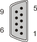
- 9-pin female DSUB connector

| **Pinout** | IF1030引脚定义   |              |
| ---------- | ------------ | ------------ |
| **Pin**    | **RS485**    | **RS422**    |
| 1          | Reserved     | Reserved     |
| 2          | Reserved     | TxD1)        |
| 3          | DATA         | RxD          |
| 4          | Reserved     | Reserved     |
| 5          | GND          | GND          |
| 6          | +5 V / 50 mA | +5 V / 50 mA |
| 7          | Reserved     | TXD\\1)      |
| 8          | DATA\\       | RXD\\        |
| 9          | Reserved     | Reserved     |

| 1) | RS422 send data is TRISTATE-capable. |
|----|--------------------------------------|

- 在AS中，可以在IF1030的Serial配置界面，配置该接口卡工作在RS422模式还是RS485模式。
- F1030模式配置
    - 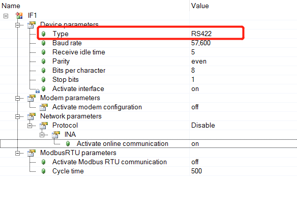

### 2.1.3 X67IF1121

- X67IF1121模块是一个RS232/RS485/RS422的多模式通信模块。该模块只能工作在三种模式中的一种模式下。
- AS中在该模块的Serial配置界面下，可以选择该模块的工作模式，如下图所示。
- IF1121模式配置
    - 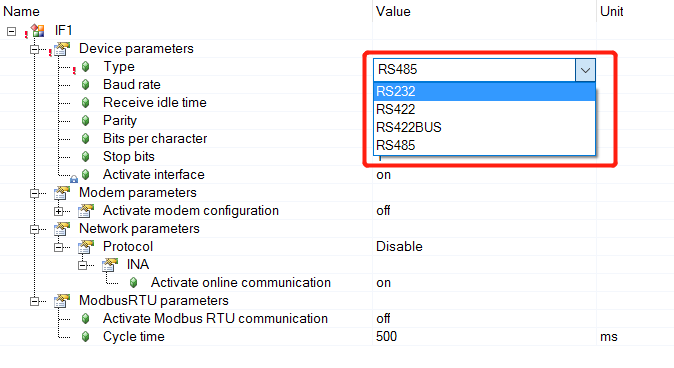
- 该模块的接口定义请参考AS中的 Hardware/X67 system/X67 modules/Other modules/X67IF1121-1。

### 2.1.4 X67IF1121-1

- X67IF1121-1模块是一个RS232/RS485/RS422的多功能通信模块。该模块的RS232和 RS422/RS485可以并行工作。
- 在AS中可以看到该模块下面有两个Serial接口，其中serial1是RS232接口，Serial2是RS422/RS485接口。对于RS422/RS485接口可以在配置界面选择工作模式。
- 该模块的接口定义请参考AS中的 Hardware/X67 system/X67 modules/Other modules/X67IF1121-1。

## 2.2 X2X模块

### 2.2.1 X20(c)CS1020

- CS1020模块是一个RS232接口模块，该模块的引脚定义如下图。
    - 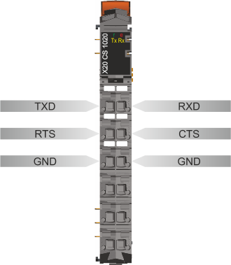
- CS1020的RS232接口上是没有DTR和DSR信号的，使用时需要注意，如果连接的设备上有这两个信号的话，需要在对方的设备中将这两个信号关闭。
- 对于RTS和CTS信号，如果对方设备没有这两个信号，或者关闭了这两个信号，可以在AS中将这两个信号关闭,如下图所示。
    - 打开/关闭CTS
    - 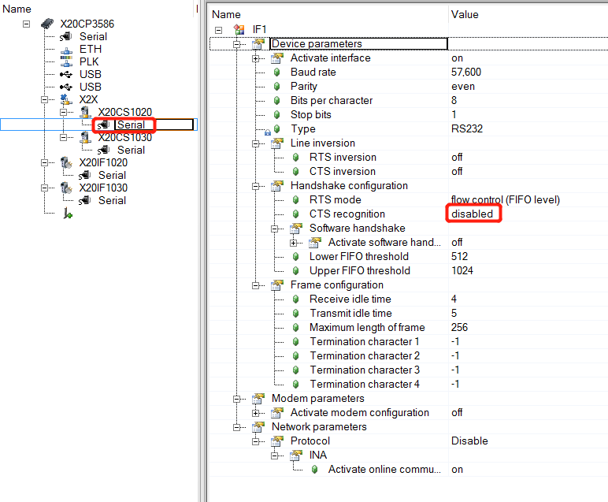
- 另外，在该界面还可以配置串口的其他参数，如波特率，奇偶校验，停止位等，请参考AS的帮助，在此不再赘述。
- 在X20CS1020的配置界面（不是Serial的配置界面）有一个选项 Extended error status information，打开该配置后，可以在IO mapping中会多出一些错误信息的通道，可以用于检测通讯的错误，如下图所示。
    - 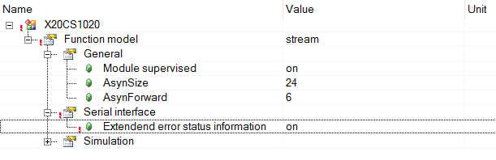

### 2.2.2 X20(c)CS1030

- CS1030是一个RS422/RS485通信模块，其引脚定义如下图所示。
- RS485 mode
    - 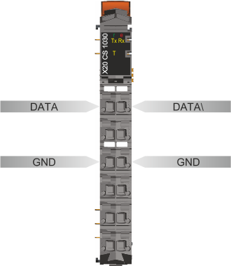
- RS422 mode
    - 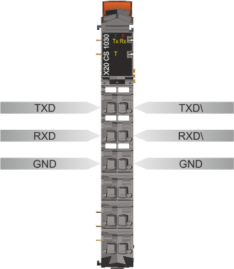
- 通过模块的配置界面可以配置模块工作在何种模式下。
- 同CS1020一样，CS1030也有Extended error status information选项，打开该配置后，可以在IO mapping中会多出一些错误信息的通道，可以用于检测通讯的错误。

## 2.3 X20CPU

- 在X20系列的CPU上都有一个RS232的串口，该串口的引脚位于PS模块上
- X20CPU上的串口引脚
- 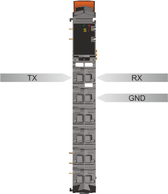
- 该串口模块只有TX,RX和GND三个信号，没有通信控制信号。该模块的最大波特率为115200，可以与其他设备进行通信。

# 3 串口简介

- 串口是自动化设备中常用的通信接口之一。主要有 RS232,RS422,RS485三种电气接口。RS232，RS422, RS485是电气信号的标准。实际与 CPU 或 MCU 直接连接的是一个 UART 接口，通常在 CPU 或 MCU 的芯片上直接集成了 UART 接口。UART 接口上连接一个 RS232，RS422或 RS485的电气信号转换芯片，将 UART 上的 TTL 或 CMOS 信号转换为标准的 RS232，RS422或 RS485信号。最后在通过一个接口元件将信号引出到设备的接口上。如下图所示。
    - 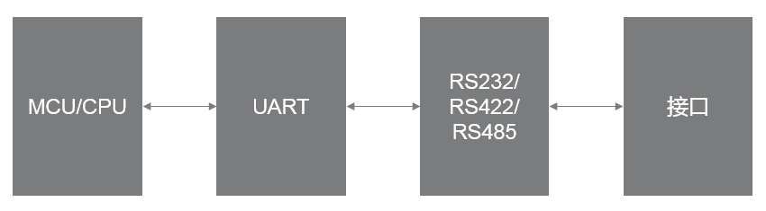

# 4 UART技术详解

- UART全称是Universal Asynchronous Receiver/Transmitter，是一种串行异步通信技术。
- 所谓异步通信，是指通信的双方没有一个共同的时钟来为信号做同步。通信双方使用各自的时钟来完成信号的收发。

## 4.1 UART信号

- 由于通信双方各自使用自己的时钟，会导致收发信号在一段时间之后由于时钟的偏差而产生错误，如数据漏采或过采。为了解决这一问题，UART在每次传输一段数据之前都会进行一次时钟同步，通常这段数据的长度是一个字节，通信上称这一段数据为一帧。
- 在计算机技术发展的早期，各个厂商对一个字节的长度的定义各不相同，也就导致了串口中一帧的长度有多种定义，如，5,6,7,8,9 位。现在通常使用8位作为一帧的长度，即一个字节。
- UART通信中，用于时钟同步的这一位称为起始位，其值为0，之后是若干数据位（通常是8位），紧跟数据位后面是一位校验位，校验位后面是停止位，停止位的长度有1位，1.5位或2位。其中校验位在通讯时可以设置为使用或不使用，校验位又分为奇校验和偶校验。
- 对于奇校验，一帧数据中，数据位和校验位中为1的个数是奇数；对于偶校验，一帧数据中，数据位和校验位中为1的个数是偶数。
- 下图为示波器住区的字符‘a’在UART上的信号。UART信号在空闲时保持高电平，即逻辑值为1。开始传输时，信号线上先发送一位的0，作为起始位。之后是数据位，本例中，数据位为8位。字符‘a’的ASCII码值为0x61,对已二进制的值为b01100001。UART上的数据是按照低位在前，高位在后的顺序传输的，所以，在UART的信号上，数据的顺序为1,0,0,0,0,1,1,0。该例子中，采用奇校验，即，数据位和校验位中1的个数为计数，由于前面的数据位中有3个1，为奇数，所以校验位的值为0，校验位后面是停止位，停止位的值为1，该例子中，停止位的长度为1位。停止位之后，UART处于空闲状态，即空闲位，空闲位的值为1。
- 字符‘a’的UART信号（奇校验）
    - 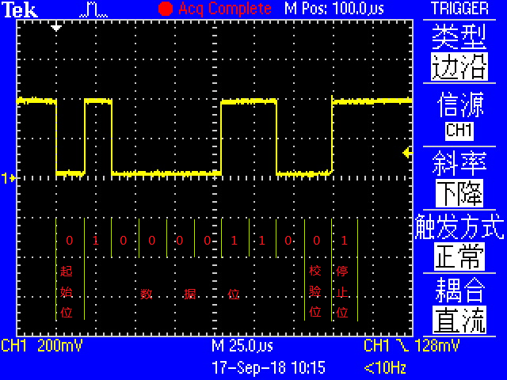
- 字符‘a’的UART信号（偶校验）
    - 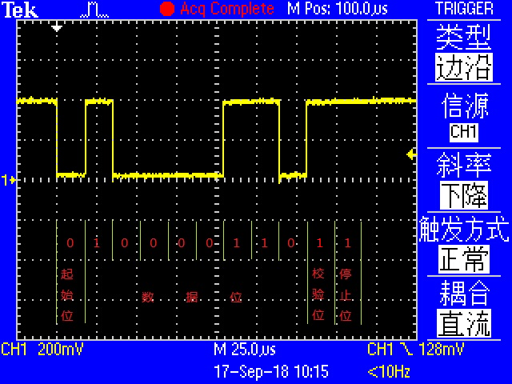

## 4.2 波特率同步

- 通常MCU的时钟频率要远高于UART的波特率，因此需要通过分频技术将系统的时钟频率调整到与波特率匹配。采用UART通信的两个设备，各自使用自己的时钟，又因为采用了分频技术，所以，两个设备的时钟很难做到完全相同。UART的处理方法是采用一个比波特率高的时钟，对信号进行采样，通常采样频率是波特率的4倍，8倍或16倍。
- 下面以4倍波特率频率采样来说明UART如何接受数据。
- 对于接收端，始终在以一个4倍的频率对信号进行采样，当发送端发送了起始位之后，接收端将采样得到一个11110000的数据，接收端将第一个0作为波特率同步的起始位置，即第1位，并判断第2次采样的值是否是0，如果第2次为0，则认为接收到一个起始位，间隔两个采样之后，后面将以4次为一个周期对信号在每个周期的第二个位置进行采样；如果在起始位的第二次采样得到一个1，则认为起始位错误。
- 如果收发双方的波特率完全相同，则，每次对数据采样都会在一位数据的中点位置。实际上，由于波特率的产生受系统时钟和分频的影响，波特率会存在一定的误差，根据上面的采样过程可知，只要在最后一位采样时还在最后一位的时间范围内，数据就不会出错，即，不超过0.5位的时间。通常一帧数据中包含1位起始位，8位数据位，以及1位校验位，即10位数据，因此需要将通信双方的波特率误差控制在0.5/10以内，即5%以内。由于通信双方各自产生自己的波特率，所以，对于其中1方来说，其误差不应该超过允许误差的一半，即，2.5%。

## 4.3 波特率误差

- UART接口的波特率是由UART设备的时钟分频产生的，时钟分频只能整数分频，不能使用小数。这就导致UART实际工作的波特率与所设置的波特率之间存在一个偏差，即，波特率误差。通常UART设备产生的波特率误差在2.5%以下都不会影响数据的正常传输。
- 下面一个实际的例子来说明波特率误差。
    - A,B两个UART设备，A的驱动时钟为24MHz,B的驱动时钟为25MHz,双方采用115200的波特率进行通信。
    - A设备的波特率发生器的分频系数为24,000,000 / (115200 * 8) ≈26.04 取值为26。其中8为UART的采样率。实际的波特率为24,000,000 / (26 * 8) ≈ 115384.6。波特率误差为（115384.6 - 115200）/115200 = 0.16%。
    - B设备的波特率发生器的分频系数为25,000,000 / (115200 * 8) ≈27.13 取值为27。其中8为UART的采样率。实际的波特率为25,000,000 / (27 * 8) ≈ 115740.7。波特率误差为（115740.7 - 115200）/115200 = 0.47%。
    - 双方的波特率误差均小于2.5%，可以正常通信。
- 从上面的计算可以看出，波特率误差的主要来源是分频系数取整导致的，取整运算的绝对误差≤0.5，要使最后的相对误差≤2.5%，则只需要分频系数u满足0.5/u≤2.5%,即u≥0.5/2.5%=20。即，只要分频系数大于20，就可以控制波特率误差小于2.5%的要求。

# 5 信号传输

两个设备之间通信，需要传输的是数据，在传输时，数据被转换成信号在线缆上传输。信号的传输从本质上讲是能量的传输。能量在介质中传递时，会因为介质的消耗导致能量衰减，对应在信号传输上就是信号的衰减。能量在传递过程中，也会受到外来能量的干扰，即，信号的干扰。能量在不同介质中传递，在两种介质的表面上，能量会被分成两部分，一部分传递给下一种介质，继续传递，另外一部分在原来的介质中反向传递，即，反射。

## 5.1 信号衰减

### 5.1.1 衰减的原理

- 信号以电压的形式在信号线中传播，由于信号线的电阻作用，能量在信号性中传递的同时会被损耗掉一部分。
- 另外，由于导线的“天线”作用，信号在导线上传输，还会以电磁波的方式向外辐射，同样会引起信号衰减。

### 5.1.2 克服衰减的方法

- 信号衰减的表现是信号的幅值的下降，即，电压的下降。比较简单的降低衰减的方法是采用电阻率较小的材料。但是，通常电阻率小的材料，价格都较高，所以这种方法通常不是很经济。
- 另外一个简单又有效的方法就是提高信号的电压幅值。如RS232接口标准中，逻辑1的电压值为-3V ~ -15V，逻辑0的电压值为+3V ~ +15V，高于标准的3.3V的TTL电平。
- 差分传输（参见下方差分传输章节）也可以在一定程度上提高传输能力。

## 5.2 信号干扰

### 5.2.1 干扰的原理

- 信号在线缆上传输的过程中，线缆会受到外界的电磁辐射而产生一个感应电压，这个感应电压会叠加在信号上，一起进入到接收器上，从而干扰信号的接收。
- 信号在线缆上传输，线缆就相当于一个天线，将信号转换为电磁波的形式向外辐射。相邻的信号线就像接收天线一样会接收到该线缆上的信号。

### 5.2.2 抗干扰的方法

#### 5.2.2.1 差分传输

- 在RS232中接收和发送各自在一根信号线上传输，当线缆受到外部电磁干扰时，干扰信号会直接影响接收端。采用差分传输可以大大的提高信号的抗干扰能力。
- 差分传输是一种信号传输的技术，区别于传统的一根信号线一根地线的做法，差分传输在这两根线上都传输信号，这两个信号的幅值相等，相位相差180度，极性相反。在这两根线上传输的信号就是差分信号。
- 差分信号的第一个好处是，因为你在控制‘基准’电压，所以能够很容易地识别小信号。在一个地做基准，单端信号方案的系统里，测量信号的精确值依赖系统内‘地’的一致性。信号源和信号接收器距离越远，他们局部地的电压值之间有差异的可能性就越大。从差分信号恢复的信号值在很大程度上与‘地’的精确值无关，而在某一范围内。
- 差分信号的第二个主要好处是，它对外部电磁干扰（EMI）是高度免疫的。一个干扰源几乎相同程度地影响差分信号对的每一端。既然电压差异决定信号值，这样将忽视在两个导体上出现的任何同样干扰。除了对干扰不大灵敏外，差分信号比单端信号生成的EMI还要少。
- 差分信号的第三个好处是，在一个单电源系统，能够从容精确地处理‘双极’信号。为了处理单端，单电源系统的双极信号，我们必须在地和电源干线之间某任意电压处（通常是中点）建立一个虚地。用高于虚地的电压来表示正极信号，低于虚地的电压来表示负极信号。接下来，必须把虚地正确地分布到整个系统里。而对于差分信号，不需要这样一个虚地，这就使我们处理和传播双极信号有一个高真度，而无须依赖虚地的稳定性。
- RS422中，采用两对差分线分别用来发送和接收数据；RS485中，采用一对差分信号线组成总线，在同一个数据通路上接收和发送数据，RS485是一个半双工的总线。

#### 5.2.2.2 双绞线

- 在RS422和RS485中，通讯线缆通常采用双绞线。双绞线（twisted pair，TP）由两根具有绝缘保护层的铜导线组成的。把两根绝缘的铜导线按一定密度互相绞在一起，每一根导线在传输中辐射出来的电波会被另一根线上发出的电波抵消，有效降低信号干扰的程度。
- 双绞线一般由两根绝缘铜导线相互缠绕而成，“双绞线”的名字也是由此而来。实际使用时，双绞线是由多对双绞线一起包在一个绝缘电缆套管里的。如果把一对或多对双绞线放在一个绝缘套管中便成了双绞线电缆 ，但日常生活中一般把“双绞线电缆”直接称为“双绞线”。与其他传输介质相比，双绞线在传输距离，信道宽度和数据传输速度等方面均受到一定限制，但价格较为低廉。
- 在双绞线中，干扰主要来自以下两方面：第一，外部干扰。第二，同一电缆内部各对线之间的相互串扰。下面，我们对双绞线消除干扰的原理进行分析。
- **1、 双绞线对外部干扰的抑制**
    - （1）干扰信号对平行线的干扰，见Figure 3-1。Us为干扰信号源，干扰电流Is在双线的两条导线L1、L2上产生的干扰电流分别是I1和I2。由于L1距离干扰源较近，因此，I1 > I2，I = I1 - I2 ≠ 0，有干扰电流存在。
    - 信号对平行线的干扰
        - 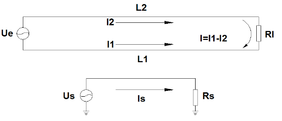
    - （2）干扰信号对扭绞双线回路的干扰，见下图，与上图不同的是，双线回路在中点位置进行了一次扭绞。在L1上存在干扰电流I11和I12，在L2上存在干扰电流I21和I22，干扰电流I = I21 + I22 - I11 - I12，由于两段线路的条件相同，所以，总干扰电流I = 0。所以只要设置合理的绞距，就能达到消除干扰的目的。
        - 信号对双绞线的干扰
            - 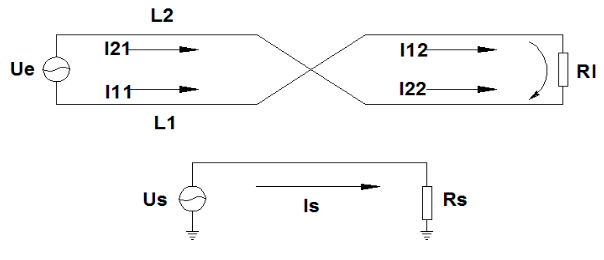
- **2、同一电缆内部各线对之间的串扰**
    - 1）两个未绞双线回路间的串扰，见Figure 3-3。其中Ue为主串回路，Us为被串回路。导线L1上的电流I1在被串回路L3和L4中产生感应电流I31和I41 ，I41 > I31，在被串回路中形成串扰电流I11=I41 - I31，同样，导线L2上的电流I2在被串回路 L3 和 L4 中产生感应电流I32和I42，I42 > I32，在被串回路中形成串扰电流I12 = I32 - I42，总干扰电流I = I11 + I12，由于L1与L3、L4的距离比L2较近，I = I11 + I12 > 0，在回路Us中形成干扰。
        - 平行线之间的串扰
            - 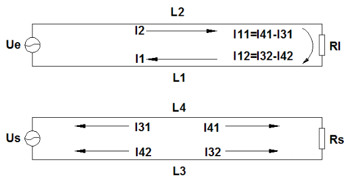
    - （2）两个绞距相同的回路如Figure 3-4所示。回路Ue和回路Us同时在中点位置作扭绞，因此，两个回路的4根导线之间的相对关系与未绞是完全相同的，根据以上分析可知，是不能起到消除串扰的作用。Ue和Us分别在对方回路中产生干扰电流Is和Ie，所以当两个绞合的双线回路绞距相同时，不能消除串扰。
        - 双绞线之间的串扰
            - 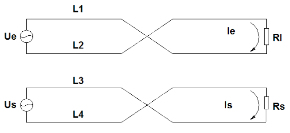
    - （3 ） 两个绞距不同的双线回路见Figure 3-5。回路Ue在中点作扭绞。回路Us除在中点作扭绞外，还在A段和B段的二分之一处分别作扭绞。
        - 下面以回路Ue为主串回路，回路Us为被串回路。分为A、B两段，先分析A段的串扰。在A段内，回路Ue未作扭绞，而回路Us在二分之一处作扭绞；根据1.2节的分析可知，由于回路Us在A段的中点扭绞，导线L1对回路Us的干扰电流为零。同样道理，导线L2对回路Us的干扰电流也为零。因此，在A段，回路Ue对回路Us的串扰电流为零。
        - B段的情况与A段完全相同，在B段串扰电流也为零。因此，回路Ue对回路Us的总串扰为零。所以，两个独立的双绞线回路，只要设计合理的绞距，是可以消除相互串扰。
        - 不同绞距之间的串扰
            - 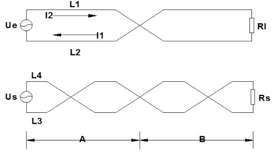
    - （4 ）一条超五类双绞线电缆由4对线组成。每对线各自按反时针方向扭绞。4对线的绞距是各不相同的（对于绞距，没有量化标准，各个厂家的绞距有差别，从1.1~2.2cm不等，正规厂家的产品都能满足电气要求）。采取这些措施，不仅可消除外部干扰，同时可消除线对间的串扰。

#### 5.2.2.3 屏蔽线

- 屏蔽线是使用金属网状编织层把信号线包裹起来的传输线，编织层一般是红铜或者镀锡铜。屏蔽线的屏蔽层需要接地，外来的干扰信号可被该层导入大地。这种屏蔽线也有防止线路向外辐射电磁能的作用。
- 通常RS232,RS422，RS485的线缆都带有屏蔽层的。

## 5.3 信号反射

### 5.3.1 特征阻抗

- 特性阻抗，又称“特征阻抗”，它不是直流电阻，属于长线传输中的概念。在高频范围内，信号传输过程中，信号沿到达的地方，信号线和参考平面（电源或地平面）间由于电场的建立，会产生一个瞬间电流，如果传输线是各向同性的，那么只要信号在传输，就始终存在一个电流I，而如果信号的输出电平为V，在信号传输过程中，传输线就会等效成一个电阻，大小为V / I，把这个等效的电阻称为传输线的特性阻抗Z。
- 影响特性阻抗的因素有：介电常数、介质厚度、线宽、铜箔厚度等。

### 5.3.2 反射原理

- 信号在传输的过程中，如果传输路径上的特性阻抗发生变化，信号就会在阻抗不连续的结点产生反射。
- 以水波在水面传播为例，当水面的宽度变窄时，一部分水波会在变窄的位置发生反射，干扰后面的水波，另一部分会进入到变窄后的水面，继续传播。

### 5.3.3 终端电阻

- 通常，信号的接收器的输入阻抗都比较大，所以，在接收端，线缆与接收器上的阻抗不相等，信号到达接收端时就会产生反射。靠近接收端，并联接一个与线缆特征阻抗相同的电阻，可以有效的抑制信号反射。
- 继续以水波作为例子说明，水面越宽，水波受到的阻力越小，水面越窄阻力越大。当水面变窄时，如果在变窄的地方增加水波吸收装置，例如防波堤，就可以有效的防止水波的反射。
- 如果从能量的角度来看的话，信号在线缆上传输，就是一个个脉冲能量通过线缆传递给接收器，当能量到达接收器的时候，由于接收器的阻抗较大，能量不能很快的被消耗掉，剩余的能量就会沿着线缆反向传输，产生反射，干扰后面的信号。当接入终端电阻后，能量就会在电阻上被消耗掉，剩余的能量就会大大降低，反射的信号强度就会下降。
- 综上，终端电阻的作用就是在接收端将信号的能量吸收掉，抑制信号反射。常用的通信线缆的典型特征阻抗为100\~120Ω，因此，终端电阻的阻值通常选用120Ω。

#### 5.3.3.1 RS422

- 通过上面的描述可以知道，在接收端设置一个终端电阻可以有效的抑制信号的反射，提高信号质量。
- RS422电气标准中，收发采用两个独立的差分信号，因此只需要在接收端设置终端电阻即可。
- RS422的接线
    - 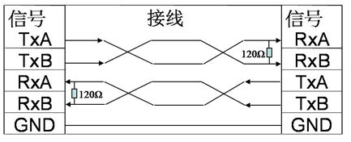

#### 5.3.3.2 RS485

- 采用RS485连接的设备通常是一个接一个的形成一个线型的拓扑结构。这时候，只需要在这个线型拓扑结构的首尾两端的设备上，各设置一个终端电阻即可。
- RS485通常不组成星型拓扑结构，因为在星型拓扑结构的分叉点处，信号由一条电缆分为两个或多个电缆，信号强度会直接衰减为原来的1/2或1/n，直接影响信号质量。
- RS485如果需要组成星型结构必须使用RS485集线器。

# 6 接线

## 6.1 接线规则

### 6.1.1 RS232

- RS232接口的信号引脚通常有以下这些：
    - RXD:数据接收引脚，输入信号，用于接收数据，该引脚是必需的；
    - TXD:数据发送引脚，输出信号，用于发送数据，该引脚是必需的；
    - RTS:请求发送引脚，输出信号，用于通知对方本方已经准备好接收数据，请求对方发送数据，该引脚为可选引脚；
    - CTS: 允许发送引脚，输入信号，用于确认对方是否已经准备好接收数据，该信号有效时，才能发送数据，该引脚为可选引脚；
    - DTR:数据终端就绪引脚，输出信号，该信号有效时，允许对方发总数据；
    - DSR:数据设备就绪引脚，输入信号，该信号有效，表示对方已经准备好接收数据；
    - GND:信号地。
- 接线时，要保证RXD信号与对方的TXD信号相连，TXD信号与对方的RXD信号相连；RTS信号与对方的CTS信号相连，CTS与对方的RTS信号相连；DTR信号与对方的DSR信号相连，DSR与对方的DTR信号相连；双方的GND信号要连在一起，确保信号共地。
- 其中，RXD、TXD和GND三个信号是必需连接的，RTS、CTS、DTR和DSR四个信号为可选信号，需要根据实际应用场合确定是否使用。

### 6.1.2 RS422

- RS422接口的信号引脚通常有一下这些：
    - TXA：数据发送正引脚，输出信号，用于发送数据，该引脚是必需的；
    - TXB：数据发送负引脚，输出信号，用于发送数据，该引脚是必需的；
    - RXA：数据接收正引脚，输入信号，用于接收数据，该引脚是必需的；
    - RXB：数据接收负引脚，输入信号，用于接收数据，该引脚是必需的；
    - GND：信号地。
- RS422的接线图：
    - 
- 通信的双方，需要将收发互连，即，本方的发送要与对方的接收连接，本方的接收要与对方的发送连接。
- 需要注意的是，RS422接线时，需要在通信双方的接收信号RXA、RXB之间接一个120Ω的匹配电阻，尤其是在通信距离较远的时候。

### 6.1.3 RS485

- RS422的收发是分开的，可以实现全双工的数据传输，RS485的收发则采用同一对信号线，工作在半双工模式。相比于RS422，RS485的传输效率会有所下降，但是RS485可以实现总线式的接线，可以有多个设备连接在一起。
- RS485的引脚如下：
    - A：数据发送/接收 的正信号，该引脚书输入输出信号；
    - B：数据发送/接收的负信号，该引脚书输入输出信号；
    - GND：数字地。
- RS485在接线时，只要将相同名字的信号线连接在一起即可。当多个RS485设备连在一起时，需要顺次将每个设备连接起来组成菊花链的结构，并在第一个设备和最后一个设备的A、B信号之间配置终端电阻，中间的设备不能配置终端电阻，如下图
    - 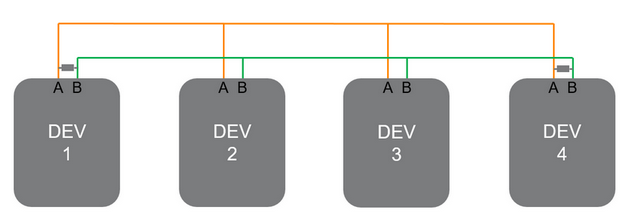
- RS485接线时要避免出现星型结构，如下图。
    - 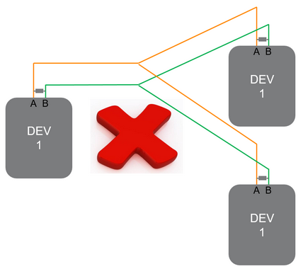
- 错误的RS485接线（星型结构）
    - 也要避免在中间的设备上布置终端电阻
    - 错误的终端电阻的使用
        - 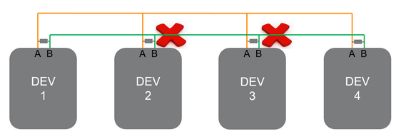

## 6.2 线缆选择

线缆选择的基本原则是根据设备的接口形式，满足4.1中所述的接线规则。同时要考虑工作环境，选择屏蔽层的规格。通常，屏蔽层有铝箔和铜丝网两种，铜丝网的屏蔽效果要由于铝箔。比较好的屏蔽方式是铜丝网加铝箔的双层屏蔽线。对于采用差分信号传输的RS422和RS485来说，线缆选择时要保证同一对信号线在线缆内部是绞起来的。

# 7 诊断

- 串口通信出现故障的原因主要有三个方面：
    - 1___配置原因
    - 2___接线原因
    - 3___电磁干扰
    - 4___程序问题
    - 5___硬件故障
- 当串口出现故障的时候，也应该按顺序检查以上三个方面。

## 7.1 配置原因

- 配置原因是指通信的双方或多方的配置不同导致的通信故障的原因。这些原因有：
    - 波特率；
    - 校验位；
    - 字节位宽；
    - 停止位；
    - RTS/CTS是否使能；
    - RTS/CTS的有效电平；
    - 软件流控制（XON/XOFF）是否使能；
    - 串口的工作模式（RS232/RS422/RS485）。
- 在通信故障的时候，应当先检查通信的各方上述配置是否匹配。

## 7.2 接线原因

- 如果通信的各方的配置是匹配的话，应该上文所述的接线规则检查通信各方之间的连线是否正确，以及检查单根信号线是否连通；GND信号线是否连接正确；对于差分信号对，在信号线上是不是同一组双绞线；屏蔽层的连接是否正确等。

## 7.3 电磁干扰

- 如果配置和接线是正确的，那么很大的原因是电磁干扰导致的，可以检查通信设备及连线周围是否用大功率的设备在工作。对于电磁干扰导致的通信问题，可以采用屏蔽性能更好的连线，或者降低通信速率来解决问题。

## 7.4 程序原因

- 导致通信故障的另外一个原因就是软件程序，此时应当检查程序的正确性。

## 7.5 硬件故障

- 如果以上内容检查都没问题，则很大的概率是硬件损坏了。

## 7.6 诊断方法

- 对于CS1020和CS1030模块可以通过打开Extended error status information选项，在IO mapping中，对错误信息分析来检测通讯的错误。
- 另外，还可以尝试连接其他设备，用替换法来检测通信故障是哪个设备导致的。
