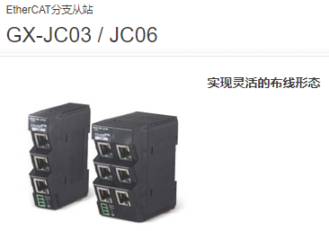
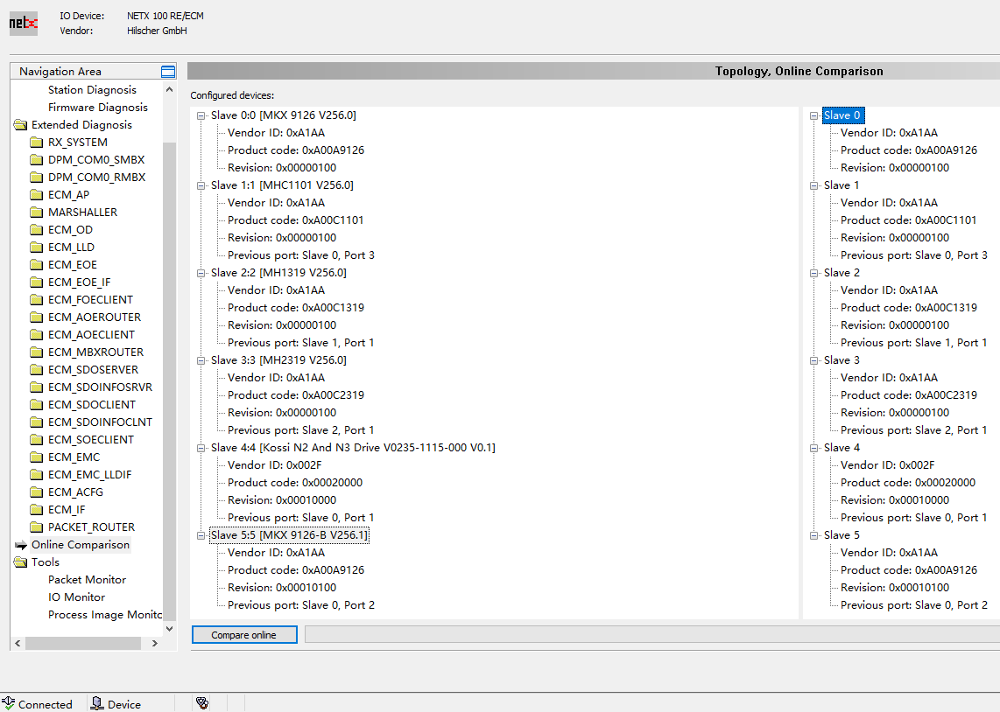
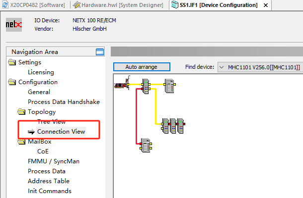
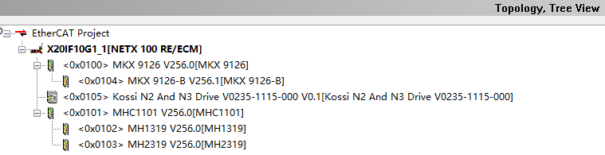

> Tags: #EtherCAT

- [1 053贝加莱EtherCAT主站模块X20IF10G1-1使用EtherCAT分支器](#1%20053%E8%B4%9D%E5%8A%A0%E8%8E%B1EtherCAT%E4%B8%BB%E7%AB%99%E6%A8%A1%E5%9D%97X20IF10G1-1%E4%BD%BF%E7%94%A8EtherCAT%E5%88%86%E6%94%AF%E5%99%A8)
- [2 使用方式与注意事项](#2%20%E4%BD%BF%E7%94%A8%E6%96%B9%E5%BC%8F%E4%B8%8E%E6%B3%A8%E6%84%8F%E4%BA%8B%E9%A1%B9)
- [3 更新日志](#3%20%E6%9B%B4%E6%96%B0%E6%97%A5%E5%BF%97)

# 1 B08.053-贝加莱EtherCAT主站模块X20IF10G1-1使用EtherCAT分支器

- 经过实际测试，贝加莱使用EtherCAT主站模块，支持使用EtherCAT分支从站例如 OMRON GX-JC03 / JC06
- 
    - [GX-JC03 / JC06 EtherCAT分支从站/样本 | OMRON Industrial Automation](https://www.fa.omron.com.cn/products/family/3079/)

# 2 使用方式与注意事项

- 贝加莱的主站加 EtherCAT 分支器可以支持，不过需要手动调整组态的连接顺序。
- 不能自动组态，但可以自动识别从站连接信息，然后在AS软件的DTM处手动组态。
- 4口的分支器会被识别为一个从站，6口的分支器会被识别为两个从站。
- 
- 
- 

# 3 更新日志

| 日期         | 修改人       | 修改内容 |
| :--------- | :-------- | :--- |
| 2024-02-24 | CW YZY | 初次创建 |
