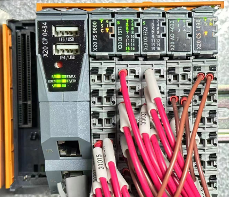
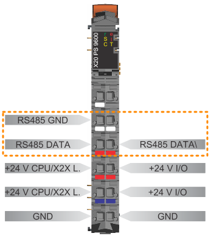

> Tags: #ModbusRTU #X20CP048x

- [1 054ModbusRTU通信使用BB63底座上自带的485接口不能正常运行](#1%20054ModbusRTU%E9%80%9A%E4%BF%A1%E4%BD%BF%E7%94%A8BB63%E5%BA%95%E5%BA%A7%E4%B8%8A%E8%87%AA%E5%B8%A6%E7%9A%84485%E6%8E%A5%E5%8F%A3%E4%B8%8D%E8%83%BD%E6%AD%A3%E5%B8%B8%E8%BF%90%E8%A1%8C)
- [2 原因与解决方案](#2%20%E5%8E%9F%E5%9B%A0%E4%B8%8E%E8%A7%A3%E5%86%B3%E6%96%B9%E6%A1%88)
- [3 相关信息](#3%20%E7%9B%B8%E5%85%B3%E4%BF%A1%E6%81%AF)
- [4 更新日志](#4%20%E6%9B%B4%E6%96%B0%E6%97%A5%E5%BF%97)

# 1 B08.054-ModbusRTU通信使用BB63底座上自带的485接口不能正常运行

- BB53或BB63底座上自带的485接口做modbusRTU通讯
- 同样的程序从CS1030换到BB63上，通讯就不通了
- 
- MBMaster() 功能块状态是 65535 和 20220 之间切换
    - 20220 mbERR_NODE_TOUT
        - In MBSOpen() or MBMOpen() FBKs: invalid value for timeout parameter (< 250 ms)
        - In MBMCmd(), MBMaster() and MBSlave() FBKs: timeout detected

# 2 原因与解决方案

- 使用X20BB63底座上的RS485口，需要满足以下条件
    - Automation Studio 4.11 及更高版本
    - Automation Runtime B4.92 及更高版本
        - [B&R Online Help (br-automation.com)](https://help.br-automation.com/#/en/4/hardware%2Fx20bb63%2Fsystemvoraussetzungen.html)
    - CPU和X20PS9600的硬件固件需要升级到最新
- 升级固件后，此问题解决

# 3 相关信息

- X20BB63
    - [B&R Online Help (br-automation.com)](https://help.br-automation.com/#/en/4/hardware%2Fx20bb63%2Fallgemeines.html)
- X20PS9600
    - [B&R Online Help (br-automation.com)](https://help.br-automation.com/#/en/4/hardware%2Fx20ps9600%2Fallgemeines.html)
- ModbusRTU接线方式
    - 

# 4 更新日志

| 日期         | 修改人       | 修改内容 |
| :--------- | :-------- | :--- |
| 2024-02-26 | YZY LZ | 初次创建 |
