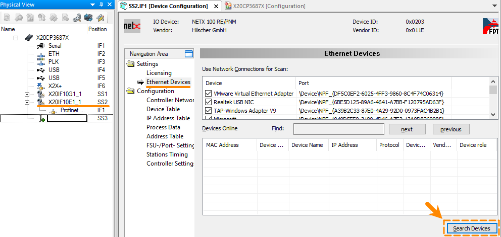
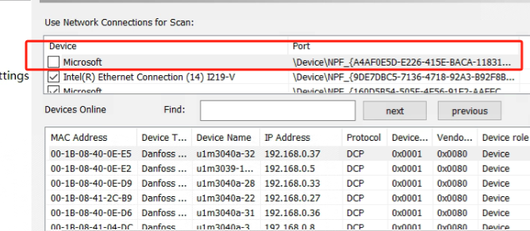

> Tags: #PROFINET #AS #闪退

# B08.055-PROFINIET主站扫描网络从站扫出几个站后闪退或白屏

- 
- 搜查出几个站后AS软件就闪退
- 使用AS软件 4.12.5.95
- 并不是所有人电脑都有这样的问题

# 解决方式

- 取消Network Connections for Scan中的第一个Microsoft选项，即可正常扫描。
    - 

# 更新日志

| 日期         | 修改人        | 修改内容 |
| :--------- | :--------- | :--- |
| 2024-03-21 | HHR YZY | 初次创建 |
