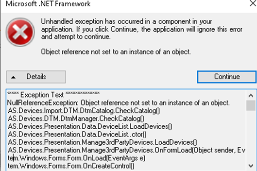
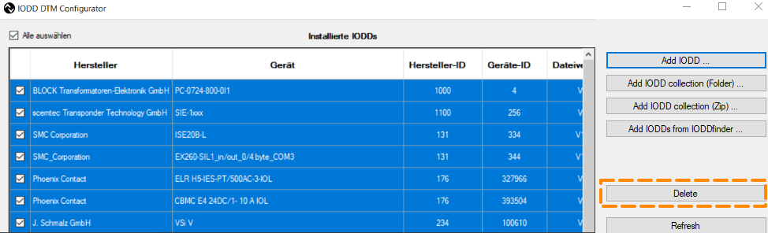
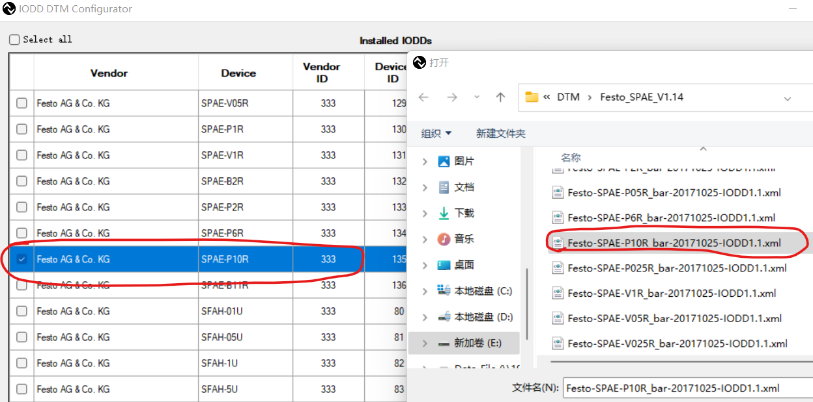

> Tags: #IODD

- [1 057使用IO-Link以及IODD异常处理](#_1-057%E4%BD%BF%E7%94%A8io-link%E4%BB%A5%E5%8F%8Aiodd%E5%BC%82%E5%B8%B8%E5%A4%84%E7%90%86)
- [2 AS编译项目报错 no data was exported from the supplied DTM](#_2-as%E7%BC%96%E8%AF%91%E9%A1%B9%E7%9B%AE%E6%8A%A5%E9%94%99-no-data-was-exported-from-the-supplied-dtm)
- [3 FDT/DTM 容器损坏](#_3-fdtdtm-%E5%AE%B9%E5%99%A8%E6%8D%9F%E5%9D%8F)
- [4 Festo-SPAE-P10R_bar文件导入DTM IODD文件更新失败](#_4-festo-spae-p10r_bar%E6%96%87%E4%BB%B6%E5%AF%BC%E5%85%A5dtm-iodd%E6%96%87%E4%BB%B6%E6%9B%B4%E6%96%B0%E5%A4%B1%E8%B4%A5)
- [5 更新日志](#_5-%E6%9B%B4%E6%96%B0%E6%97%A5%E5%BF%97)

# 1 057使用IO-Link以及IODD异常处理

# 2 AS编译项目报错 no data was exported from the supplied DTM

- 现象
    - 项目原本正常，在其他电脑上编译通过，更换电脑后，编译提示 no data was exported from the supplied DTM
- 检查方式
    - 打开 IODD DTM Configurator软件
    - 
    - 检查正在使用的设备文件，检查确认对应的文件条目，黄色警告符号提示文件异常，绿色标记说明文件正常。
- 常见解决方式
    - IODD 文件损坏。
    - 删除了旧文件并重新安装了新文件后解决。

# 3 FDT/DTM 容器损坏

- 现象
    - 如果有时出现以下异常，原因可能是 FDT / DTM 容器损坏。
    - 
    - Null ReferenceException: Object reference not set to an instance of an object.
    - AS.Devices.lmport.DTM.DtmCatalog.CheckCatalog()
- 解决方式
    - 打开 **IODD DTM Configurator**
    - 删除所有模块，然后重新插入将使用的模块。
    - 

# 4 Festo-SPAE-P10R_bar文件导入DTM IODD文件更新失败

- 现象
    - Festo-SPAE-P10R_bar得文件，在DTM configurator加载后却为 Festo-SPAE-P10R，导致AS项目使用报错
    - 
- 解决方式
    - 用文本编辑器打开文件Festo-SPAE-P10R_bar-20171025-IODD1.1.xml
    - 找到 `<Text id="TN_Device_Name" value="SPAE-P10R" />`
    - 改成 `<Text id="TN_Device_Name" value="SPAE-P10R_bar" />`
    - 保存文件
    - 重新导入AS

# 5 更新日志

| 日期                             | 修改人 | 修改内容 |
| :----------------------------- | :-- | :--- |
| 2024-07-29 | YZY | 初次创建 |
