> Tags: #POWERLINK #TCP

- [1 060基于POWERLINK网络扩展ETH网口_X20HB8815](#_1-060%E5%9F%BA%E4%BA%8Epowerlink%E7%BD%91%E7%BB%9C%E6%89%A9%E5%B1%95eth%E7%BD%91%E5%8F%A3_x20hb8815)
- [2 使用案例](#_2-%E4%BD%BF%E7%94%A8%E6%A1%88%E4%BE%8B)
- [3 配置方式](#_3-%E9%85%8D%E7%BD%AE%E6%96%B9%E5%BC%8F)
- [4 实物连接演示](#_4-%E5%AE%9E%E7%89%A9%E8%BF%9E%E6%8E%A5%E6%BC%94%E7%A4%BA)
- [5 更新日志](#_5-%E6%9B%B4%E6%96%B0%E6%97%A5%E5%BF%97)

# 1 060基于POWERLINK网络扩展ETH网口_X20HB8815

- X20HB8815模块是一个HUB，通过此模块，可以基于POWERLINK网络，实现TCP/IP通信。
- 例如：
    - 在POWERLINK一个站点模块旁，扩展ETH口，实现ModbusTCP通信。
    - 风电场景下，PLC在塔底，塔顶的POWERLINK的扩展模块通过光纤与塔底的PLC通信，可在塔顶，使用X20HB8815，访问到PLC的mappView画面/VNC画面，使用AS软件在塔顶进行程序更新。
- 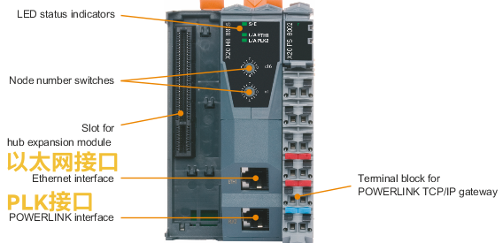
- 详细介绍
    - X20HB8815硬件模块作为POWERLINK与TCP/IP网关可以在POWERLINK V2网络和TCP/IP网络之间交换所有类型的应用程序数据（HMI，诊断，参数数据等）。
    - 它的功能类似于第2层交换机，但循环POWERLINK数据包不会路由到ETH端口。
    - 关于第2层交换机的功能，应该注意的是，网关使用存储转发原则。 网关功能不需要单独配置。
    - 当网关收到帧时，它会将发送方的MAC地址和相应的接口保存在源地址表（SAT）中。 如果在SAT中找到目标地址，则网关将帧路由到相应的接口。 具有广播或多播地址的帧始终路由到所有接口。
    - 当在“ETH”端口接收到大于为POWERLINK配置的MTU的IP数据包时，如果允许，它们将被分包。
        - “ETH”端口：TCP / IP网络接口
        - “PLK”端口：POWERLINK网络的接口
    - 扩展到左侧的总线模块允许连接最多2个集线器扩展模块以及网关。
        - 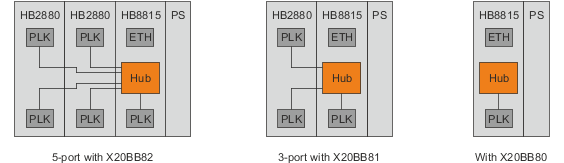
- 注意事项
    - X20HB8815无法操作 I/O 模块。
    - 不支持POWERLINK V1。
    - X20HB8815还可以作为仅支持异步的POWERLINK控制节点运行。 确保节点编号介于1和239之间，并且它实际存在且尚未在POWERLINK网络中使用。
    - 通信速率差异：通过以太网（PC控制系统）的直接连接比通过X20HB8815的连接更快，因为必须与POWERLINK协议共享可用带宽。
    - 搜索设备IP地址服务（SNMP）不适用于X20HB8815。
    - MTU size
        - 目前不支持自动MTU配置。 MTU大小设置为300（默认值）。
        - 可以在模块的I / O配置中的“Asynchronous Optimization” → “Local ASnd MTU”下手动设置MTU。
            - 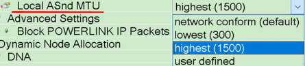
    - 异步发送优先级
        - 如果需要，可以为模块分配更高的异步发送优先级。此设置是在 “Asynchronous Optimization” → “Asynchronous Send Priority” 下的模块的 I/O 配置。
        - 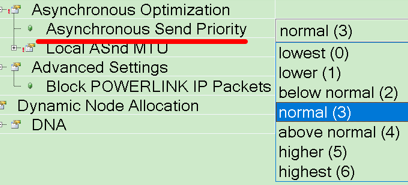
        - 如果优先级设置得太高，则在某些情况下，其他POWERLINK站可能无法按时发送其异步数据。

# 2 使用案例

- 通过POWERLINK与Automation Studio或SDM在线连接
    - 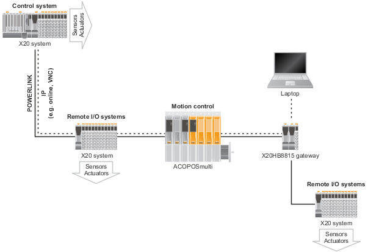
- 通过POWERLINK网络使用 TCP/IP服务
    - 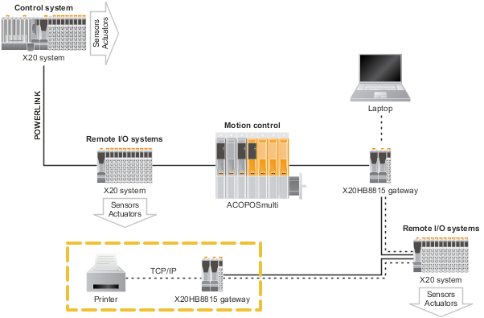
- 通过POWERLINK使用X20HB8815连接终端面板
    - 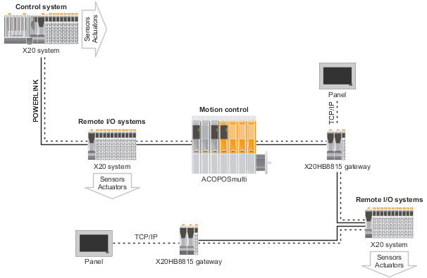

# 3 配置方式

- Physical View视图以及拓扑结构
    - 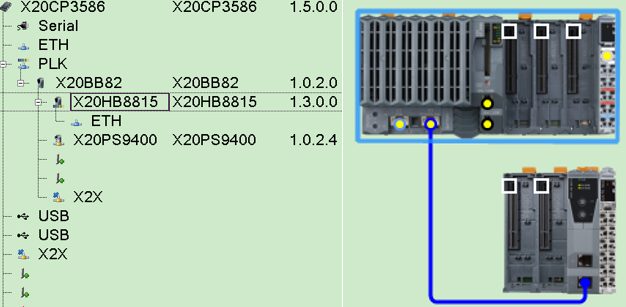
- PLK参数配置
    - 请确认手动设置IF3口PLK的Ethernet parameters所对应的IP地址。IP地址不能与IF2网口配置的IP地址在同一网段。
    - 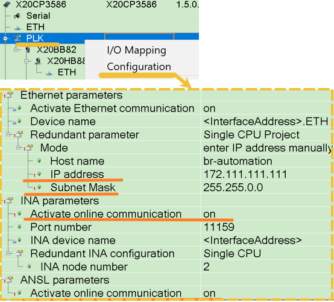
- 通过X20HB8815的ETH口是无法通过AS软件 → Online → Online Setting → Browse扫描出来PLC，需要手写IP地址进行Connect操作。
    - 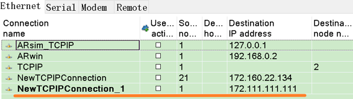
    - 如果使用Automation Studio 4.3以上的软件以及Runtime，请务必开启ANSL通讯，否则AS软件无法连接上设备
- 若需要访问的内容数据量大，需要将PLK的MTU size与Asynchronous Slots per cycle参数进行调整，否则在连接MappView画面会出现严重的卡顿
    - 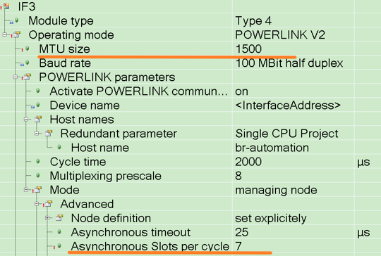
    - MTU size参数为POWERLINK每个循环周期异步端通讯的最大传输单元，考虑到需要通过POWERLINK实现TCP/IP通讯，建议设置为最大。
    - Asynchronous Slots per cycle参数为每个PLK循环周期可以发送的异步帧数量，将此参数设置为最大8，可加速TCP/IP单位时间发包，使基于TCP/IP的应用数据交互更流畅。开启此参数后建议多观察PLK的I/O mapping参数中的FailedCycleCount以及CycleIdleTime，确保异步段发包数增加不影响PLK的数据实时通讯。
        - 
    - 建议将X20HB8815参数配置参数的MTU改为1500
        - 

# 4 实物连接演示

<video muted autoplay="autoplay" loop="loop" width="640" height="360" controls>
  <source src="/B08_技术_通信/FILES/060基于POWERLINK网络扩展ETH网口_X20HB8815/X20hb8815测试1.mp4" type="video/mp4">
  Your browser does not support the video tag.
</video>

- 通过PC端进行ping操作，发现回包的速率略慢
- 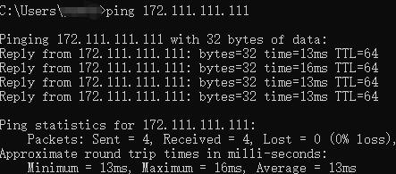
- MappView画面访问测试默认参数：界面加载只能显示一半内容
    - PLK的MTU size为300，Asynchronous Slots per cycle为1
    - 能够访问，但加载很慢，几乎没有加载出来
    - 
- MappView画面使用调整参数，访问流畅
    - PLK的MTU size为1500，Asynchronous Slots per cycle为7
    - 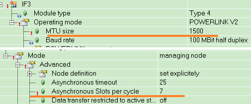
    - 能够非常流畅的访问mappView画面

# 5 更新日志

| 日期                             | 修改人 | 修改内容 |
| :----------------------------- | :-- | :--- |
| 2024-07-31 | YZY | 初次创建 |
