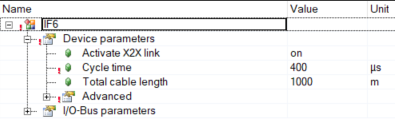

> Tags: #RS485

- [1 061贝加莱RS485通信速率最快能到多少](#_1-061%E8%B4%9D%E5%8A%A0%E8%8E%B1rs485%E9%80%9A%E4%BF%A1%E9%80%9F%E7%8E%87%E6%9C%80%E5%BF%AB%E8%83%BD%E5%88%B0%E5%A4%9A%E5%B0%91)
- [2 合适的参数](#_2-%E5%90%88%E9%80%82%E7%9A%84%E5%8F%82%E6%95%B0)
	- [2.1 提高程序循环任务 → 0.4ms](#_21-%E6%8F%90%E9%AB%98%E7%A8%8B%E5%BA%8F%E5%BE%AA%E7%8E%AF%E4%BB%BB%E5%8A%A1-%E2%86%92-04ms)
	- [2.2 X2X通讯时间 → 0.4ms](#_22-x2x%E9%80%9A%E8%AE%AF%E6%97%B6%E9%97%B4-%E2%86%92-04ms)
	- [2.3 传输字节数量 → 4字节](#_23-%E4%BC%A0%E8%BE%93%E5%AD%97%E8%8A%82%E6%95%B0%E9%87%8F-%E2%86%92-4%E5%AD%97%E8%8A%82)
	- [2.4 波特率 → 115200](#_24-%E6%B3%A2%E7%89%B9%E7%8E%87-%E2%86%92-115200)
- [3 参数对于控制RS485的通讯速度的关联性](#_3-%E5%8F%82%E6%95%B0%E5%AF%B9%E4%BA%8E%E6%8E%A7%E5%88%B6rs485%E7%9A%84%E9%80%9A%E8%AE%AF%E9%80%9F%E5%BA%A6%E7%9A%84%E5%85%B3%E8%81%94%E6%80%A7)
	- [3.1 程序的循环任务时间](#_31-%E7%A8%8B%E5%BA%8F%E7%9A%84%E5%BE%AA%E7%8E%AF%E4%BB%BB%E5%8A%A1%E6%97%B6%E9%97%B4)
	- [3.2 X2X的通讯时间参数](#_32-x2x%E7%9A%84%E9%80%9A%E8%AE%AF%E6%97%B6%E9%97%B4%E5%8F%82%E6%95%B0)
	- [3.3 传输的字节数数量大小](#_33-%E4%BC%A0%E8%BE%93%E7%9A%84%E5%AD%97%E8%8A%82%E6%95%B0%E6%95%B0%E9%87%8F%E5%A4%A7%E5%B0%8F)
	- [3.4 波特率](#_34-%E6%B3%A2%E7%89%B9%E7%8E%87)
- [4 搭建方式与测试结论](#_4-%E6%90%AD%E5%BB%BA%E6%96%B9%E5%BC%8F%E4%B8%8E%E6%B5%8B%E8%AF%95%E7%BB%93%E8%AE%BA)
- [5 更新日志](#_5-%E6%9B%B4%E6%96%B0%E6%97%A5%E5%BF%97)

# 1 061贝加莱RS485通信速率最快能到多少

- 使用两块X20CS1030模块分别作为Sender与Receiver，使用贝加莱DVFrame库函数
- 一发一收最快时间：9 ms
    - Sender 发出一帧数据 → Receiver 接受数据 → Receiver发送数据 → Sender接受数据
- 单次发送，底层驱动和实际芯片传输数据所需最少时间为 4ms
- 影响此通信速率的因素
    - 程序循环任务（0.4ms）
    - X2X通讯时间 （0.4ms )
    - 传输字节数量（4字节）
    - 波特率（115200） ← 影响最大

# 2 实际应用案例使用介绍

- DVFrame功能块运行任务需要2个周期才能执行完成一次，在一定的数据量要求下，与第三方设备稳定通信，在2ms循环任务周期下，可实现18ms一次下位数据刷新。
- 程序负载较低（X20CP1585 为 1%）
- 程序执行读写解析在一个case下一个周期执行完成，可以做到20ms刷新读取数据，长时间运行正常。
- 注意：如果基于RS485的ModbusRTU通信，若使用DRV_mbus库，则最快刷新时间只能在24ms，正常使用一般在50ms的数据刷新周期。若希望通信速度更快，建议更换使用DVFrame库发报文。

# 3 合适的参数

- 如何选取一个合适的参数才能达到这么快的速度，需要考虑下面的关联性数据
- 此次测试选用了最合适的参数并且选择了X20CP3586作为对象进行了测试。

## 3.1 提高程序循环任务 → 0.4ms

- 由于使用X20CS1030模块，注意使用X2X总线为时钟起点
    - 

## 3.2 X2X通讯时间 → 0.4ms

- 修改X2X时间
    - 

## 3.3 传输字节数量 → 4字节

- 需要保证最大字节数大于传输字节数，否则会导致出现分段传输现象，最大字节数为1024
    - 
- 有2个地方需要修改，修改模块配置和程序配置
    - 
    - 修改传输字节长度即可
    - 

## 3.4 波特率 → 115200

- 修改模块波特率
    - 
- 依然有2个地方需要修改程序和模块配置中。
    - 

# 4 参数对于控制RS485的通讯速度的关联性

- 对于速度有最大影响的是波特率的变化。
- 当不使用最快波特率的情况下，通讯速度会出现非常大的下降。
- 其他的数据变化都是成比例关系，而波特率会呈现非线性关系。

## 4.1 程序的循环任务时间

| 循环时间参数 | 64ms  | 32ms  | 16ms | 8ms  | 4ms  | 0.8ms  | 0.4ms |
| ------ | ----- | ----- | ---- | ---- | ---- | ------ | ----- |
| 延迟速率   | 320ms | 160ms | 80ms | 40ms | 20ms | 10.4ms | 9ms   |

## 4.2 X2X的通讯时间参数

| X2X的通讯时间参数 | 8ms   | 4ms  | 2ms  | 1.6ms  | 1.2ms  | 0.8ms  | 0.4ms |
| ---------- | ----- | ---- | ---- | ------ | ------ | ------ | ----- |
| 延迟速率       | 120ms | 60ms | 34ms | 27.2ms | 20.4ms | 15.4ms | 9ms   |

## 4.3 传输的字节数数量大小

| 传输的字节数数量大小（字节） | 400     | 200    | 100  | 48   | 24     | 12     | 4   |
| -------------- | ------- | ------ | ---- | ---- | ------ | ------ | --- |
| 延迟速率           | 160.8ms | 77.2ms | 38ms | 22ms | 17.2ms | 13.2ms | 9ms |

## 4.4 波特率

| 波特率参数 | 115200 | 57600 | 38400 | 19200 | 9600 | 4800 | 2400  | 1200  |
| ----- | ------ | ----- | ----- | ----- | ---- | ---- | ----- | ----- |
| 延迟速率  | 9ms    | 40ms  | 40ms  | 56ms  | 72ms | 88ms | 152ms | 264ms |

# 5 搭建方式与测试结论

- 硬件平台
    - 一个PLC带2个X20CS1030互相通信，2个X20CS1030之间通过一股线缆进行连接。
    - 
- 测试环境软件平台设计
    - 通过2组程序（基于DVFrame官方例程调整）分别控制2个X20CS1030程序
    - Sender程序会将一个每循环累加的数值通过X20CS1030模块发送给另一个X20CS1030模块
    - Receiver接收到数据后，将他重新打包经过X20CS1030模块发送回Sender管理的X20CS1030模块
    - 接收到数据的Sender立即计算当前循环和返回数据的差值，计算出经过上面过程中的时间差
- RS485通信对传工作流程
    - 
- 结果描述
    - 从测试的结果来看，如果将所有的相关参数都调整成合适的数据（合适的参数参见下一章），完成一次来回通讯和PLC中内部逻辑处理的总共时间为 8.8ms ~ 9.2ms。
        - 这个数值时间包括下面的过程，
            - Sender程序发送数据 + 底层驱动发送数据处理 + 底层驱动接收数据处理 + Receiver程序获得数据 + Receiver程序发送数据 + 底层驱动发送数据处理 + 底层驱动接收数据处理 + Sender程序接收数据
    - 单次发送时底层驱动和实际芯片传输数据所需的时间为 4ms ~ 4.4ms。
        - 除去应用层处理数据和调用驱动功能块的时间后，检查Sender程序发出数据时的步和Receiver程序接收到数据的步之间的差值，此差值大约为4ms ~ 4.4ms，

# 6 更新日志

| 日期         | 修改人               | 修改内容 |
| :--------- | :---------------- | :--- |
| 2024-08-08 | DHZ HYW YZY | 初次创建 |
