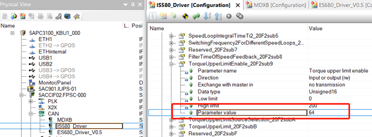
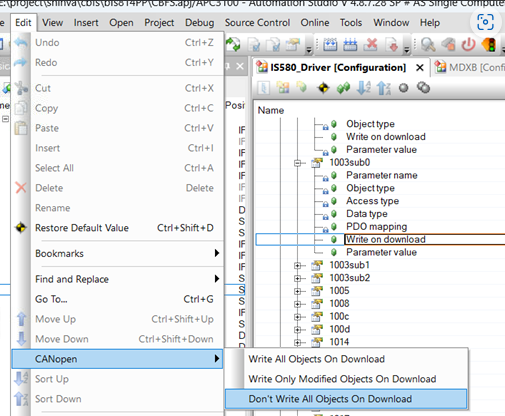
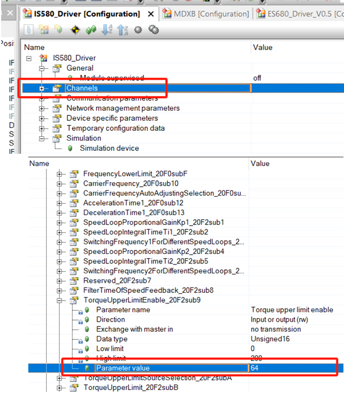
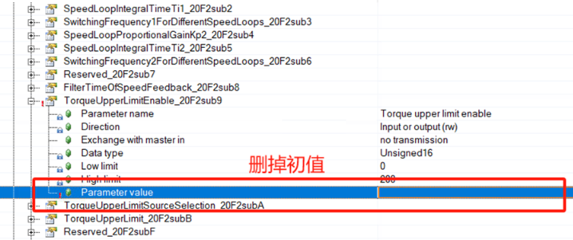
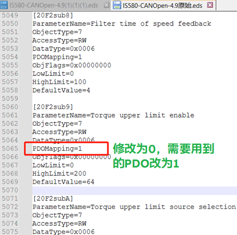

> Tags: #CANopen #驱动器

- [1 B08.062.CANopen驱动器参数被PLC初始化的解决方法](#_1-b08062canopen%E9%A9%B1%E5%8A%A8%E5%99%A8%E5%8F%82%E6%95%B0%E8%A2%ABplc%E5%88%9D%E5%A7%8B%E5%8C%96%E7%9A%84%E8%A7%A3%E5%86%B3%E6%96%B9%E6%B3%95)
- [2 解决方式](#_2-%E8%A7%A3%E5%86%B3%E6%96%B9%E5%BC%8F)
	- [2.1 将所有通道的 Write on download 选项改为off](#_21-%E5%B0%86%E6%89%80%E6%9C%89%E9%80%9A%E9%81%93%E7%9A%84-write-on-download-%E9%80%89%E9%A1%B9%E6%94%B9%E4%B8%BAoff)
	- [2.2 将Channels中对象的Parameter value屏蔽](#_22-%E5%B0%86channels%E4%B8%AD%E5%AF%B9%E8%B1%A1%E7%9A%84parameter-value%E5%B1%8F%E8%94%BD)
	- [2.3 不必要的通道不要配置为PDO](#_23-%E4%B8%8D%E5%BF%85%E8%A6%81%E7%9A%84%E9%80%9A%E9%81%93%E4%B8%8D%E8%A6%81%E9%85%8D%E7%BD%AE%E4%B8%BApdo)
- [3 更新日志](#_3-%E6%9B%B4%E6%96%B0%E6%97%A5%E5%BF%97)

# 1 B08.062.CANopen驱动器参数被PLC初始化的解决方法

- 贝加莱PLC（APC3100工控机）通过CANopen带汇川驱动器，当PLC连接到驱动器时，会将许多通道的值初始化为驱动器配置中的默认值。
- 

# 2 解决方式

## 2.1 将所有通道的 Write on download 选项改为off

- 该操作只影响下载程序时 Device specific parameters 中的对象。
- 如果改为off，则在下载程序时不会将 Parameter value 的值更新到驱动器中。Device specific parameters中的对象对应eds文件中的 PDOMaping=0。
- 🔴 但是对于Channels 中可以开放为PDO的通道，如果设置了初值，在PLC与驱动器建立连接时会被初始化到PLC，该机制无法通过配置一键关闭。
- 

## 2.2 将Channels中对象的Parameter value屏蔽

- 在CANopen硬件的配置中，Channels列表中包含了所有可开放PDO通道的对象。PDO（过程数据对象）简单讲就是能开放到IOMapping中直接关联变量的参数。
- 因为PDO是实时读写的过程变量，一般只需要开放控制字、状态字、设定速度（频率）、反馈速度（频率）、电流、报警码等对象。而像电机参数或控制参数类只需要写一次的对象一般用SDO（服务数据对象），可以通过函数只读写一次，减小总线的负载，没有必要配置到PDO通道中，或者直接通过驱动器面板进行设置。
- 贝加莱PLC对于CANopen的机制是如果在Channels中配置了Parameter value，在与CANopen从站建立连接时会将改该值写入对应的对象中。
- 以20F2sub9对象为例，因配置了初值64，每次建立连接时驱动器中对应的通道会被初始化成64。这个可以通过AS中的配置取消初值（删掉初值，不是设为0）。
- 
- 
- 如果eds文件中配置了大量的PDO且都有初值，在AS中删除初始的工作量比较大，也可以通过修改eds文件进行处理。

## 2.3 不必要的通道不要配置为PDO

- CANopen的物理层是CAN，其总线的负载是有限的，PDO通道尽量只开放需要的。测试将eds文件中PDO对象的默认值删除后出现PLC无法与驱动器通讯的情况。所以尝试将非必要的PDO对象关闭，移到CANopen配置中Device specific parameters中。具体操作是将eds文件中的PDOMapping=1改为PDOMapping=0。
- eds文件可以用文本编辑器打开，将所有的PDOMapping=1替换为PDOMapping=0，然后再将需要配置PDO的通道修改回1。例如控制字、给定速度等。
- 

# 3 更新日志

| 日期         | 修改人 | 修改内容 |
| :--------- | :-- | :--- |
| 2024-08-16 | ZJM | 初次创建 |
