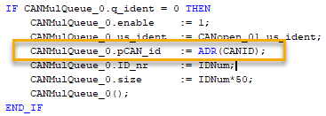
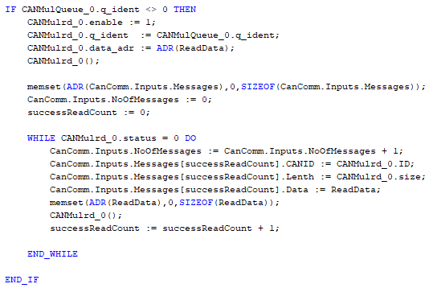
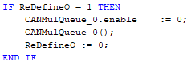

> Tags: #CAN

# B08.065.CAN通信使用CAN_Lib库总结

- 1___ CAN id只是一个自定义的id，网络上可以存在重复id。比如3个驱动器的id分别定义为1,2,3，测试工具也定义为1；这样测试工具和驱动器1发的数据都可以收到。
- 2___ COB对于一个id，只能有一个。但是读和写都会分别建立COB，所以第二个调用的会报错 **8806**；所以读和写调用完后需要分别将enable置0并调用，以删除其所建立的COB；
- 3___ 如果不即刻读取CAN总线的数据，数据会丢失不会再读到。使用case语句，将读和写分别放在不同的step，程序放在10ms，在write的step发出读驱动器位置指令后，下个周期跳转到read step，会报错 **8877** 读不到数据。如果程序放在2ms就可以读到。如果程序放在2ms可以读到（2ms循环周期会占用大量cpu资源）。后去掉了case语句，读和写都放在循环，放在10ms可以读到。
- 4___ 如果有多个接收数据，会造成overwrite，报错 **8872** 。使用测试工具给驱动器1发送读位置指令，测试工具会收到驱动器返回的当前位置，PLC也会接收到驱动器返回的当前位置。但是会报错 **8872**，根据后来的测试，应该是测试工具发出的读位置指令也被PLC接收，但后来又被驱动器返回的当前位置覆盖了。
- 5___ 使用CANqueue防止覆盖问题。CANqueue可以为读创建一个队列，如果有多个报文到达，可以防止后面的报文覆盖前面的报文。
    - 使用注意：CANqueue也会创建COB，需要写的时候也要把CANqueue的COB删掉；
    - CANqueue只能调用一次，如果已经成功创建了队列再调用会报错，可在调用时加个判断条件，判断 CANqueue 的返回q_ident是否存在；
    - CANqueue只是创建队列，需要用CANrd把数据读出来，CANrd一次只能读一个报文，如果有多个报文，不能每个循环读一次，下个循环数据就被清掉了会报错 **8877**，需要在一个循环内多次调用CANrd读出所有报文，可以参考帮助的例子使用while循环。
    - 读数据前需要清空存放数据的变量，否则旧数据不会被覆盖，比如上次读到3个数据5 6 7，这次只读到一个数据8，那么变量数组就会是8 6 7；
- 6___ 希望能够接收总线上所有数据，并能够区分是那个ID的数据。所以改为CANMulQueue和CANMulrd；
    - 使用注意：CANID数组的类型需要是UDINT类型，如果类型不对，则读不到数据，一直 **8877**；
    - 
    - 同样需要使用while循环在一个周期内读完所有总线上数据；
    - 
    - 如果重新定义了CANID个数及ID值的话，需要重新调用CANMulQueue功能块；
    - 
- 7___ 测试数据
    - 使用CANWrite数组同时写32个查询位置命令给电机，电机会返回32个数据；如果任务周期是10ms，需要2个周期读完32个数据；如果任务周期是2ms，需要3个周期完成读完32个数据；

# 更新日志

| 日期         | 修改人 | 修改内容 |
| :--------- | :-- | :--- |
| 2023-01-06 | MSS | 初次创建 |
| 2024-10-11 | YZY | 整理更新 |
