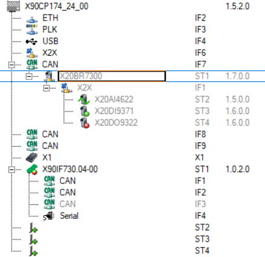
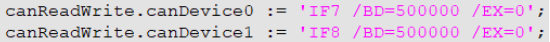
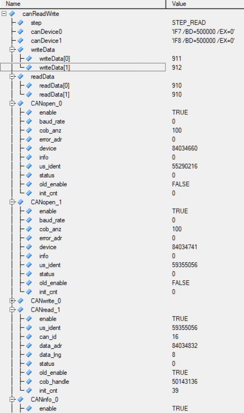
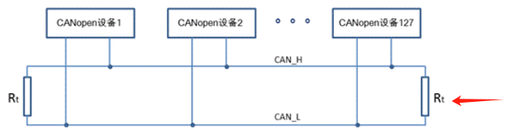
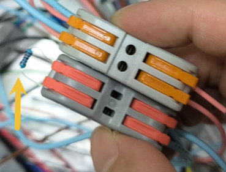
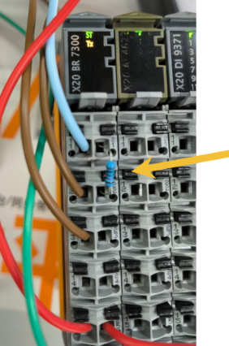

> Tags: #X90 #CAN

- [1 B08.066.X90硬件使用CAN口通信注意事项](#_1-b08066x90%E7%A1%AC%E4%BB%B6%E4%BD%BF%E7%94%A8can%E5%8F%A3%E9%80%9A%E4%BF%A1%E6%B3%A8%E6%84%8F%E4%BA%8B%E9%A1%B9)
- [2 解决方式：外接120欧电阻](#_2-%E8%A7%A3%E5%86%B3%E6%96%B9%E5%BC%8F%EF%BC%9A%E5%A4%96%E6%8E%A5120%E6%AC%A7%E7%94%B5%E9%98%BB)
- [3 更新日志](#_3-%E6%9B%B4%E6%96%B0%E6%97%A5%E5%BF%97)

# 1 B08.066.X90硬件使用CAN口通信注意事项

- X90上直接使用 CAN_Lib 例程 [贝加莱CAN通讯使用例程说明 > 通过编程实现CAN通讯 > 例程与用例 > CAN_Lib > CAN_read/write_1对1](https://can.brhelp.cn/can_read_write_1to1.html) 无法通信成功，一直显示8877 收不到数据。同样的程序使用X20CP1381控制器能够正常通信。

# 2 解决方式：外接120欧电阻

- X90比较特殊，没法在软件里设置开启终端电阻，必须接上一个120欧的终端电阻才能通信上。
    - 
- 用的本身的IF7和IF8通信，IF7发数据，IF8收数据
    - 
    - 
- 120欧终端电阻接法
    - 接在CAN H和CAN L之间
    - 
    - 
- CAN接收端（X20BR7300 CAN I/O slave）也需要接终端电阻，不然也通讯不上
    - 

# 3 更新日志

| 日期         | 修改人        | 修改内容 |
| :--------- | :--------- | :--- |
| 2024-10-11 | HHR YZY | 初次创建 |
