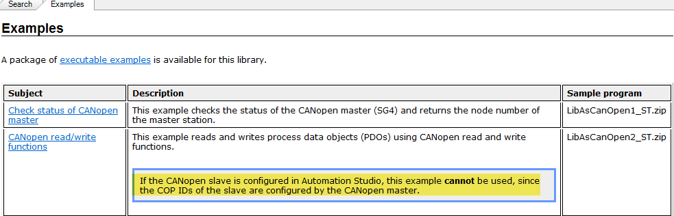

> Tags: #CANopen

- [1 B08.067.使用AsCANopen库注意事项](#_1-b08067%E4%BD%BF%E7%94%A8ascanopen%E5%BA%93%E6%B3%A8%E6%84%8F%E4%BA%8B%E9%A1%B9)
- [2 使用AsCANopen库的CANopenRegisterCOBID报错NO_FREE_COBID_TABLE_ENTRY](#_2-%E4%BD%BF%E7%94%A8ascanopen%E5%BA%93%E7%9A%84canopenregistercobid%E6%8A%A5%E9%94%99no_free_cobid_table_entry)
	- [2.1 原因：COB ID注册具有独占性（AS配置/库配置 二选一）](#_21-%E5%8E%9F%E5%9B%A0%EF%BC%9Acob-id%E6%B3%A8%E5%86%8C%E5%85%B7%E6%9C%89%E7%8B%AC%E5%8D%A0%E6%80%A7%EF%BC%88as%E9%85%8D%E7%BD%AE%E5%BA%93%E9%85%8D%E7%BD%AE-%E4%BA%8C%E9%80%89%E4%B8%80%EF%BC%89)
- [3 使用AsCANopen库来读/写PDO与AS中配置通道冲突](#_3-%E4%BD%BF%E7%94%A8ascanopen%E5%BA%93%E6%9D%A5%E8%AF%BB%E5%86%99pdo%E4%B8%8Eas%E4%B8%AD%E9%85%8D%E7%BD%AE%E9%80%9A%E9%81%93%E5%86%B2%E7%AA%81)
	- [3.1 原因：PDO通道配置方式与通过库来写PDO方式二选一](#_31-%E5%8E%9F%E5%9B%A0%EF%BC%9Apdo%E9%80%9A%E9%81%93%E9%85%8D%E7%BD%AE%E6%96%B9%E5%BC%8F%E4%B8%8E%E9%80%9A%E8%BF%87%E5%BA%93%E6%9D%A5%E5%86%99pdo%E6%96%B9%E5%BC%8F%E4%BA%8C%E9%80%89%E4%B8%80)
	- [3.2 解决方式：使用SDO完成绑定（没有EDS文件）](#_32-%E8%A7%A3%E5%86%B3%E6%96%B9%E5%BC%8F%EF%BC%9A%E4%BD%BF%E7%94%A8sdo%E5%AE%8C%E6%88%90%E7%BB%91%E5%AE%9A%EF%BC%88%E6%B2%A1%E6%9C%89eds%E6%96%87%E4%BB%B6%EF%BC%89)
	- [3.3 解决方式：直接PDO配置（有EDS文件）](#_33-%E8%A7%A3%E5%86%B3%E6%96%B9%E5%BC%8F%EF%BC%9A%E7%9B%B4%E6%8E%A5pdo%E9%85%8D%E7%BD%AE%EF%BC%88%E6%9C%89eds%E6%96%87%E4%BB%B6%EF%BC%89)
- [4 更新日志](#_4-%E6%9B%B4%E6%96%B0%E6%97%A5%E5%BF%97)

# 1 B08.067.使用AsCANopen库注意事项

# 2 使用AsCANopen库的CANopenRegisterCOBID报错NO_FREE_COBID_TABLE_ENTRY

- 使用AsCANopen Demo，返回错误NO_FREE_COBID_TABLE_ENTRY。发送COBID设置为16 #202 ，接收COBID设置为16 #182 。
- 使用CANopenRegisterCOBID()注册COB ID，error接口返回报错为 66，即16进制的42
- 
- 
- 

## 2.1 原因：COB ID注册具有独占性（AS配置/库配置 二选一）

- CANopen从站已经配置了Automation Studio（从站Lexium32M）。
- 从示例帮助中了解以下信息，COB ID注册只能独占使用：通过Automation Studio配置从站，或使用AsCANopen功能。
- https://help.br-automation.com/#/en/4/libraries%2Fascanopen%2Fsamples%2Fsamples_ascanopen.html
- 
- COB ID在系统中注册，并且必须是唯一的。
- 如果您通过Automation Studio配置从站，PDO的COB ID将由系统任务处理CANopen注册。在这种情况下再次尝试将它们再次通过CANopenRegisterCOBID进行注册，将收到此 NO_FREE_COBID_TABLE_ENTRY 错误。

# 3 使用AsCANopen库来读/写PDO与AS中配置通道冲突

- 如果我们使用AsCANopen库来读/写PDO，那么我们不能配置通道 (因为它会冲突)，我们如何将对象映射到PDO？(如下图所示)，库可以有这样的功能来做映射吗？
    - 

## 3.1 原因：PDO通道配置方式与通过库来写PDO方式二选一

- 根本原因为COB ID反复注册导致的报错。
- 使用通道映射就等于默认注册了COB ID，如果又使用AsCANopen又要注册一遍就会冲突。

## 3.2 解决方式：使用SDO完成绑定（没有EDS文件）

> 若没有EDS文件，只能通过写SDO进行实现PDO的通道映射
- 映射是通过SDO（服务数据对象）完成的。AsCANopen 库包含用于读取和写入SDO的功能块，例如“CANopenSDOWriteData”。
- 任何CANopen从站通常都提供称为“PDO mapping”的对象。基本上，您需要将需要传输的对象写入此参数。换句话说，您将PDO参数的值写入此映射参数。为此，您需要了解从站，这意味着您必须至少拥有EDS文件并且从站能提供的可用PDO和SDO的描述。
- 另请注意，在不使用EDS文件时，编写映射并不是需要做的唯一事情。还必须配置从站来调整必要的参数。

## 3.3 解决方式：直接PDO配置（有EDS文件）

> 若有EDS文件，建议直接通过配置的方式，通过PDO通道映射绑定。

# 4 更新日志

| 日期         | 修改人               | 修改内容 |
| :--------- | :---------------- | :--- |
| 2024-10-22 | PJR ZSY YZY | 初次创建 |
