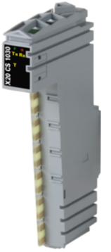
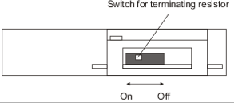
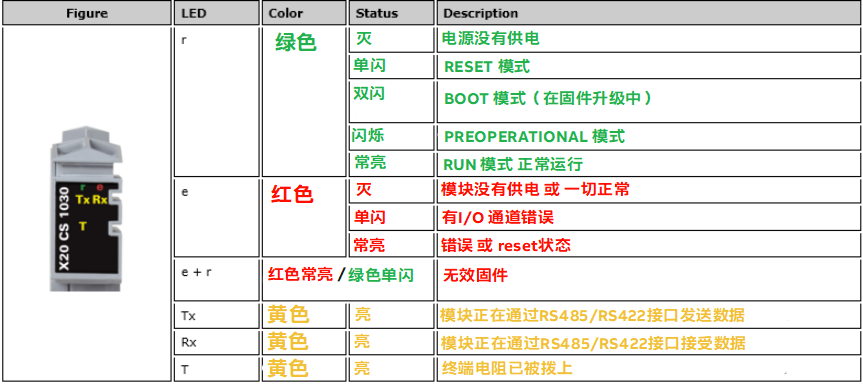
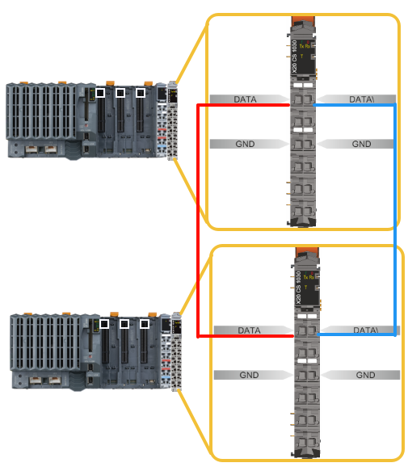
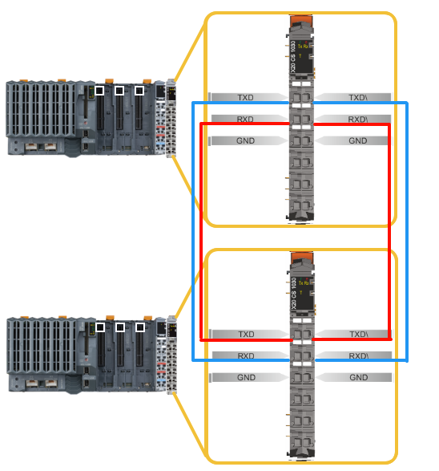
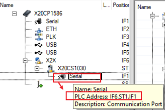

> Tags: #RS485

- [1 B08.068.使用X20CS1030实现RS485与RS422通信案例](#_1-b08068%E4%BD%BF%E7%94%A8x20cs1030%E5%AE%9E%E7%8E%B0rs485%E4%B8%8Ers422%E9%80%9A%E4%BF%A1%E6%A1%88%E4%BE%8B)
- [2 关联文档](#_2-%E5%85%B3%E8%81%94%E6%96%87%E6%A1%A3)
- [3 X20CS1030接线方式](#_3-x20cs1030%E6%8E%A5%E7%BA%BF%E6%96%B9%E5%BC%8F)
- [4 编程说明](#_4-%E7%BC%96%E7%A8%8B%E8%AF%B4%E6%98%8E)
	- [4.1 FRM_xopen() 的 Device接口说明](#_41-frm_xopen-%E7%9A%84-device%E6%8E%A5%E5%8F%A3%E8%AF%B4%E6%98%8E)
	- [4.2 FRM_xopen() 的 mode 参数说明](#_42-frm_xopen-%E7%9A%84-mode-%E5%8F%82%E6%95%B0%E8%AF%B4%E6%98%8E)
	- [4.3 DVFrame 帧通讯函数说明](#_43-dvframe-%E5%B8%A7%E9%80%9A%E8%AE%AF%E5%87%BD%E6%95%B0%E8%AF%B4%E6%98%8E)
		- [4.3.1 AS帮助](#_431-as%E5%B8%AE%E5%8A%A9)
		- [4.3.2 FRM_xopen 函数](#_432-frm_xopen-%E5%87%BD%E6%95%B0)
		- [4.3.3 FRM_read 函数](#_433-frm_read-%E5%87%BD%E6%95%B0)
		- [4.3.4 FRM_write 函数](#_434-frm_write-%E5%87%BD%E6%95%B0)
		- [4.3.5 FRM_close 函数](#_435-frm_close-%E5%87%BD%E6%95%B0)
		- [4.3.6 FRM_ rbuf 函数](#_436-frm_-rbuf%C2%A0%E5%87%BD%E6%95%B0)
		- [4.3.7 FRM_gbuf 函数](#_437-frm_gbuf-%E5%87%BD%E6%95%B0)
	- [4.4 贝加莱例程 LIBDVFRAME1_ST 和 LIBDVFRAME2_ST](#_44-%E8%B4%9D%E5%8A%A0%E8%8E%B1%E4%BE%8B%E7%A8%8B-libdvframe1_st%C2%A0%E5%92%8C-libdvframe2_st)
		- [4.4.1 添加方式](#_441-%E6%B7%BB%E5%8A%A0%E6%96%B9%E5%BC%8F)
- [5 测试案例下载](#_5-%E6%B5%8B%E8%AF%95%E6%A1%88%E4%BE%8B%E4%B8%8B%E8%BD%BD)
- [6 更新日志](#_6-%E6%9B%B4%E6%96%B0%E6%97%A5%E5%BF%97)

# 1 B08.068.使用X20CS1030实现RS485与RS422通信案例

- 贝加莱RS485通信常用X20CS1030模块。
- RS485常用库为 DVFrame [点击跳转 → 在线英文帮助](https://help.br-automation.com/#/en/4/libraries%2Fdvframe%2Fdvframe.html)
- X20CS1030模块用于支持RS422/RS485串口通讯。并集成有终端电阻。
    - 
- 当使用RS485串口通讯方式时，可通过模块外壳底部的终端电阻选择开关来开启/关闭终端电阻。
- 🔴在现场使用时，务必注意终端电阻是否首尾两端都打开，否则容易出现通不上的情况。
    - 
- X20CS1030模块LED显示说明
    - 

# 2 关联文档

- [050贝加莱串口通信与对应硬件模块](050贝加莱串口通信与对应硬件模块.md)
- [061贝加莱RS485通信速率最快能到多少](061贝加莱RS485通信速率最快能到多少.md)
- [017X20CS1030放在X20PLC本地使用是正常。但是放在BC0083扩展时候，FRM_gbuf() 报8071  frmERR_NOBUFFER](017X20CS1030放在X20PLC本地使用是正常。但是放在BC0083扩展时候，FRM_gbuf%28%29%20报8071%20%20frmERR_NOBUFFER.md)
- [032X20PS9400的RS232在硬件组态中为什么看不到？](032X20PS9400的RS232在硬件组态中为什么看不到？.md)

# 3 X20CS1030接线方式

- RS485方式
    - Data接Data，Data\接Data\
    - 
- RS422方式：模块对拖时接线如下表所示
    - TXD	   → RXD
    - TXD\ → RXD\
    - RXD	   → TXD
    - RXD\ → TXD\
    - 

# 4 编程说明

## 4.1 FRM_xopen() 的 Device接口说明

- 格式：`[SL<x>].[SS<x>].[IF<x>]`**SL** … 槽号**SS** … 扩展槽号**IF** … 通讯接口 `IF 号<x>`
- 例如
    - IF2: CPU 自带的第 2 个通讯口SS1.IF1: CPU 第 1 个扩展槽模块的第 1 个通讯口
    - 在AS-Physical View对应串口上悬停鼠标即可查看对应串口的接口描述信息。
    - 

## 4.2 FRM_xopen() 的 mode 参数说明

- 通信的关键在于此处参数设置的准确性。

| **Day**     | **取值范围**                            | **例子**       | **Description**                                  |
| ----------- | ----------------------------------- | ------------ | ------------------------------------------------ |
| **/BD**     | 300-115200                          | /BD=57600    | 波特率、非标准速率（例如 /BD=78600）都是可能的                     |
| **/PA**     | N\|E\|O\|H\|L                       | /PA=N        | 奇偶校验                                             |
| **/DB**     | 7\|8                                | /DB=8        | 数据位                                              |
| **/SB**     | 1\|2                                | /SB=1        | 停止位                                              |
| **/PHY**    | RS232\|RS422\|RS485\| TTY\|RS422BUS | /PHY=RS422   | 端口类型                                             |
| **/RIT**    | 1-65535                             | /RIT=4       | 接收数据空闲时间                                         |
| **/TIT**    | 1-65535                             | /TIT=5       | 发送数据空闲时间                                         |
| **/CCHAR1** | Code of any ASCII character         | /CCHAR1=0x0a | 控制字符1(帧结束分隔符)                                    |
| **/CCHAR2** | Code of any ASCII character         | /CCHAR2=0x0b | 控制字符2                                            |
| **/CCHAR3** | Code of any ASCII character         | /CCHAR3=0x0c | 控制字符3                                            |
| **/CCHAR4** | Code of any ASCII character         | /CCHAR4=0x0d | 控制字符4                                            |
| **/FCCTS**  | 0\|1 (FALSE/TRUE)                   | /FCCTS=1     | CTS输出流量控制(输出方向硬件握手)                              |
| **/FCSW**   | 0\|1 (FALSE/TRUE)                   | /FCSW=1      | XON/XOFF输出流控制(输出方向软件握手)。XON = 0x11, XOFF = 0x13。 |
| **/RTSTX**  | 0\|1 (FALSE/TRUE)                   | /RTSTX=1     | TX帧由RTS信号构成                                      |
| **/TEMTS**  | 0\|1 (FALSE/TRUE)                   | /TEMTS=1     | RS485模式下从发送到接收模式最快切换                             |

- **例如：**
    - "/PHY=RS485 /PA=N /DB=8 /SB=1 /BD=9600"

## 4.3 DVFrame 帧通讯函数说明

### 4.3.1 AS帮助

- Programming → Libraries → Communication → DVFrame
- [点击跳转 → 在线英文帮助](https://help.br-automation.com/#/en/4/libraries%2Fdvframe%2Fdvframe.html)

### 4.3.2 FRM_xopen 函数

- 打开通讯端口

| I/O            | 参数           | 数据类型           | 描述                      |
|----------------|--------------|----------------|-------------------------|
| IN             | enable      | BOOL           | 使能                  |
| IN             | device      | UDINT（指向字符串类型） | 指针指向Device接口描述  |
| IN             | mode       | UDINT（指向字符串类型） | 指针指向Mode接口描述 |
| IN             | config      | UDINT（指向字符串类型） | 指针指向配置参数 |
| OUT         | status     | UINT | 错误号（0=无错误） |
| OUT         | ident       | UDINT | 端口ident，供DVFrame库相关函数使用 |

- 其中device及mode填写方式较为重要，文档前面已提及。
- Config配置参数

| 变量     | 数据类型     | 描述                            |
|--------|----------|-------------------------------|
| idle   | UINT     | 两个字符之间允许的最大时间间隔（见Frame Limit） |
| delimc | UINT     | 1：激活delimiters      默认值为0     |
| delim  | USINT(2) | Frame delimiters参数，默认值为0，0    |
| tx_cnt | UINT     | 发送缓存区个数（最大8个）  默认值：2          |
| rx_cnt | UINT     | 接收缓存区个数（最大8个）  默认值：2          |
| tx_len | UINT     | 发送缓存区长度  默认值：256字节            |
| rx_len | UINT     | 接收缓存区长度  默认值：256字节            |
| argc   | UINT     | Argv参数个数    默认值：0             |
| argv   | UDINT    | 指向额外参数     默认值：0              |

- 关于 delimc 和 delim
    - delimc = 0: delim 的参数无效；
    - delimc 不等于 0: delim 的参数有效； 
    - delimc = 1: delim[0]参数有效；
    - delimc = 2: delim[0]和 delim[1]参数有效

### 4.3.3 FRM_read 函数

- 接收数据

| I/O | 参数     | 数据类型  | 描述                    |
|-----|--------|-------|-----------------------|
| IN  | enable | BOOL  | 使能                    |
| IN  | ident  | UDINT | 接口ID（为FRM_open.ident） |
| OUT | status | UINT  | 错误号（0=无错误）            |
| OUT | buffer | UDINT | 指向接收缓存区               |
| OUT | buflng | UINT  | 接收缓存区长度               |

### 4.3.4 FRM_write 函数

- 发送数据

| I/O | 参数     | 数据类型  | 描述                    |
|-----|--------|-------|-----------------------|
| IN  | enable | BOOL  | 使能                    |
| IN  | ident  | UDINT | 接口ID（为FRM_open.ident） |
| IN  | buffer | UDINT | 指向发送缓存区               |
| IN  | buflng | UDINT | 发送缓存区长度               |
| OUT | status | UINT  | 错误号（0=无错误）            |

### 4.3.5 FRM_close 函数

- 关闭端口通讯

| I/O | 参数     | 数据类型  | 描述                    |
|-----|--------|-------|-----------------------|
| IN  | enable | BOOL  | 使能                    |
| IN  | ident  | UDINT | 接口ID（为FRM_open.ident） |
| OUT | status | UINT  | 错误号（0=无错误）            |

### 4.3.6 FRM_ rbuf 函数

- 接收缓存区数据释放。当接收缓存区接收到数据后，需要通过此函数将缓存区数据清空。如果有多个缓存区，可能要等到数据都接收完才清空。

| I/O | 参数     | 数据类型  | 描述                    |
|-----|--------|-------|-----------------------|
| IN  | enable | BOOL  | 使能                    |
| IN  | ident  | UDINT | 接口ID（为FRM_open.ident） |
| IN  | buffer | UDINT | 指向接收缓存区               |
| IN  | buflng | UINT  | 此参数未使用，无需设定           |
| OUT | status | UINT  | 错误号（0=无错误）            |

### 4.3.7 FRM_gbuf 函数

- 此函数可以得到发送缓存区。缓存区地址和长度可以通过此函数得到。

| I/O | 参数     | 数据类型  | 描述                    |
|-----|--------|-------|-----------------------|
| IN  | enable | BOOL  | 使能                    |
| IN  | ident  | UDINT | 接口ID（为FRM_open.ident） |
| OUT | status | UINT  | 错误号（0=无错误）            |
| OUT | buffer | UDINT | 指向发送缓存区               |
| OUT | buflng | UINT  | 发送缓存区长度               |

## 4.4 贝加莱例程 LIBDVFRAME1_ST 和 LIBDVFRAME2_ST

- **LibDVFrame1_ST** **例程** 发送和接收分成两个任务。任务基本框架：打开端口 → 发送/接收数据 → 关闭端口（可选项）
- **LibDVFrame2_ST** **例程** 发送和接收合在一个任务里。**备注：**通常 FRM_read 函数不断执行（即不断接收数据），FRM_write 函数只在有需要发送数据时，执行。

### 4.4.1 添加方式

- [002使用modbus TCP，EthernetIP，Profibus，Profinet，CANOpen，OPC UA，modbus RTU，POWERLINK，TCPIP，UDP，Serial，IMA等协议，是否有参考例程？](002使用modbus%20TCP，EthernetIP，Profibus，Profinet，CANOpen，OPC%20UA，modbus%20RTU，POWERLINK，TCPIP，UDP，Serial，IMA等协议，是否有参考例程？.md)

# 5 测试案例下载

- [点击下载 → 2021-10-19-TestForRS485.zip](/B08_技术_通信/FILES/068使用X20CS1030实现RS485与RS422通信案例/2021-10-19-TestForRS485.zip ':ignore')

# 6 更新日志

| 日期         | 修改人 | 修改内容 |
| :--------- | :-- | :--- |
| 2021-10-17 | CJP | 初次创建 |
| 2024-10-28 | YZY | 更新调整 |
