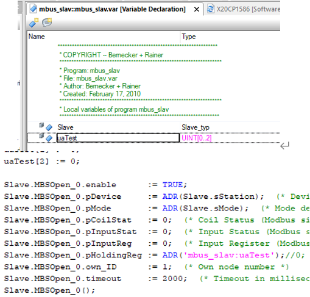

> Tags: #ModbusRTU

- [1 B08.069.ModbusRTU使用代码案例说明](#_1-b08069modbusrtu%E4%BD%BF%E7%94%A8%E4%BB%A3%E7%A0%81%E6%A1%88%E4%BE%8B%E8%AF%B4%E6%98%8E)
	- [1.1 Modbus基本资料](#_11-modbus%E5%9F%BA%E6%9C%AC%E8%B5%84%E6%96%99)
	- [1.2 硬件平台](#_12-%E7%A1%AC%E4%BB%B6%E5%B9%B3%E5%8F%B0)
- [2 Modbus通讯-主站](#_2-modbus%E9%80%9A%E8%AE%AF-%E4%B8%BB%E7%AB%99)
	- [2.1 MBMOpen() 函数](#_21-mbmopen-%E5%87%BD%E6%95%B0)
	- [2.2 MBMaster函数](#_22-mbmaster%E5%87%BD%E6%95%B0)
	- [2.3 MBMCmd()函数](#_23-mbmcmd%E5%87%BD%E6%95%B0)
	- [2.4 MBMClose函数](#_24-mbmclose%E5%87%BD%E6%95%B0)
	- [2.5 贝加莱例程 mbus_mast 任务使用说明](#_25-%E8%B4%9D%E5%8A%A0%E8%8E%B1%E4%BE%8B%E7%A8%8B-mbus_mast-%E4%BB%BB%E5%8A%A1%E4%BD%BF%E7%94%A8%E8%AF%B4%E6%98%8E)
- [3 Modbus通讯-从站](#_3-modbus%E9%80%9A%E8%AE%AF-%E4%BB%8E%E7%AB%99)
	- [3.1 MBSOpen 函数](#_31-mbsopen-%E5%87%BD%E6%95%B0)
	- [3.2 MBSlave函数](#_32-mbslave%E5%87%BD%E6%95%B0)
	- [3.3 MBSClose函数](#_33-mbsclose%E5%87%BD%E6%95%B0)
	- [3.4 贝加莱例程 mbus_slav 任务使用说明](#_34-%E8%B4%9D%E5%8A%A0%E8%8E%B1%E4%BE%8B%E7%A8%8B-mbus_slav-%E4%BB%BB%E5%8A%A1%E4%BD%BF%E7%94%A8%E8%AF%B4%E6%98%8E)
- [4 实际案例](#_4-%E5%AE%9E%E9%99%85%E6%A1%88%E4%BE%8B)
	- [4.1 贝加莱 CPU 与 MODBUS 通讯实际测试](#_41-%E8%B4%9D%E5%8A%A0%E8%8E%B1-cpu-%E4%B8%8E-modbus-%E9%80%9A%E8%AE%AF%E5%AE%9E%E9%99%85%E6%B5%8B%E8%AF%95)
- [5 测试案例下载](#_5-%E6%B5%8B%E8%AF%95%E6%A1%88%E4%BE%8B%E4%B8%8B%E8%BD%BD)
- [6 更新日志](#_6-%E6%9B%B4%E6%96%B0%E6%97%A5%E5%BF%97)

# 1 B08.069.ModbusRTU使用代码案例说明

- AS帮助
    - Programming → Libraries → Communication → DRV_mbus
    - ModbusRTU常用库为 DRV_mbus [点击跳转 → 在线英文帮助](https://help.br-automation.com/#/en/4/libraries%2Fdrv_mbus%2Fdrv_mbus.html)

## 1.1 Modbus基本资料

- Modbus 功能码一览（常用）

| 功能码 | 名称      | 作用                    |
|-----|---------|-----------------------|
| 01  | 读取线圈状态  | 取得一组逻辑线圈的当前状态（ON/OFF) |
| 02  | 读取输入状态  | 取得一组开关输入的当前状态（ON/OFF) |
| 03  | 读取保持寄存器 | 在一个或多个保持寄存器中取得当前的二进制值 |
| 04  | 读取输入寄存器 | 在一个或多个输入寄存器中取得当前的二进制值 |
| 05  | 强置单线圈   | 强置一个逻辑线圈的通断状态         |
| 06  | 预置单寄存器  | 把具体二进值装入一个保持寄存器       |
| 15  | 强置多线圈   | 强置一串连续逻辑线圈的通断         |
| 16  | 预置多寄存器  | 把具体的二进制值装入一串连续的保持寄存器  |

## 1.2 硬件平台

硬件平台：RS232、RS422、RS485

# 2 Modbus通讯-主站

## 2.1 MBMOpen() 函数

| I/O | 参数      | 数据类型           | 描述                                       |
|-----|---------|----------------|------------------------------------------|
| IN  | enable  | BOOL           | 使能                                       |
| IN  | pDevice | UDINT（指向字符串类型） | Device接口描述（设置 详见2.3节）                    |
| IN  | pMode   | UDINT（指向字符串类型） | Mode接口描述（设置 详见2.4节）                      |
| IN  | pConfig | UDINT（指向字符串类型） | 数据模块名字，配置通讯变量表（可选项）                      |
| IN  | timeout | UINT           | 通讯超时，10的倍数，单位：ms                         |
| IN  | ascii   | USINT          | Modbus模式（0为RTU、1为ASCII）                  |
| OUT | status  | UINT           | 错误号（0=无错误）                               |
| OUT | ident   | UDINT          | 端口ident，供MBMaster（），MBMCmd（）以及MBMClose使用 |

- 数据模块（DataObj）主要定义通讯变量内容：
    - 从站：站号、功能码、寄存器起始地址、寄存器长度
    - 主站：相对应的变量名
    - AS Help说明：其中EventPV出发Modbus指令，当指令正常执行后，EventPV会自动复位。各参数含义可参见AS Help。
    - 
- 程序中定义数据模块：
    - 

## 2.2 MBMaster函数

- 当使用定义的数据模块（DataObj）才能调用该函数实现Modbus通讯

| I/O | 参数        | 数据类型  | 描述                                                         |
| --- | --------- | ----- | ---------------------------------------------------------- |
| IN  | enable    | BOOL  | 使能                                                         |
| IN  | ident     | UDINT | MBMOpen功能块得到的Ident                                         |
| OUT | status    | UINT  | 错误号（0=无错误）                                                 |
| OUT | execute   | BOOL  | Execute=1，与从站通讯正常； Execute=0，等待从站应答或功能块报错（错误号见“status”） |
| OUT | recordnum | UINT  | 返回当前正在执行的Modbus功能码                                         |

## 2.3 MBMCmd()函数

- 调用MBMCmd函数可实现所有的Modbus功能，且无需定义数据模块（DataObj），相比于MBMaster函数更灵活

| I/O | 参数     | 数据类型  | 描述                 |
|-----|--------|-------|--------------------|
| IN  | enable | BOOL  | 使能                 |
| IN  | ident  | UDINT | MBMOpen功能块得到的Ident |
| IN  | mfc    | USINT | Modbus功能码          |
| IN  | node   | USINT | 站点号（0=广播）          |
| IN  | data   | UDINT | 数据区起始地址            |
| IN  | offset | UINT  | 偏移量                |
| IN  | len    | UINT  | 线圈、寄存器数量           |
| OUT | status | UINT  | 错误号（0=无错误）         |

## 2.4 MBMClose函数

- 关闭驱动环境

| I/O | 参数     | 数据类型  | 描述                 |
|-----|--------|-------|--------------------|
| IN  | enable | BOOL  | 使能                 |
| IN  | ident  | UDINT | MBMOpen功能块得到的Ident |
| OUT | status | UINT  | 错误号（0=无错误）         |

## 2.5 贝加莱例程 mbus_mast 任务使用说明

- 例程获取方式 → [⭐002通信例程获取与下载方式](002使用modbus%20TCP，EthernetIP，Profibus，Profinet，CANOpen，OPC%20UA，modbus%20RTU，POWERLINK，TCPIP，UDP，Serial，IMA等协议，是否有参考例程？.md)
- 
- mbus_mast 任务说明第 1 步，用 MBMOpen 函数打开端口，得到端口的 ident。第 2 步，打开端口后，MBMaster 函数不断地执行进行主站数据收发。其他，如有需要，用 MBMClose 函数关闭端口通讯。
    - 
    - 
- 当Master.S1 = FALSE，此时Modbus通讯依照数据模块定义通讯规则，查看数据模块datamod可知：
    - 
    - LibDRVmbus.EventPV4触发指令16，将LibDRVmbus.LocalPV4数组的值写入MB4数组头3个元素；
    - LibDRVmbus.EventPV3触发指令03，读取MB4数组头3个元素的值至LibDRVmbus.LocalPV3数组。
- 当Master.S1 = TRUE，此时Modbus通讯以MBMCmd（）定义的功能码等信息为准，实现灵活通讯，程序中为调用功能码16，读取Slave端的前三个寄存器数值。
    - 

# 3 Modbus通讯-从站

- 贝加莱 Modbus 从站只支持 RTU 模式，主站 RTU 和 ASCII 模式都支持。

## 3.1 MBSOpen 函数

| I/O | 参数          | 数据类型           | 描述                                            |
|-----|-------------|----------------|-----------------------------------------------|
| IN  | enable      | BOOL           | 使能                                            |
| IN  | pDevice     | UDINT（指向字符串类型） | Device接口描述（设置 详见2.3节）                         |
| IN  | pMode       | UDINT（指向字符串类型） | Mode接口描述（设置 详见2.4节）                           |
| IN  | pCoilStat   | UDINT          | Coil Status (Modbus simulation varia-ble)     |
| IN  | pInputStat  | UDINT          | Input Status (Modbus simulation vari-able)    |
| IN  | pInputReg   | UDINT          | Input Register (Modbus simulation variable)   |
| IN  | pHoldingReg | UDINT          | Holding Register (Modbus simulation variable) |
| IN  | own_ID      | USINT          | 自定义端口站号                                       |
| IN  | timeout     | UINT           | 通讯超时，10的倍数，单位：ms                              |
| OUT | status      | UINT           | 错误号（0=无错误）                                    |
| OUT | ident       | UDINT          | 端口ident，供MBSlave及MBSClose使用                   |

- 关于 pCoilStat, pInputStat, pInputReg, pHoldingReg对应绑定变量
- 如果 pCoilStat, pInputStat, pInputReg, pHoldingReg 为 0 时，采用默认的 MB0、MB1、MB3、MB4命名方式。（**全局变量**）
    - 
    - 等同于
        - 
- 也可以自定义成其他变量名。
    - 例如，定义 CoilStat 为 BOOL[0..99]、InputStat 为 BOOL [0..99]、InputReg 为 UINT[0..99]、HoldingReg 为 UINT [0..99]分别替换 MB0、MB1、MB4、MB3。（其中CoilStat、InputStart、InputReg、HoldingReg均为全局变量）
    - 
    - 当采用局部变量时，需使用 **任务名:变量名** 的引用形式
        - 

## 3.2 MBSlave函数

- 在Slave端运行Modbus协议

| I/O | 参数      | 数据类型  | 描述                 |
|-----|---------|-------|--------------------|
| IN  | enable  | BOOL  | 使能                 |
| IN  | ident   | UDINT | MBSOpen功能块得到的Ident |
| OUT | status  | UINT  | 错误号（0=无错误）         |
| OUT | execute | UINT  | 接收Modbus指令计数器      |

- 正常通讯时：
    - Status 返回值为 0，Exec 返回值不断加 1。
    - 每收到主站数据命令，Exec 加 1。

## 3.3 MBSClose函数

- 这个功能块关闭了驱动环境。使MBSOpen功能块可以再次使能调用。

| I/O | 参数     | 数据类型  | 描述                 |
|-----|--------|-------|--------------------|
| IN  | enable | BOOL  | 使能                 |
| IN  | ident  | UDINT | MBSOpen功能块得到的Ident |
| OUT | status | UINT  | 错误号（0=无错误）         |

## 3.4 贝加莱例程 mbus_slav 任务使用说明

- 例程获取方式 → [⭐002通信例程获取与下载方式](002使用modbus%20TCP，EthernetIP，Profibus，Profinet，CANOpen，OPC%20UA，modbus%20RTU，POWERLINK，TCPIP，UDP，Serial，IMA等协议，是否有参考例程？.md)
- 
- mbus_slav 任务说明第 1 步，用 MBSOpen 函数打开端口，得到端口的 ident。第 2 步，打开端口后，MBSlave 函数不断地执行进行从站数据收发。其他，如有需要，可以用 MBSClose 函数关闭端口通讯。
- 
- 地址对应
    - Y=X+1。例如，Modbus 的 400002 对应贝加莱从站 MB4[1]。如需在 B&R 系统中仿真，必须采用 MBx。

| 贝加莱默认变量名 | 支持类型            | Modbus变量类型        | Modbus功能码 | Modbus地址 |
|----------|-----------------|-------------------|-----------|----------|
| MB0[x]   | BOOL,USINT,SINT | Coil Status       | 1,5,15    | 00000Y   |
| MB1[x]   | BOOL,USINT,SINT | Read input status | 2         | 10000Y   |
| MB3[x]   | UINT,INT        | Holding register  | 4         | 30000Y   |
| MB4[x]   | UINT,INT        | Input register    | 3,6,16    | 40000Y   |

# 4 实际案例

## 4.1 贝加莱 CPU 与 MODBUS 通讯实际测试

- C4.05 操作系统，X20CP1583 做从站，Proface 屏做主站，RS232 交叉连接，偶校验，8 位数据位，1 位停止位。
- 波特率为 19200 时，Exce 数据不断加 1，但是 MB4 数据收不到。
- 波特率为 9600 时，能够正常收发数据。

# 5 测试案例下载

- [点击下载 → 2021-10-19-TestForRS485.zip](/B08_技术_通信/FILES/068使用X20CS1030实现RS485与RS422通信案例/2021-10-19-TestForRS485.zip ':ignore')

# 6 更新日志

| 日期         | 修改人 | 修改内容 |
| :--------- | :-- | :--- |
| 2021-10-17 | CJP | 初次创建 |
| 2024-10-28 | YZY | 调整优化 |
