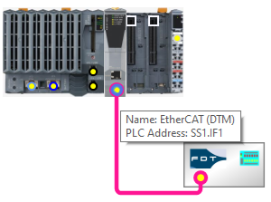
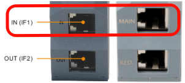
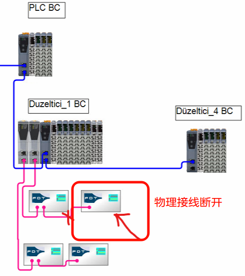

> Tags: #EtherCAT

- [1 B08.071.贝加莱EtherCAT主站与从站接线说明](#_1-b08071%E8%B4%9D%E5%8A%A0%E8%8E%B1ethercat%E4%B8%BB%E7%AB%99%E4%B8%8E%E4%BB%8E%E7%AB%99%E6%8E%A5%E7%BA%BF%E8%AF%B4%E6%98%8E)
- [2 X20IF01G1-1接线说明](#_2-x20if01g1-1%E6%8E%A5%E7%BA%BF%E8%AF%B4%E6%98%8E)
- [3 EtherCAT网络中实际物理的从站与配置的从站需一致](#_3-ethercat%E7%BD%91%E7%BB%9C%E4%B8%AD%E5%AE%9E%E9%99%85%E7%89%A9%E7%90%86%E7%9A%84%E4%BB%8E%E7%AB%99%E4%B8%8E%E9%85%8D%E7%BD%AE%E7%9A%84%E4%BB%8E%E7%AB%99%E9%9C%80%E4%B8%80%E8%87%B4)
- [4 更新日志](#_4-%E6%9B%B4%E6%96%B0%E6%97%A5%E5%BF%97)

# 1 B08.071.贝加莱EtherCAT主站与从站接线说明

# 2 X20IF01G1-1接线说明

- 项目配置中：AS项目的Physical View配置显示的只是一张图片，并不相关。重要的是，AS表示它连接到IF1
    - 
- 实际接线：
    - 需要将IF10G1-1中的电缆连接到main，您还需要将电缆连接到第3方设备上的“main”。需要核对EtherCAT从站设备的手册，主端口是什么。Ethercat是一个菊花链总线系统，因此连接电缆的位置至关重要
    - 

# 3 EtherCAT网络中实际物理的从站与配置的从站需一致

- **现象**
    - 希望在EtherCAT网络中，将末端的从站断开，而程序不修改，按下图所示
        - 
    - 会发现报出 Topology mismatch detected 错误。
        - 
- **解决方式**
    - 通过软件在线更改配置，确保配置与实际物理接线完全一致，是唯一的解决方案。

# 4 更新日志

| 日期         | 修改人 | 修改内容 |
| :--------- | :-- | :--- |
| 2025-01-14 | YZY | 初次创建 |
