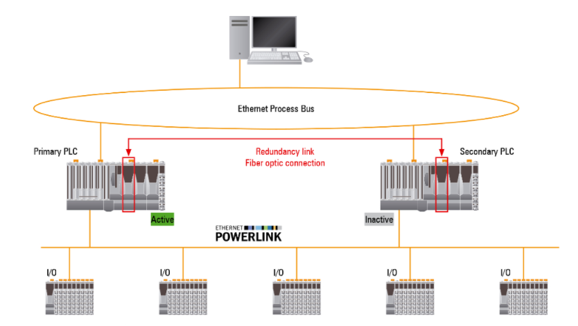
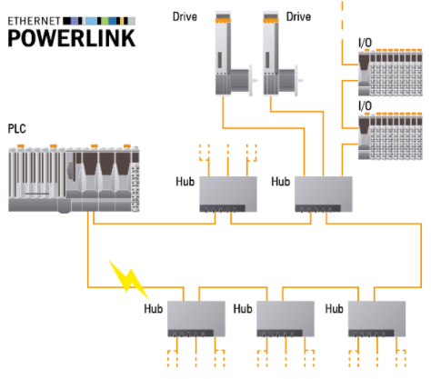
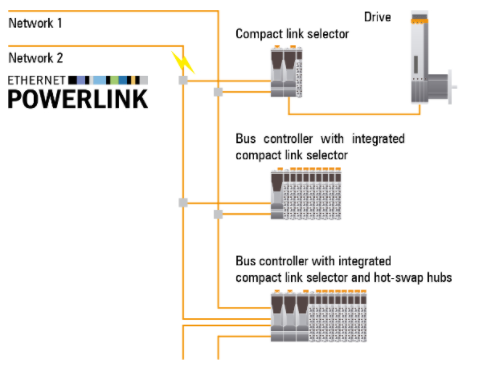

# 001贝加莱产品支持哪些形式的冗余方案，有哪些技术特点？
Tags：冗余

A： 
贝加莱控制器支持控制器冗余和网络冗余。其中POWERLINK网络冗余可以进一步区分为环网冗余和电缆冗余。
这两种冗余方式相结合能最大程度保证系统免受故障影响，其具体技术特点如下：
## 控制器冗余

POWERLINK主站冗余实现数据微秒级同步精度，并且可以在几毫秒内完成切换。此功能可以无缝集成在实时操作系统中，易于使用。
第二个相同的X20标准产品系列AtomTM控制器可以被添加到现有的控制技术中并通过软件进行冗余配置。接口模块完全自动处理数据交换。

## 环网冗余

POWERLINK设备连成一线，最后一个单元接回主站。从而形成闭环。环网冗余管理器会立即在任意点寄存一个中断，并处理来自两边的数据。
这样可以保证，无论是否发生中断，所有节点通信都完好无损。当环网再次闭合时，主站会识别并做出相应的响应，数据再次从环网一边提供。

##  电缆冗余

可以使系统的每个网络节点都有两条电缆通过。如果线缆出错，那么系统会自动切换至另一条线继续工作。
它还可以允许线路运行在单独的路径上，因为它通常被用于过程技术。POWERLINK的主站冗余功能可以将电缆冗余与控制器冗余完美结合。
这使贝加莱可以提供能够最大限度确保机器及系统可用性的冗余解决方案。
如需获取更为详细的冗余方案相关信息，可参考冗余方案的用户手册，下载链接为：

https://www.br-automation.com/zh/downloads/control-and-io-systems/x20-system/hub-redundancy-system/x20-redundancy-system/