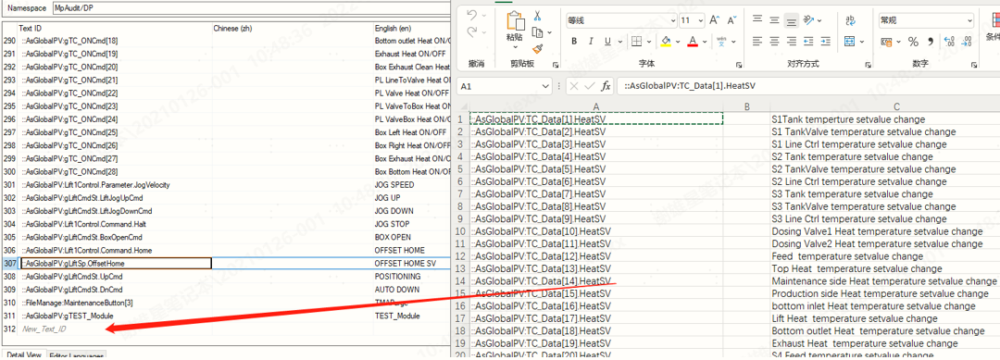
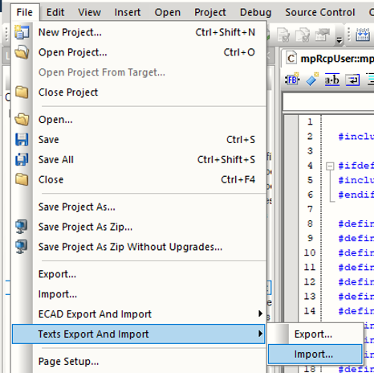
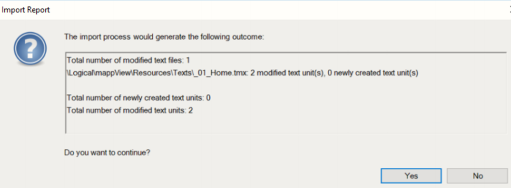

# 005如何将外部，如EXCEL及CSV中的文本信息快速导入AS的TMX文本中？

A：可以使用AS-File-Texts Export And Import功能
1.	首先将AS中已有的TMX导出为CSV文件
2.	对导出的TMX文件进行文本编辑，可以直接将已经存在的EXCEL/CSV中的文本源进行赋值
3.	在AS中重新导入更新后的TMX的CSV文件（导入时必须关闭AS中的TMX文本编辑窗口），此时会提示新增及修改的TMX条目数

