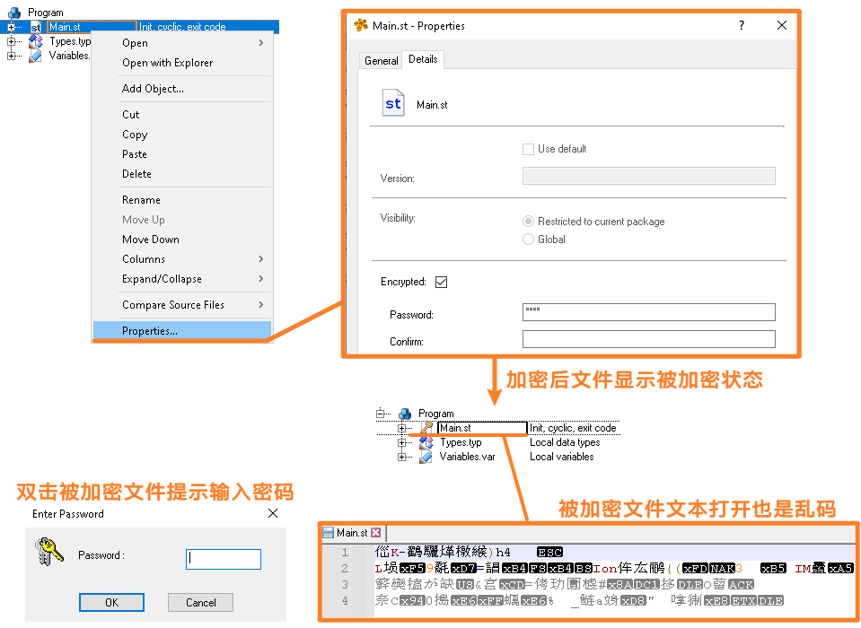
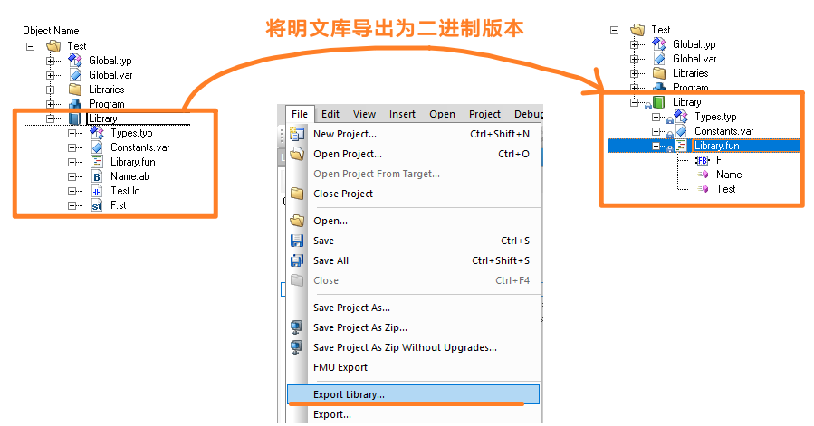

> Tags: #加密

- [1 B12.011.贝加莱任务程序加密](#_1-b12011%E8%B4%9D%E5%8A%A0%E8%8E%B1%E4%BB%BB%E5%8A%A1%E7%A8%8B%E5%BA%8F%E5%8A%A0%E5%AF%86)
- [2 解决方式一：代码文件加密](#_2-%E8%A7%A3%E5%86%B3%E6%96%B9%E5%BC%8F%E4%B8%80%EF%BC%9A%E4%BB%A3%E7%A0%81%E6%96%87%E4%BB%B6%E5%8A%A0%E5%AF%86)
- [3 解决方式二：将代码写入库，导出二进制版本](#_3-%E8%A7%A3%E5%86%B3%E6%96%B9%E5%BC%8F%E4%BA%8C%EF%BC%9A%E5%B0%86%E4%BB%A3%E7%A0%81%E5%86%99%E5%85%A5%E5%BA%93%EF%BC%8C%E5%AF%BC%E5%87%BA%E4%BA%8C%E8%BF%9B%E5%88%B6%E7%89%88%E6%9C%AC)

# 1 B12.011.贝加莱任务程序加密

- 需求
    - 希望写的代码保密，不希望他人直接就能看到。

# 2 解决方式一：代码文件加密

- 
- 程序、程序库和数据对象的源文件可以加密，以防止未经授权的用户查看或修改这些文件。
- 举例来说，如果一家公司只允许技术服务人员对应用程序的部分内容进行调整或修改，但应用程序中包含有价值算法的某些程序应受到保护，不能让技术服务人员或终端客户看到，那么这种加密方法就非常有用。
- 当尝试打开加密文件时，系统会提示用户输入密码。如果没有输入密码或输入的密码不正确，则无法打开和显示文件。
- 项目编译期间无需输入密码。
- 注意事项
    - 使用的加密算法是电子密码本 (ECB)。与所有加密机制一样，源文件的密码保护并不能提供绝对的安全性。要使用技术保护特别精细的算法，最好以二进制库的形式在项目中使用它们。

# 3 解决方式二：将代码写入库，导出二进制版本

- 
- 二进制库能够将代码细节与结构封装，只暴露接口。
- 使用二进制库，能够加速编译速度。
- 🚩需注意，二进制库与 AR 版本有关，在低版本 AR 下生成的二进制库，不一定能够在高版本 AR 下编译成功，建议一个 AR 大版本对应一个二进制库。
