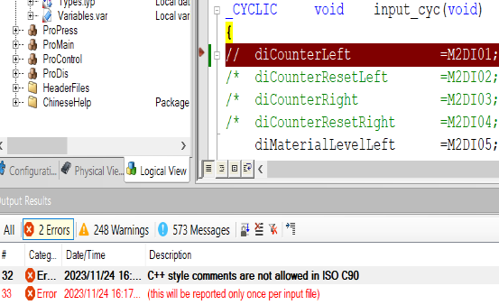
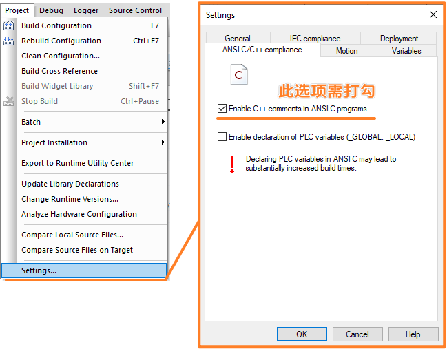

> 014在 C 代码中//注释无法被识别
> #cpp #c

- [1 现象](#1%20%E7%8E%B0%E8%B1%A1)
- [2 解决方式](#2%20%E8%A7%A3%E5%86%B3%E6%96%B9%E5%BC%8F)

# 1 现象

- C 任务里 // 注释符不能识别编译报错？ `/*   */ ` 可以识别
- 报错提示 C++ style comments are not allowed in ISO C90
- 

# 2 解决方式

- 
