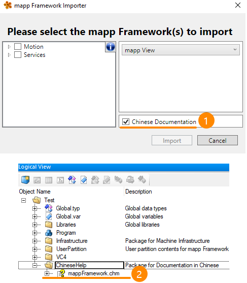
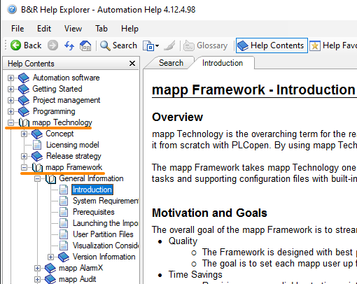
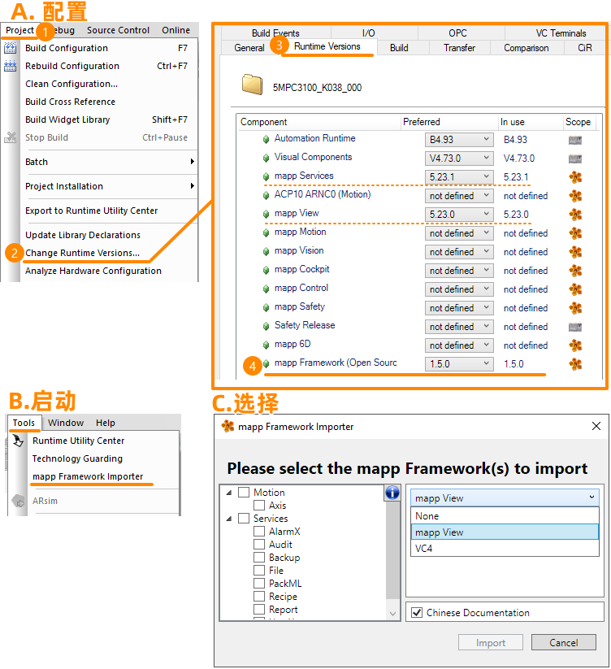

> Tags: #开发 #mappView #mappServices #mappFramework

> 最新版本 1.5 最后更新时间 2023.12.08

- [1 B12.016.mappFramework功能介绍](#_1-b12016mappframework%E5%8A%9F%E8%83%BD%E4%BB%8B%E7%BB%8D)
- [2 概述](#_2-%E6%A6%82%E8%BF%B0)
- [3 帮助文件](#_3-%E5%B8%AE%E5%8A%A9%E6%96%87%E4%BB%B6)
	- [3.1 中文版本](#_31-%E4%B8%AD%E6%96%87%E7%89%88%E6%9C%AC)
		- [3.1.1 在线阅览](#_311-%E5%9C%A8%E7%BA%BF%E9%98%85%E8%A7%88)
		- [3.1.2 本地离线查看](#_312-%E6%9C%AC%E5%9C%B0%E7%A6%BB%E7%BA%BF%E6%9F%A5%E7%9C%8B)
	- [3.2 英文版本](#_32-%E8%8B%B1%E6%96%87%E7%89%88%E6%9C%AC)
- [4 使用指引](#_4-%E4%BD%BF%E7%94%A8%E6%8C%87%E5%BC%95)
- [5 mappFramework下载](#_5-mappframework%E4%B8%8B%E8%BD%BD)
- [6 更新日志](#_6-%E6%9B%B4%E6%96%B0%E6%97%A5%E5%BF%97)

# 1 B12.016.mappFramework功能介绍

# 2 概述

- mapp技术是B&R公司现成的、模块化软件产品的总称。这项技术使你只需用几个mapp功能块和配置设置就能实现复杂或繁琐的功能（如配方系统），而不是用PLCopen从头开始创建。通过使用mapp技术，你完成应用开发的速度可提高三倍，代码量也比完全用PLCopen编写要少得多。
- **mapp Framework**使mapp技术更进一步，为用户提供了mapp技术的一个通用起点。这甚至进一步减少了必须由应用工程师编写的应用代码量。该框架包括编程任务和支持配置文件，并内置了最佳实践和应用知识。它的设计是模块化的，因此用户可以轻松地将与机器相关的特定部分添加到现有的项目中。
- mapp Framework目前可使用以下mapp技术，你可以点击下面的链接，通过视频了解更多。

| 介绍内容 | Bilibili网站链接 |
| :--- | :--- |
| 总览 | [mapp Framework 概览视频](https://www.bilibili.com/video/BV1YY4y1T7f8?spm_id_from=333.999.0.0) |
| mapp AlarmX | [mapp AlarmX Framework 教学视频](https://www.bilibili.com/video/BV1TG4y1r7dh?spm_id_from=333.999.0.0) |
| mapp Recipe | [mapp Recipe Framework 教学视频](https://www.bilibili.com/video/BV1gt4y1779t?spm_id_from=333.999.0.0) |
| mapp UserX | [mapp UserX Framework 教学视频](https://www.bilibili.com/video/BV1RK411Z7ks?spm_id_from=333.999.0.0) |
| mapp File | [mapp File Framework 教学视频](https://www.bilibili.com/video/BV1ZD4y1B7Zm?spm_id_from=333.999.0.0) |
| mapp Backup | [mapp Backup Framework 教学视频](https://www.bilibili.com/video/BV1bV4y1p7he?spm_id_from=333.999.0.0) |
| mapp Axis / Cockpit | [mapp Axis Framework 教学视频](https://www.bilibili.com/video/BV11K411Z7g5?spm_id_from=333.999.0.0) |

# 3 帮助文件

## 3.1 中文版本

- 想更多了解mappFramework有什么功能，是否适合目前自己项目的特点？可以先从中文帮助手册开始了解。

### 3.1.1 在线阅览

- 你可以通过在线网站，了解mappFramework要求与特点
- [⭐mappframework.brhelp.cn](https://mappframework.brhelp.cn)

### 3.1.2 本地离线查看

- 你可以在安装mappFramework后，在导入mapp Framework时，勾选Chinese Documentation，则可在项目中的 Logical View中，直接查看中文版本的CHM文件
    - 

## 3.2 英文版本

- 安装mappFramework后，可通过Automation Help中的以下路径获取英文帮助
    - **mapp Technology -> mapp Framework**
    - 
    - 这些页面确定了每个框架所包含的内容，以及将框架正确嵌入现有应用程序所需的任何更改。
- 🔔每个 mapp Framework 帮助部分都有一个标题为 "Required Modifications"（所需修改）的页面。必须执行该页面上的步骤才能使框架进入功能状态！

# 4 使用指引

- 每个 mapp Framework 组件都包含以下内容：
    - Logical View（逻辑视图）任务文件
    - Configuration View（配置视图）配置文件
    - Automation Studio帮助/中文在线帮助中的支持文档
- 安装
    - 下载解压获得.exe文件，双击执行，软件会自动提示对应需要安装的Automation Studio软件版本
- 配置与使用
    - 

# 5 mappFramework下载

| 下载选项 | 链接 |
| ---: | :--- |
| 贝加莱PC知识库 | 需登录后访问 [贝加莱知识库 (huashengyun.online)](https://brtechs.huashengyun.online/index.php?mod=bjl&do=file&gid=19#group&do=file&gid=19&fid=1928) |
| Github | [Releases · br-automation-com/mapp-Framework (github.com)](https://github.com/br-automation-com/mapp-Framework/releases) |

# 6 更新日志

| 日期         | 修改人 | 修改内容 |
| :--------- | :-- | :--- |
| 2023-12-13 | YZY | 初次创建 |
