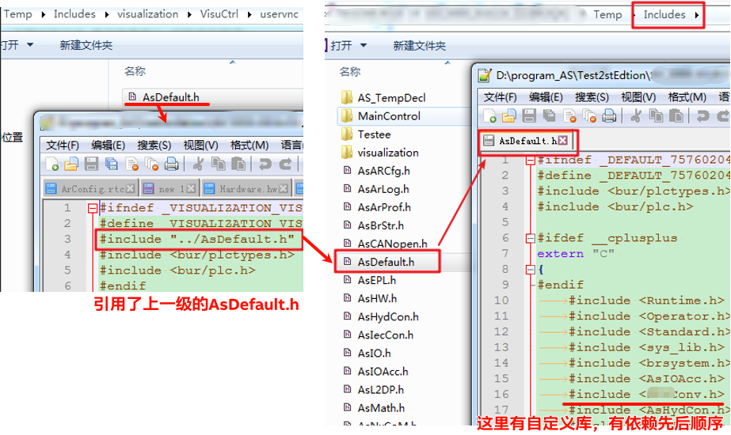

> Tags: #c #StructuredText

- [1 B12.020.C语言与ST语言混合编译注意事项](#_1-b12020c%E8%AF%AD%E8%A8%80%E4%B8%8Est%E8%AF%AD%E8%A8%80%E6%B7%B7%E5%90%88%E7%BC%96%E8%AF%91%E6%B3%A8%E6%84%8F%E4%BA%8B%E9%A1%B9)
- [2 案例说明](#_2-%E6%A1%88%E4%BE%8B%E8%AF%B4%E6%98%8E)
- [3 补充说明](#_3-%E8%A1%A5%E5%85%85%E8%AF%B4%E6%98%8E)
- [4 参考贝加莱帮助说明](#_4-%E5%8F%82%E8%80%83%E8%B4%9D%E5%8A%A0%E8%8E%B1%E5%B8%AE%E5%8A%A9%E8%AF%B4%E6%98%8E)
- [5 更新日志](#_5-%E6%9B%B4%E6%96%B0%E6%97%A5%E5%BF%97)

# 1 B12.020.C语言与ST语言混合编译注意事项

- 贝加莱C语言编译器是 GCC，常用版本为 4.1.2，可选 6.3.0
- 贝加莱所有的IEC61131-3语言均最终编译为C语言，生成 `.br` 文件
- 大致的编译过程如下
    - C程序通过 .h 头文件引用其他的库函数，在链接时，自动把头文件中所指向的 .a 库（来源AutomationRuntime） 一起链接，再生成可执行文件。
    - ST语言在编译过程中也有相类似的编译过程。
    - 
- 💥在C程序中，会默认使用 `#include <AsDefault.h>`，而AsDefault.h中的内容会  逐层往上包含上一个目录的 AsDefault.h，并且包含了ST语言的所使用的 .h文件，容易导致编译错误。
    - 
    - ⭐建议在使用C语言程序，且此程序会与ST程序混合编译时，当出现一些编译冲突问题时，不使用 `#include <AsDefault.h>`，手动添加所需要的头文件。

# 2 案例说明

- 某客户程序跨度较大，有将近10年的代码积累，代码语言主要使用ST语言，部分功能使用C语言。当清空Temp文件夹中的内容，重新全局编译，则会报出如下错误
    - 
- 从Output窗口可看到以上信息，则定位到uservnc.c。发现c代码头文件引用了AsDefault.h头文件
    - 
- 其中此头文件实际引用内容如下：会依序引入所有其他的库的头文件，由于大量改动，导致头文件中引用的顺序错乱，因而引发编译错误出现。
    - 
- 通过修改uservnc.c的头文件引用内容，使 .c 文件只引用其所需要的头文件内容，即能解决问题。
    - 

# 3 补充说明

- AsDefault.h 引用库文件的顺序是Logical View中库的放置顺序，出现类似问题，亦可尝试手动调整库的先后循序解决
- 若自定义库与结构体，有相互的依赖关系，建议确保在Logical View与Software中，确保先后顺序一致。
- 使用C语言，建议使用 AsMath.h 文件
    - 由于C语言自带的math.h本身实现计算过程存在些许问题，在不同AS版本上，可能会存在意想不到的错误，因此推荐使用AsBrMath.h。例如math.h中的pow函数就有时存在算出非数值的值。
    - 如果引用了math.h，则不能添加AsBrMath库，会导致冲突错误
- [008C语言使用结构体套用结构体报错field xx has incomplete type](008C语言使用结构体套用结构体报错field%20xx%20has%20incomplete%20type.md)
- [012项目编译时大量报错stray in program](012项目编译时大量报错stray%20in%20program.md)
- [013编写C与Cpp代码编译提示undefined reference to sbrk](013编写C与Cpp代码编译提示undefined%20reference%20to%20sbrk.md)
- [014在C代码中双斜杠注释无法被识别](014在C代码中双斜杠注释无法被识别.md)
- [015原先正常库代码升级到AS4.5以上提示出现field xxx type has incomplete type](015原先正常库代码升级到AS4.5以上提示出现field%20xxx%20type%20has%20incomplete%20type.md)
- [018AS项目中Cpp程序升级GCC版本后提示memset was not declared in this scope](018AS项目中Cpp程序升级GCC版本后提示memset%20was%20not%20declared%20in%20this%20scope.md)
- [019编译cpp代码时提示cos与pow等函数has not been declared](019编译cpp代码时提示cos与pow等函数has%20not%20been%20declared.md)

# 4 参考贝加莱帮助说明

- [B&R Online Help (br-automation.com)](https://help.br-automation.com/#/en/4/programming%2Fmixiecandansic%2Fprogrammingmodel_mixiecandansic.html)

# 5 更新日志

| 日期                             | 修改人 | 修改内容 |
| :----------------------------- | :-- | :--- |
| 2024-07-04 | YZY | 初次创建 |
