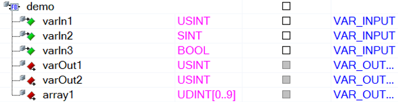
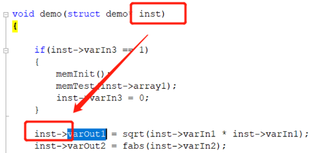

> Tags: #cpp #c

- [1 B12.021.AS软件中移植C语言库注意事项](#_1-b12021as%E8%BD%AF%E4%BB%B6%E4%B8%AD%E7%A7%BB%E6%A4%8Dc%E8%AF%AD%E8%A8%80%E5%BA%93%E6%B3%A8%E6%84%8F%E4%BA%8B%E9%A1%B9)
- [2 功能块（function block）的输入输出](#_2-%E5%8A%9F%E8%83%BD%E5%9D%97%EF%BC%88function-block%EF%BC%89%E7%9A%84%E8%BE%93%E5%85%A5%E8%BE%93%E5%87%BA)
- [3 功能（function）的输出](#_3-%E5%8A%9F%E8%83%BD%EF%BC%88function%EF%BC%89%E7%9A%84%E8%BE%93%E5%87%BA)
- [4 C语言的数据类型转换](#_4-c%E8%AF%AD%E8%A8%80%E7%9A%84%E6%95%B0%E6%8D%AE%E7%B1%BB%E5%9E%8B%E8%BD%AC%E6%8D%A2)
- [5 多个函数](#_5-%E5%A4%9A%E4%B8%AA%E5%87%BD%E6%95%B0)
- [6 C标准库函数的移植](#_6-c%E6%A0%87%E5%87%86%E5%BA%93%E5%87%BD%E6%95%B0%E7%9A%84%E7%A7%BB%E6%A4%8D)
- [7 数组指针](#_7-%E6%95%B0%E7%BB%84%E6%8C%87%E9%92%88)
- [8 编译问题注意](#_8-%E7%BC%96%E8%AF%91%E9%97%AE%E9%A2%98%E6%B3%A8%E6%84%8F)
- [9 更新日志](#_9-%E6%9B%B4%E6%96%B0%E6%97%A5%E5%BF%97)

# 1 B12.021.AS软件中移植C语言库注意事项

# 2 功能块（function block）的输入输出

- C语言库功能块的输入输出要使用结构体的形式来调用
- 默认的输入输出结构体为inst
    - 
    - 

# 3 功能（function）的输出

- 功能中只有一个返回值，使用return来进行输出的返回值返回，同时，接口函数的类型必须被定义
- 
- 

# 4 C语言的数据类型转换

- 定义功能块时使用的一些数据类型将会在创建后自动转换成相应的数据类型，例如
    - LREAL → double
    - INT → signed short
    - BOOL → plcbit
- 

# 5 多个函数

- C语言库中除了接口函数（函数名称必须与文件名对应），还可以有多个其他函数可以写在一个文件中
- 

# 6 C标准库函数的移植

- C语言中的一些标准库是可以直接拿来用的，关于一些标准库函数是否能够直接使用，可以参考帮助
    - GUID: 9dc8ec86-c8fb-4367-bf6e-ba0a22d0a3fe
    - [点击访问在线 → B&R Online Help (br-automation.com)](https://help.br-automation.com/#/en/4/programming%2Fprograms%2Fansic%2Fprogrammingmodel_programs_ansic_reservedkeywords.html)
- 例如一些数学计算函数可以直接用fabs(double n), sqrt(double n)
- 但是alloc()不能直接拿来用，需要使用TMP_alloc()来实现，具体可以参考附件的例子
    - 
- C/CPP一些标准库，可在AS Help中确认哪些可用
    - 
    - 

# 7 数组指针

- 接口函数为数组是，C语言中使用指针的方式作为传递，使用功能块时需要赋值实际数组的指针地址。
    - 

# 8 编译问题注意

- 如出现下述编译问题，需要进行设置
- `Error: stray '\304' in program`
    - 
- 

# 9 更新日志

| 日期         | 修改人        | 修改内容 |
| :--------- | :--------- | :--- |
| 2024-07-04 | ZSY YZY | 初次创建 |
