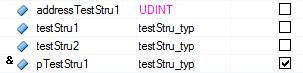

> Tags: #c #cpp

- [1 B12.022.C语言常见报错与编程错误](#_1-b12022c%E8%AF%AD%E8%A8%80%E5%B8%B8%E8%A7%81%E6%8A%A5%E9%94%99%E4%B8%8E%E7%BC%96%E7%A8%8B%E9%94%99%E8%AF%AF)
- [2 warning: no newline at end of file](#_2-warning-no-newline-at-end-of-file)
- [3 Number of initialization values does not match array length](#_3-number-of-initialization-values-does-not-match-array-length)
- [4 Variable Kp is declared but not used in the current configuration](#_4-variable-kp-is-declared-but-not-used-in-the-current-configuration)
- [5 Variable KpHoist is declared but not used in the current configuration](#_5-variable-kphoist-is-declared-but-not-used-in-the-current-configuration)
- [6 Warning : implicit declaration of function 'strcpy'](#_6-warning--implicit-declaration-of-function-strcpy)
- [7 Warning : assignment makes integer from pointer without a cast](#_7-warning--assignment-makes-integer-from-pointer-without-a-cast)
- [8 Warning : pointer targets in passing argument 1 of 'strcpy' differ in signedness](#_8-warning--pointer-targets-in-passing-argument-1-of-strcpy-differ-in-signedness)
- [9 Warning : assignment makes integer from pointer without a cast passing argument 1 of 'memcpy' makes pointer from integer without a cast](#_9-warning--assignment-makes-integer-from-pointer-without-a-cast-passing-argument-1-of-memcpy-makes-pointer-from-integer-without-a-cast)
- [10 warning: comparison between pointer and integer](#_10-warning-comparison-between-pointer-and-integer)
- [11 warning: assignment discards qualifiers from pointer target type](#_11-warning-assignment-discards-qualifiers-from-pointer-target-type)
- [12 warning: passing argument 1 of 'send' makes pointer from integer without a cast](#_12-warning-passing-argument-1-of-send-makes-pointer-from-integer-without-a-cast)
- [13 warning: comparison is always true due to limited range of data type](#_13-warning-comparison-is-always-true-due-to-limited-range-of-data-type)
- [14 warning: initialization from incompatible pointer type](#_14-warning-initialization-from-incompatible-pointer-type)
- [15 warning: incompatible implicit declaration of built-in function 'xxx'](#_15-warning-incompatible-implicit-declaration-of-built-in-function-xxx)
- [16 warning: initialization discards qualifiers from pointer target type](#_16-warning-initialization-discards-qualifiers-from-pointer-target-type)
- [17 warning: comparison is always false due to limited range of data type](#_17-warning-comparison-is-always-false-due-to-limited-range-of-data-type)
- [18 warning: assignment from incompatible pointer type](#_18-warning-assignment-from-incompatible-pointer-type)
- [19 Switch 语句 缺少break;](#_19-switch-%E8%AF%AD%E5%8F%A5-%E7%BC%BA%E5%B0%91break)
- [20 隐式类型转换1](#_20-%E9%9A%90%E5%BC%8F%E7%B1%BB%E5%9E%8B%E8%BD%AC%E6%8D%A21)
- [21 隐式类型转换2](#_21-%E9%9A%90%E5%BC%8F%E7%B1%BB%E5%9E%8B%E8%BD%AC%E6%8D%A22)
- [22 函数abs](#_22-%E5%87%BD%E6%95%B0abs)
- [23 数据溢出](#_23-%E6%95%B0%E6%8D%AE%E6%BA%A2%E5%87%BA)
- [24 Continue break 区别](#_24-continue-break-%E5%8C%BA%E5%88%AB)
- [25 更新日志](#_25-%E6%9B%B4%E6%96%B0%E6%97%A5%E5%BF%97)

# 1 B12.022.C语言常见报错与编程错误

# 2 warning: no newline at end of file

- 解决方法
    - 在文件最后一行加上回车键
- 原因
    - c/c++代码的每一行后面有一个“结束符”，也就是newline。避免当被include的文件展开后，前一个文件的最后一行与后一个文件的第一行直接被连接成一行从而造成错误

# 3 Number of initialization values does not match array length

- 解决方式
    - 在变量声明表中补全数组初始化值
- 原因
    - 通常由于修改了数组大小造成此问题

# 4 Variable Kp is declared but not used in the current configuration

- 解决方式
    - 删除变量或者在程序中引用一次

# 5 Variable KpHoist is declared but not used in the current configuration

- 解决方式
    - 删除变量或者在程序中引用一次

# 6 Warning : implicit declaration of function 'strcpy'

- Warning : implicit declaration of function 'memset'
- 解决方式
    - 在程序引用处添加include“string.h”
- 原因
    - 请注意如果包含string.h，那么尽量不要使用asstring库函数
    - 如果包含string.h那么任务中不能使用index做为变量否则报警变量重复定义。

# 7 Warning : assignment makes integer from pointer without a cast

- 代码举例
    - dirInfo.pDevice = STRING_DEVICE_NAME;
- 解决方式
    - dirInfo.pDevice = (UDINT)&MPRCP_DEVICE_NAME;
- 原因
    - 没有加强制类型转换，因为需要的是UDINT类型，将指针给过来需要类型转换。
    - Warning : assignment makes xxx from xxx without a cast 同理。需要类型转换。

# 8 Warning : pointer targets in passing argument 1 of 'strcpy' differ in signedness

- 代码举例
    - strcpy(&usintArray[0],stringTest);
- 解决方式
    - strcpy((char*)&usintArray[0],stringTest);
- 原因
    - 参数类型不匹配Strcpy函数原型`char *strcpy(char *dst, const char *src);`
    - 所以他需要两个char类型指针做为参数。

# 9 Warning : assignment makes integer from pointer without a cast passing argument 1 of 'memcpy' makes pointer from integer without a cast

 - 函数举例：memcpy函数
     - 
 - 代码举例
     - addressTestStru1 = &testStru1;
     - memcpy(addressTestStru1, &testStru2, sizeof(testStru1));
 - 解决方式1
     - addressTestStru1 = (UDINT)&testStru1;
     - memcpy((void*)addressTestStru1,&testStru2,sizeof(testStru1));
 - 解决方式2
     - pTestStru1 = &testStru1;
     - memcpy(pTestStru1,&testStru2,sizeof(testStru1));

# 10 warning: comparison between pointer and integer

- 原因
    - integer与pointer比较

# 11 warning: assignment discards qualifiers from pointer target type

- 原因
    - 赋值时，取消了右值的限定。

# 12 warning: passing argument 1 of 'send' makes pointer from integer without a cast

- 原因
    - 函数send的第一个integer型参数没有强制转换为指针类型

# 13 warning: comparison is always true due to limited range of data type

- 原因
    - 由于数据类型范围的限制，比较结果一直为真。

# 14 warning: initialization from incompatible pointer type

- 原因
    - 不兼容指针类型的初始化

# 15 warning: incompatible implicit declaration of built-in function 'xxx'

- 原因
    - 与内置的xxx函数隐式声明不兼容。

# 16 warning: initialization discards qualifiers from pointer target type

- 原因
    - initialization取消了指针目标类型的限定。

# 17 warning: comparison is always false due to limited range of data type

- 原因
    - 由于类型限制，比较一直是假

# 18 warning: assignment from incompatible pointer type

- 原因
    - 不兼容的指针间赋值

# 19 Switch 语句 缺少break;

```c
switch(step)
{
case 0:
    a =0;
    break;
case 10:
    a ++;
    break;
case 20
    a ++;
case 30:
    a ++;
    break;
}
```

- 错误处
    - case 20缺少break,会造成case 30 一起执行

# 20 隐式类型转换1

```
INT x = 5;
REAL y;
y = x/2
y = x/2.0

以上两句话结果多少？
```

- 结果
    - y = 2
    - y = 2.5
- 名词解释
    - 隐式类型转换所谓隐式类型转换就是在编译时由编译程序按照一定规则自动完成，而不需人为干预。因此，在表达式中如果有不同类型的数据参与同一运算时，编译器就在编译时自动按照规定的规则将其转换为相同的数据类型。
    - 显式类型转换的方法是在被转换对象（或表达式）前加类型标识符，其格式是： （类型标识符）表达式例如，有如下程序段：
        - int a,b;
        - float c;
        - b = a + int(c);
- 建议
    - 所以对于不同类型变量计算，为了防止其他人误解，尽量修改为显式类型转换，不容易出错，也方便其他人看懂。
    - 上面语句可以修改为 y = (REAL)x / 2;
    - 或者y = 1.0 * x / 2; 虽然也有隐式类型转换，但是第一个数是REAL比较容易理解后面的数都被转换为REAL。

# 21 隐式类型转换2

- 示例代码
    - if语句最好不要比较两个类型不一样的变量，结果难以预料。
    - 例如：
        - INT a = -100;
        - UINT b = 100;
        - UDINT c = 100;
        - If( a > b)
        - If( a > c)
    - 结果是不一样的。 不同的编译器结果可能也不一样。
- 结果
    - AS中
        - If( a > b) 结果为真（1）
        - If( a > c) 结果为假（0）
    - 两个条件语句结果是不一样的，因为比较了不同类型数据，编译器进行了隐式类型转换。
    - 为了防止错误，两个需要比较的数据尽量使用有符号数据。
- 建议
    - 尽量修改变量数据类型一致。
    - 如果一定要不一致，最好进行显式转换例如 If( a > (INT)c )
    - 转换时还要注意数据范围，尽量向大范围转换。

# 22 函数abs

- 示例代码
    - REAL x = 1.234;
    - REAL y;
    - y = abs(x)
- 结果
    - AS中结果会是很大的一个数。
    - 只能使用int类型数据进行abs处理。

# 23 数据溢出

- 示例代码
    - int x;
    - int xOld;
    - int y;
    - x += 100;
    - y = x - xOld;
    - xOld = x;
    - y的数值是否一直等于1。
- 结果
    - y的结果是一直等于1，即使输入数据溢出或跳变，结果还是1
- 建议
    - 有时可以用这种方法简化计算

# 24 Continue break 区别

```c
for(i=0;i<100;i++)
{
    if(i == 10) continue;
}
for(i=0;i<100;i++)
{
    if(i == 10) break;
}
```

- 结果
    - Continue 表示这一次循环结束 i++，继续下一个i,最终i=100
    - Break 表示结束整个for循环，i不会增加。最终i=10

# 25 更新日志

| 日期         | 修改人 | 修改内容 |
| :--------- | :-- | :--- |
| 2019-02-11 | LBY | 初次创建 |
| 2024-07-04 | YZY | 格式调整 |
