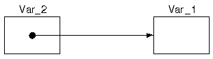
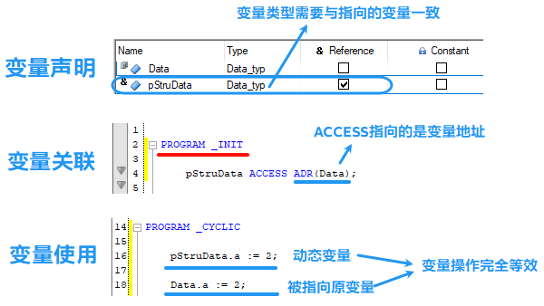
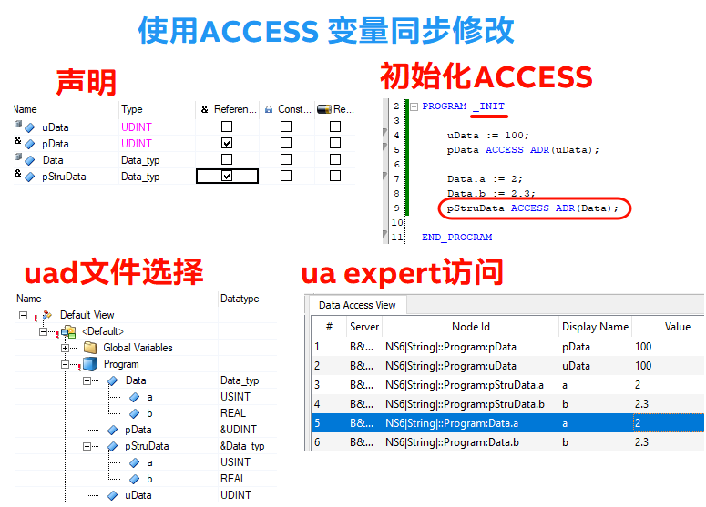

> Tags: #开发

- [1 B12.023.使用动态变量ACCESS语法实现变量映射](#_1-b12023%E4%BD%BF%E7%94%A8%E5%8A%A8%E6%80%81%E5%8F%98%E9%87%8Faccess%E8%AF%AD%E6%B3%95%E5%AE%9E%E7%8E%B0%E5%8F%98%E9%87%8F%E6%98%A0%E5%B0%84)
- [2 实现方式](#_2-%E5%AE%9E%E7%8E%B0%E6%96%B9%E5%BC%8F)
- [3 对应OPC UA访问案例](#_3-%E5%AF%B9%E5%BA%94opc-ua%E8%AE%BF%E9%97%AE%E6%A1%88%E4%BE%8B)
- [4 更新日志](#_4-%E6%9B%B4%E6%96%B0%E6%97%A5%E5%BF%97)

# 1 B12.023.使用动态变量ACCESS语法实现变量映射

- 动态变量可以访问不同的变量或任何内存地址。这一概念很像 ANSI C 中指针的工作方式或 ANSI C++ 中引用的处理方式。动态变量的声明方式是在指定类型时添加 REFERENCE TO。
- [🌐 在线贝加莱帮助 → Dynamic variables](https://help.br-automation.com/#/en/4/programming%2Fvariables%2Fprogrammingmodel_variables_dynamic.html)
- 当我们需要对一个变量、一个结构体成员，通过另外一个变量名，同时能够读写，类似于C语言中的指针操作，在StructureText语言中，我们可以使用动态变量。
- 
    - Var_2 动态访问 Var_1，即在程序执行过程中，Var_2 指向 Var_1。此时，Var_2 与 Var_1 相同。对 Var_2 的所有更改都会应用到 Var_1，反之亦然。
- 对应贝加莱库中的实现方式 [007功能块Function Block中的VAR_IN_OUT怎么用](007功能块Function%20Block中的VAR_IN_OUT怎么用.md)

# 2 实现方式

- 

# 3 对应OPC UA访问案例

- 

# 4 更新日志

| 日期                             | 修改人 | 修改内容 |
| :----------------------------- | :-- | :--- |
| 2024-08-22 | YZY | 初次创建 |
