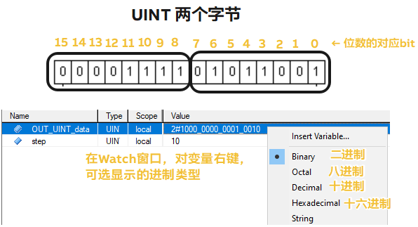
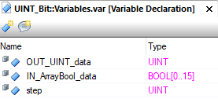
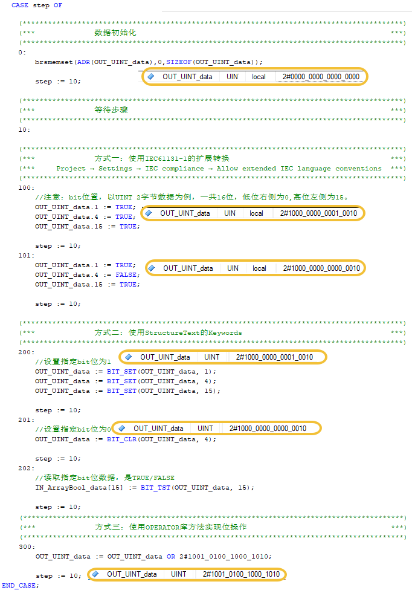
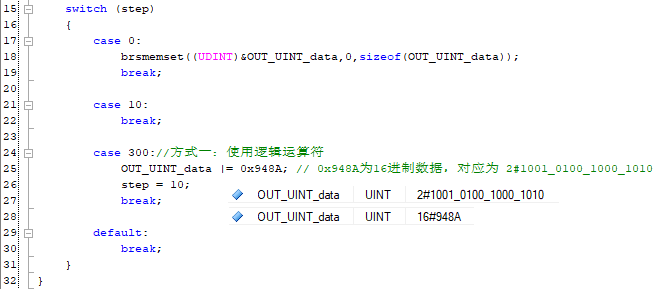

> Tags: #c #StructuredText

- [1 B12.024.如何对变量数据进行位操作_例如将UINT的每一个bit位放入1组连续的16个BOOL数据](#_1-b12024%E5%A6%82%E4%BD%95%E5%AF%B9%E5%8F%98%E9%87%8F%E6%95%B0%E6%8D%AE%E8%BF%9B%E8%A1%8C%E4%BD%8D%E6%93%8D%E4%BD%9C_%E4%BE%8B%E5%A6%82%E5%B0%86uint%E7%9A%84%E6%AF%8F%E4%B8%80%E4%B8%AAbit%E4%BD%8D%E6%94%BE%E5%85%A51%E7%BB%84%E8%BF%9E%E7%BB%AD%E7%9A%8416%E4%B8%AAbool%E6%95%B0%E6%8D%AE)
- [2 StructureText写法](#_2-structuretext%E5%86%99%E6%B3%95)
- [3 C写法](#_3-c%E5%86%99%E6%B3%95)
- [4 更新日志](#_4-%E6%9B%B4%E6%96%B0%E6%97%A5%E5%BF%97)

# 1 B12.024.如何对变量数据进行位操作_例如将UINT的每一个bit位放入1组连续的16个BOOL数据

- 

# 2 StructureText写法

- 
- 

# 3 C写法

- 

# 4 更新日志

| 日期                             | 修改人 | 修改内容 |
| :----------------------------- | :-- | :--- |
| 2024-10-11 | YZY | 初次创建 |
