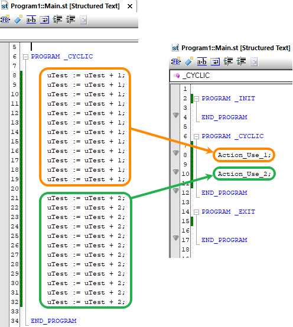

> Tags: #开发

- [1 B12.025.如何在StructureText中使用Action语法](#_1-b12025%E5%A6%82%E4%BD%95%E5%9C%A8structuretext%E4%B8%AD%E4%BD%BF%E7%94%A8action%E8%AF%AD%E6%B3%95)
- [2 添加与使用方式](#_2-%E6%B7%BB%E5%8A%A0%E4%B8%8E%E4%BD%BF%E7%94%A8%E6%96%B9%E5%BC%8F)
- [3 参考资料](#_3-%E5%8F%82%E8%80%83%E8%B5%84%E6%96%99)
- [4 更新日志](#_4-%E6%9B%B4%E6%96%B0%E6%97%A5%E5%BF%97)

# 1 B12.025.如何在StructureText中使用Action语法

- 当希望代码看上去更加简洁，把不同部分的代码分隔开，又希望这些代码在同一个任务中共用局部变量方便交互，又不想写Function Block，则可以考虑使用Action语法。
- Action语法的主要作用是把几十行上百行代码简化到主程序中的一行代码，主要代码存储在其他地方，方便后续查看，任务分割，多人同时协作。
- 

# 2 添加与使用方式

- 1___ 右键任务 → 点击 Add Object... → 选择对应语言的 Action File
    - 
- 2___ 在这个任务下，会得到一个Action.st
    - 
- 3___ 重命名此 Action.st 为任何其他名称，在代码中以 ACTION 开头，END_ACTION 结尾的一部分即为Action段。
    - 每个Action 段需要有此任务下独立的名称，用此名称用来在主程序中调用执行。例如下图中的 Action_Use_1 。
    - 一个Action.st 中可包含多个Action 段，也可以创建多个独立的 Action.st 方便管理。
    - 
- 4___ 在主程序中的以Action段的名称调用执行，如下图所示。
    - 

# 3 参考资料

- [点击跳转 → 贝加莱AS Help中相关说明](https://help.br-automation.com/#/en/4/programming%2Factions%2Fprogrammingmodel_actions.html)

# 4 更新日志

| 日期                             | 修改人 | 修改内容 |
| :----------------------------- | :-- | :--- |
| 2024-12-11 | YZY | 初次创建 |
