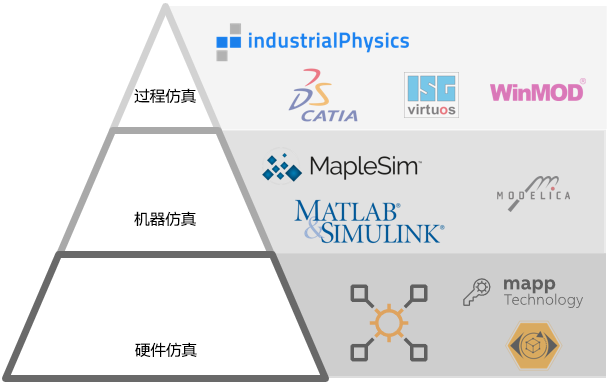

# 000B14_技术_建模与仿真

- 

# MapleSim

- [001基于MapleSim与贝加莱软件进行数字孪生调试](001基于MapleSim与贝加莱软件进行数字孪生调试.md)

# 市场概念宣传

- [为什么要进行建模仿真？](https://mp.weixin.qq.com/s?__biz=MzA4MTQ5Mzk3OA==&mid=2658760469&idx=1&sn=2ddec610be52f446276293edff0a3046&scene=19#wechat_redirect)
- [创新与效率-建模仿真技术](https://mp.weixin.qq.com/s?__biz=MzA4MTQ5Mzk3OA==&mid=2658769820&idx=1&sn=0486898a94f68c435fe3c8e7c560d709&scene=19#wechat_redirect)
- [虚拟遇见现实——贝加莱数字孪生缩短机器开发周期](https://mp.weixin.qq.com/s?__biz=MzA4MTQ5Mzk3OA==&mid=2658761967&idx=1&sn=646b7b23b9b307b8ec9074b7df99f815&scene=19#wechat_redirect)
- [【仿真】从CAD数据到数字孪生 | **视频案例**](https://mp.weixin.qq.com/s?__biz=MzA4MTQ5Mzk3OA==&mid=2658760274&idx=3&sn=4f436c2c4999ce2510a63d90f9f71537&scene=19#wechat_redirect)
- [机器开发效率-多领域软件协同仿真的规范与接口 | **FMU** | **MapleSim**](https://mp.weixin.qq.com/s?__biz=MzA4MTQ5Mzk3OA==&mid=2658768285&idx=1&sn=24eb6094f019664e8e3d6faf71d4cfea&scene=19#wechat_redirect)
- [如何看待制造成本-微小的成本都经不起时间的积分 | **MapleSim精准选型**](https://mp.weixin.qq.com/s?__biz=MzA4MTQ5Mzk3OA==&mid=2658762492&idx=1&sn=47d3ef05096245840cbf7cf4ed94b516&scene=19#wechat_redirect)
- [机器智能与创新-贝加莱基于模型的工程开发 | **视频案例**](https://mp.weixin.qq.com/s?__biz=MzA4MTQ5Mzk3OA==&mid=2658762404&idx=1&sn=0d734812ccf3955607b2be70d250dfe0&scene=19#wechat_redirect)
- [**案例** | 重工-采用仿真建模实现岸桥防摇系统的开发 ](https://mp.weixin.qq.com/s?__biz=MzA4MTQ5Mzk3OA==&mid=2658758402&idx=4&sn=04a801361554a9da77e2b8b57c8112a6&scene=19#wechat_redirect)
- [**案例** | ACOPOStrak应用于胶囊咖啡充填与包装的柔性生产 | **通过仿真实现目标工程**](https://mp.weixin.qq.com/s?__biz=MzA4MTQ5Mzk3OA==&mid=2658765345&idx=1&sn=1682ff747d41779607ab31f32eb302a4&scene=19&poc_token=HMc0p2Wjbs2wKn8s5ljqHmEMERwv7PTZM4Ajl25U)

# Matlab Simulink

- [001ACOPOS_Simulink_利用MATLAB_Simulink更快实现完美的驱动解决方案](/C08_创新点/001ACOPOS_Simulink_利用MATLAB_Simulink更快实现完美的驱动解决方案.md)
- [002基于MatlabSimulink生成PLC程序Automation Studio Target For Simulink](002基于MatlabSimulink生成PLC程序Automation%20Studio%20Target%20For%20Simulink.md)
