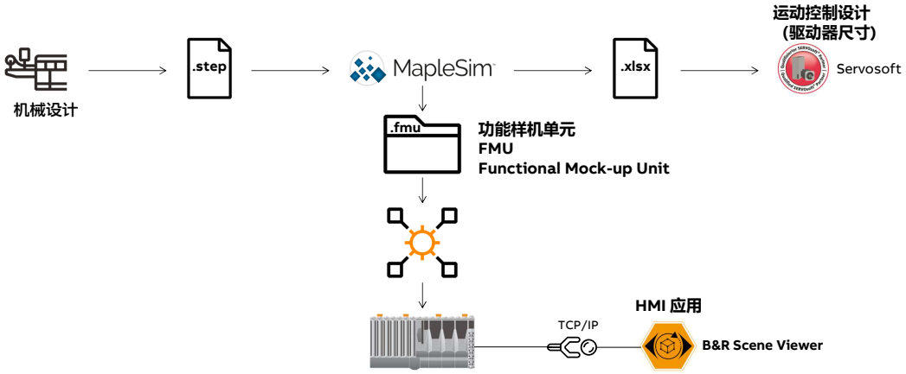
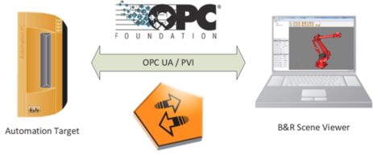
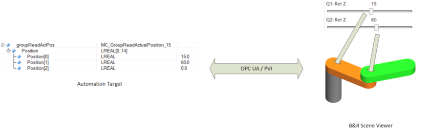

> Tags: #MapleSim #仿真 #数字孪生

- [1 基本效果演示](#1%20%E5%9F%BA%E6%9C%AC%E6%95%88%E6%9E%9C%E6%BC%94%E7%A4%BA)
- [2 数字孪生的软件配合关系](#2%20%E6%95%B0%E5%AD%97%E5%AD%AA%E7%94%9F%E7%9A%84%E8%BD%AF%E4%BB%B6%E9%85%8D%E5%90%88%E5%85%B3%E7%B3%BB)
- [3 仅需5个步骤，即可实现数字孪生调试](#3%20%E4%BB%85%E9%9C%805%E4%B8%AA%E6%AD%A5%E9%AA%A4%EF%BC%8C%E5%8D%B3%E5%8F%AF%E5%AE%9E%E7%8E%B0%E6%95%B0%E5%AD%97%E5%AD%AA%E7%94%9F%E8%B0%83%E8%AF%95)
	- [3.1 第4步，导入FMU到AS项目](#3.1%20%E7%AC%AC4%E6%AD%A5%EF%BC%8C%E5%AF%BC%E5%85%A5FMU%E5%88%B0AS%E9%A1%B9%E7%9B%AE)
	- [3.2 第5步，在同一台笔记本上，本地仿真](#3.2%20%E7%AC%AC5%E6%AD%A5%EF%BC%8C%E5%9C%A8%E5%90%8C%E4%B8%80%E5%8F%B0%E7%AC%94%E8%AE%B0%E6%9C%AC%E4%B8%8A%EF%BC%8C%E6%9C%AC%E5%9C%B0%E4%BB%BF%E7%9C%9F)
- [4 Demo项目下载](#4%20Demo%E9%A1%B9%E7%9B%AE%E4%B8%8B%E8%BD%BD)
- [5 所需软件](#5%20%E6%89%80%E9%9C%80%E8%BD%AF%E4%BB%B6)
	- [5.1 贝加莱开发调试软件 Automation Studio](#5.1%20%E8%B4%9D%E5%8A%A0%E8%8E%B1%E5%BC%80%E5%8F%91%E8%B0%83%E8%AF%95%E8%BD%AF%E4%BB%B6%20Automation%20Studio)
	- [5.2 贝加莱3D可视化软件 Scene Viewer](#5.2%20%E8%B4%9D%E5%8A%A0%E8%8E%B13D%E5%8F%AF%E8%A7%86%E5%8C%96%E8%BD%AF%E4%BB%B6%20Scene%20Viewer)
- [6 更新日志](#6%20%E6%9B%B4%E6%96%B0%E6%97%A5%E5%BF%97)

# B14.001-基于MapleSim与贝加莱软件进行数字孪生调试

# 1 基本效果演示

<video muted autoplay="autoplay" loop="loop" width="640" height="360" controls>
  <source src="/B14_技术_建模与仿真/FILES/001基于MapleSim与贝加莱软件进行数字孪生调试/step_5_show.mp4" type="video/mp4">
  Your browser does not support the video tag.
</video>

# 2 数字孪生的软件配合关系

- MapleSim软件中
    - 在 MapleSim 中加载概念设计或 CAD（STEP 文件）
    - 在MapelSim中创建模型
    - 可为 SERVOSoft 输出.xlsx 格式的速度/扭矩曲线，便于数据分析
    - 可创建生成 FMU 功能样机单元
- Automation Studio软件中
    - FMU 可以像库一样导入到 Automation Studio 项目中
    - 在Automation Studio项目中，可基于B&R Scene Viewer软件，本地仿真调试模型

# 3 仅需5个步骤，即可实现数字孪生调试

> 在Automation Studio软件侧，仅需操作第4步与第5步

## 3.1 第4步，导入FMU到AS项目

<video muted autoplay="autoplay" loop="loop" width="640" height="360" controls>
  <source src="/B14_技术_建模与仿真/FILES/001基于MapleSim与贝加莱软件进行数字孪生调试/step_4.mp4" type="video/mp4">
  Your browser does not support the video tag.
</video>

## 3.2 第5步，在同一台笔记本上，本地仿真

<video muted autoplay="autoplay" loop="loop" width="640" height="360" controls>
  <source src="/B14_技术_建模与仿真/FILES/001基于MapleSim与贝加莱软件进行数字孪生调试/step_5.mp4" type="video/mp4">
  Your browser does not support the video tag.
</video>

# 4 Demo项目下载

- 下载压缩包中包含了FMU模型与可直接编译仿真的AS项目
- [点击下载](/B14_技术_建模与仿真/FILES/001基于MapleSim与贝加莱软件进行数字孪生调试/MapleSim_CraneSim_Demo_AS47.zip ':ignore')

# 5 所需软件

## 5.1 贝加莱开发调试软件 Automation Studio

- 使用的Automation Studio版本为4.7.7
    - 亦可使用高于AS4.7的软件版本
- 软件下载地址
    - [Automation Studio V4.7 | B&R Industrial Automation (br-automation.com)](https://www.br-automation.com/en/downloads/software/automation-studio/automation-studio-47/automation-studio-v47/)
        - 本地软件，8GB
    - [V4.7 AS Upgrade (4.7.7.74_SP) | B&R Industrial Automation (br-automation.com)](https://www.br-automation.com/en/downloads/software/automation-studio/automation-studio-47/v47-as-upgrade-47774-sp/)
        - AS安装升级包，67MB，在AS4.7软件安装完成后再安装
- 软件90天免费授权码申请
    - [002如何获取Automation Studio的试用注册码](../B01_技术_AutomationStudio/002如何获取Automation%20Studio的试用注册码.md)
- 软件使用教程
    - [【第4课时】下载并安装Automation Studio软件 (xiaoe-tech.com)](https://app9qg8os8w3630.pc.xiaoe-tech.com/p/t_pc/course_pc_detail/video/v_5f342d22e4b075dc42ad6d62?product_id=p_5f8e77bde4b06aff1a0531d7&content_app_id=&type=6)
    - [【第5课时】使用咖啡机例子程序了解Automation Studio工作环境 (xiaoe-tech.com)](https://app9qg8os8w3630.pc.xiaoe-tech.com/p/t_pc/course_pc_detail/video/v_5f342ddee4b075dc42ad6d66?product_id=p_5f8e77bde4b06aff1a0531d7&content_app_id=&type=6)
    - [【第6课时】新建项目，学习Automation Studio的工作流程 (xiaoe-tech.com)](https://app9qg8os8w3630.pc.xiaoe-tech.com/p/t_pc/course_pc_detail/video/v_5f342e75e4b0b4059c4be3cb?product_id=p_5f8e77bde4b06aff1a0531d7&content_app_id=&type=6)

## 5.2 贝加莱3D可视化软件 Scene Viewer

- 软件下载地址
    - [B&R Scene Viewer | B&R Industrial Automation (br-automation.com)](https://www.br-automation.com/en/downloads/software/simulation/simulation-tools/br-scene-viewer/)
- 软件简要介绍
    - B&R Scene Viewer是一款OpenGL驱动的3D可视化工具，旨在帮助用户开发CNC和机器人应用程序。该软件提供了一个编辑器来创建3D模型。通过OPC UA或PVI接口将B&R Scene Viewer连接到目标系统，可以实现可视化模型的运动
    - 
    - 

# 6 更新日志

| 日期         | 修改人 | 修改内容 |
| :--------- | :-- | :--- |
| 2024-01-17 | YZY | 初次创建 |
