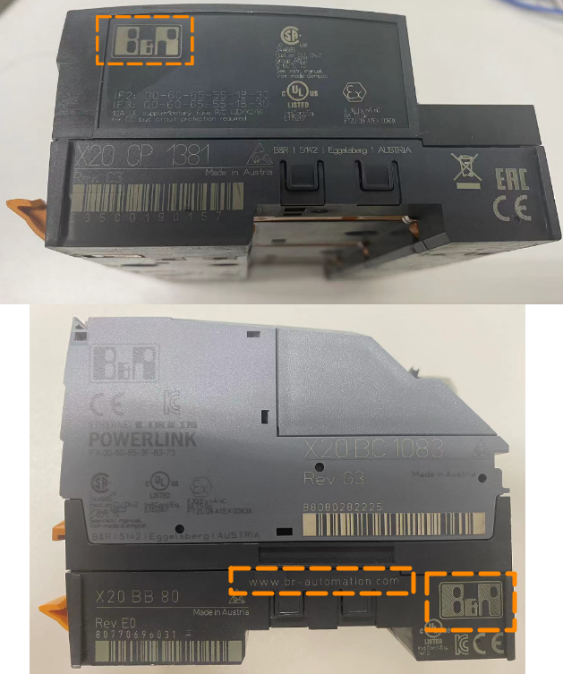

> Tags: #硬件信息 #维护

- [1 C01.001.如何判断现场的硬件设备时贝加莱的产品？寻求售后服务？](#_1-c01001%E5%A6%82%E4%BD%95%E5%88%A4%E6%96%AD%E7%8E%B0%E5%9C%BA%E7%9A%84%E7%A1%AC%E4%BB%B6%E8%AE%BE%E5%A4%87%E6%97%B6%E8%B4%9D%E5%8A%A0%E8%8E%B1%E7%9A%84%E4%BA%A7%E5%93%81%EF%BC%9F%E5%AF%BB%E6%B1%82%E5%94%AE%E5%90%8E%E6%9C%8D%E5%8A%A1%EF%BC%9F)
- [2 如何获取贝加莱硬件信息](#_2-%E5%A6%82%E4%BD%95%E8%8E%B7%E5%8F%96%E8%B4%9D%E5%8A%A0%E8%8E%B1%E7%A1%AC%E4%BB%B6%E4%BF%A1%E6%81%AF)
- [3 视频介绍](#_3-%E8%A7%86%E9%A2%91%E4%BB%8B%E7%BB%8D)
- [4 如何联系售后服务](#_4-%E5%A6%82%E4%BD%95%E8%81%94%E7%B3%BB%E5%94%AE%E5%90%8E%E6%9C%8D%E5%8A%A1)

# 1 C01.001.如何判断现场的硬件设备时贝加莱的产品？寻求售后服务？

- 快速准确查询产品信息，从此不再迷失于海量信息

# 2 如何获取贝加莱硬件信息

- 通常在硬件产品的侧面，可以找到产品的标签，标签上会提示产品的型号，及序列号等产品的信息。
- 产品标签上标有贝加莱官网网址： www.br-automation.com 或贝加莱BR的LOGO为贝加莱产品
- 

# 3 视频介绍

- Bilibili video
- aid=1903321753&bvid=BV1cm411U7Mp&cid=1509292549&p=1

# 4 如何联系售后服务

- 产品的售后服务，请联系总机 021-54644800 咨询
- 填写《BRCN Product Service 产品售后服务登记表》并按照表格中地址邮寄硬件
- 将故障件的型号与序列号发至 service.cn@br-automation.com ，沟通维修事宜。
