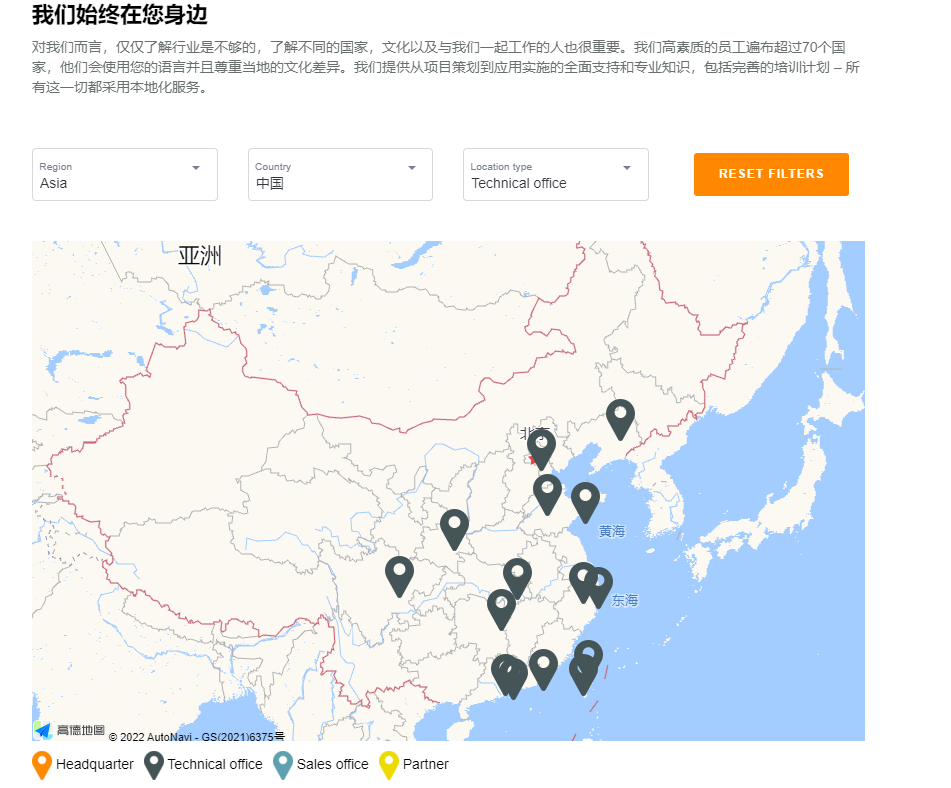

# 005终端客户在使用贝加莱相关设备时，发现硬件损坏的情况，该如何处理？
Tags：终端客户、硬件损坏
A： 
	如果需要替换损坏硬件或者服务，终端客户应首先联系机器制造商。
	机器制造商了解相关设备的机械结构、电气结构和应用软件。
	机器制造商的联系方式通常可以在控制柜或设备用户手册上找到，多数机器制造商会在其官网列出联系方式。
	联系时，终端客户应确认机器的型号，并准备好详细的故障描述。
	少数情况下，机器制造商可能不再营业。在这种情况下，可以联系距离最近的贝加莱办事处。
	进入贝加莱官网 www.br-automation.com ,点击公司→位置即可查看办事处联系方式。
	
