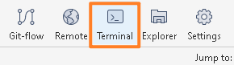
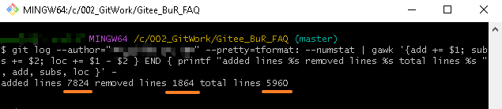

- 在 Sourcetree 软件中，打开仓库，点击 `Terminal` 按钮
    - 
- 在命令行窗口下，输入以下信息，其中马赛克处输入需要统计的作者的邮箱地址
- 即可见此用户名，对此仓库，总共的代码修改变化
    - 


```
git log --author="用户邮箱地址" --pretty=tformat: --numstat | gawk '{add += $1; subs += $2; loc += $1 - $2 } END { printf "added lines %s removed lines %s total lines %s ", add, subs, loc }' -
```
