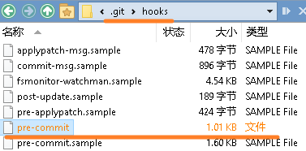

# 实现方式
利用 Git 的钩子来在 `commit` 之前执行一个脚本，在这个脚本里对提交的文件大小进行检查。  
具体操作是：修改仓库下的 `.git/hooks/pre-commit` 为如下内容

```shell
#!/bin/sh
hard_limit=$(git config hooks.filesizehardlimit)
soft_limit=$(git config hooks.filesizesoftlimit)
: ${hard_limit:=1100000} # 1.1M 当超过1.1M时，会显示错误，导致commit失败
: ${soft_limit:=1000000} # 1M   当超过10M时，会显示错误，导致commit失败

list_new_or_modified_files()
{
    git diff --staged --name-status|sed -e '/^D/ d; /^D/! s/.\s\+//'
}

unmunge()
{
 local result="${1#\"}"
    result="${result%\"}"
    env echo -e "$result"
}

check_file_size()
{
    n=0 
 while read -r munged_filename
 do
        f="$(unmunge "$munged_filename")"
        h=$(git ls-files -s "$f"|cut -d' ' -f 2)
        s=$(git cat-file -s "$h")
 if [ "$s" -gt $hard_limit ]
 then
            env echo -E 1>&2 "ERROR: hard size limit ($hard_limit) exceeded: $munged_filename ($s)"
            n=$((n+1))
 elif [ "$s" -gt $soft_limit ]
 then
            env echo -E 1>&2 "WARNING: soft size limit ($soft_limit) exceeded: $munged_filename ($s)"
 fi
 done

    [ $n -eq 0 ] 
}

list_new_or_modified_files | check_file_size
```



这里设置了 `soft_limit` 和 `hard_limit`，默认的大小分别是1M 和10M，当提交的某个文件超过1M 时，会显示警告；当超过10M 时，会显示错误，导致 commit 失败

此外，可以通过 `git config` 命令来设置 `soft_limit` 和 `hard_limit` 的值：

```bash
git config hooks.filesizehardlimit 20000000
git config hooks.filesizesoftlimit 2000000
```

# 可用文件
> 此文件即可实现限制大于 1.1 MB 文件的提交
> 请将以下文件，放到 `.git/hooks/` 文件夹下

