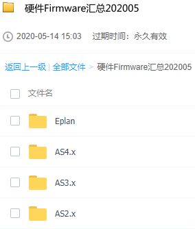

> 010贝加莱硬件老版本固件下载

- [1 背景](#1%20%E8%83%8C%E6%99%AF)
- [2 下载链接](#2%20%E4%B8%8B%E8%BD%BD%E9%93%BE%E6%8E%A5)
	- [2.1 贝加莱官方下载](#2.1%20%E8%B4%9D%E5%8A%A0%E8%8E%B1%E5%AE%98%E6%96%B9%E4%B8%8B%E8%BD%BD)
	- [2.2 百度网盘下载](#2.2%20%E7%99%BE%E5%BA%A6%E7%BD%91%E7%9B%98%E4%B8%8B%E8%BD%BD)

# 1 背景

- 项目开发过程中，往往需要维护10年20年前的老项目，其中使用的硬件模块均使用有特定的固件版本
- 在维护阶段，考虑到兼容性问题，若无必要，不建议对硬件的固件进行升级，故尽可能保证硬件的固件版本不变。

# 2 下载链接

## 2.1 贝加莱官方下载

- 在贝加莱官网 www.br-automation.com 你可以直接搜索相关的硬件型号，下载例如 `V4.0 HW Upgrade (X20CP1585)` 硬件名称的硬件即可
- 可参考 [078高版本AS软件使用已停产硬件](../B01_技术_AutomationStudio/078高版本AS软件使用已停产硬件.md) 中的资源获取方式

## 2.2 百度网盘下载

- 有些固件在官网上下载不了，可以通过百度网盘获取
- 通过此版本库，便于下载某些难以找到的特殊固件版本
- 版本库拥有从过往至2020.05所有的固件版本，可自行搜索下载
- 百度网盘链接： https://pan.baidu.com/s/1ftfQ1tUhlRIbbZAA4VZapA
- 提取码：uusm
- 
