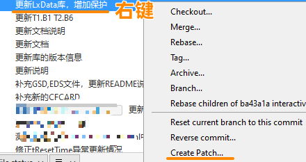

> Sourcetree 如何导出变更日志

> Tags: #版本控制 #Sourcetree

- [1 需求](#1%20%E9%9C%80%E6%B1%82)
- [2 操作方式](#2%20%E6%93%8D%E4%BD%9C%E6%96%B9%E5%BC%8F)
	- [2.1 Sourcetree 中在 History 下选择对应的条目](#2.1%20Sourcetree%20%E4%B8%AD%E5%9C%A8%20History%20%E4%B8%8B%E9%80%89%E6%8B%A9%E5%AF%B9%E5%BA%94%E7%9A%84%E6%9D%A1%E7%9B%AE)
	- [2.2 右键，选择 Create Patch](#2.2%20%E5%8F%B3%E9%94%AE%EF%BC%8C%E9%80%89%E6%8B%A9%20Create%20Patch)
	- [2.3 弹出框中选择对比内容，导出 diff 文件](#2.3%20%E5%BC%B9%E5%87%BA%E6%A1%86%E4%B8%AD%E9%80%89%E6%8B%A9%E5%AF%B9%E6%AF%94%E5%86%85%E5%AE%B9%EF%BC%8C%E5%AF%BC%E5%87%BA%20diff%20%E6%96%87%E4%BB%B6)
- [3 将输出文件导出 pdf 文件](#3%20%E5%B0%86%E8%BE%93%E5%87%BA%E6%96%87%E4%BB%B6%E5%AF%BC%E5%87%BA%20pdf%20%E6%96%87%E4%BB%B6)
	- [3.1 diff 文件可用 Notepad 等记事本软件打开查看变更](#3.1%20diff%20%E6%96%87%E4%BB%B6%E5%8F%AF%E7%94%A8%20Notepad%20%E7%AD%89%E8%AE%B0%E4%BA%8B%E6%9C%AC%E8%BD%AF%E4%BB%B6%E6%89%93%E5%BC%80%E6%9F%A5%E7%9C%8B%E5%8F%98%E6%9B%B4)
	- [3.2 下载 TortoiseGit 软件，带有颜色导出 pdf](#3.2%20%E4%B8%8B%E8%BD%BD%20TortoiseGit%20%E8%BD%AF%E4%BB%B6%EF%BC%8C%E5%B8%A6%E6%9C%89%E9%A2%9C%E8%89%B2%E5%AF%BC%E5%87%BA%20pdf)
	- [3.3 使用 TortoiseGitUDiff 查看文件变更内容](#3.3%20%E4%BD%BF%E7%94%A8%20TortoiseGitUDiff%20%E6%9F%A5%E7%9C%8B%E6%96%87%E4%BB%B6%E5%8F%98%E6%9B%B4%E5%86%85%E5%AE%B9)
	- [3.4 可生成彩色的 PDF 文件](#3.4%20%E5%8F%AF%E7%94%9F%E6%88%90%E5%BD%A9%E8%89%B2%E7%9A%84%20PDF%20%E6%96%87%E4%BB%B6)

# 1 需求

- 能否将版本控制中变更的信息导出成方便他人查看的文件

# 2 操作方式

## 2.1 Sourcetree 中在 History 下选择对应的条目

- 

## 2.2 右键，选择 Create Patch

- 

## 2.3 弹出框中选择对比内容，导出 diff 文件

- 

# 3 将输出文件导出 pdf 文件

## 3.1 diff 文件可用 Notepad 等记事本软件打开查看变更

- 

## 3.2 下载 TortoiseGit 软件，带有颜色导出 pdf

- 下载 tortoiseGit 软件并安装
- [TortoiseGit – Windows Shell Interface to Git](https://tortoisegit.org/)

## 3.3 使用 TortoiseGitUDiff 查看文件变更内容

- 
- 

## 3.4 可生成彩色的 PDF 文件

- 
