> 如何修改Sourcetree已提交的注释信息

> Tags: #版本控制 #Sourcetree

- [1 需求说明](#1%20%E9%9C%80%E6%B1%82%E8%AF%B4%E6%98%8E)
- [2 实现思路](#2%20%E5%AE%9E%E7%8E%B0%E6%80%9D%E8%B7%AF)
- [3 A1.修改本地最后一次提交的注释（Sourcetree）](#3%20A1.%E4%BF%AE%E6%94%B9%E6%9C%AC%E5%9C%B0%E6%9C%80%E5%90%8E%E4%B8%80%E6%AC%A1%E6%8F%90%E4%BA%A4%E7%9A%84%E6%B3%A8%E9%87%8A%EF%BC%88Sourcetree%EF%BC%89)
- [4 A2.修改本地最后一次提交的注释（命令行）](#4%20A2.%E4%BF%AE%E6%94%B9%E6%9C%AC%E5%9C%B0%E6%9C%80%E5%90%8E%E4%B8%80%E6%AC%A1%E6%8F%90%E4%BA%A4%E7%9A%84%E6%B3%A8%E9%87%8A%EF%BC%88%E5%91%BD%E4%BB%A4%E8%A1%8C%EF%BC%89)
- [5 B.修改以前提交的注释](#5%20B.%E4%BF%AE%E6%94%B9%E4%BB%A5%E5%89%8D%E6%8F%90%E4%BA%A4%E7%9A%84%E6%B3%A8%E9%87%8A)
- [6 如何把历史的注释记录修改推送到远端](#6%20%E5%A6%82%E4%BD%95%E6%8A%8A%E5%8E%86%E5%8F%B2%E7%9A%84%E6%B3%A8%E9%87%8A%E8%AE%B0%E5%BD%95%E4%BF%AE%E6%94%B9%E6%8E%A8%E9%80%81%E5%88%B0%E8%BF%9C%E7%AB%AF)
	- [6.1 需求说明](#6.1%20%E9%9C%80%E6%B1%82%E8%AF%B4%E6%98%8E)
	- [6.2 解决方式](#6.2%20%E8%A7%A3%E5%86%B3%E6%96%B9%E5%BC%8F)

# 1 需求说明

- 有时候我们在进行版本控制提交日志时，不小心写错了提交的说明日志，希望进行修改

# 2 实现思路

- 在本地通过 Git 的命令行的方式修改
- 再根据需要，强制推送到远端的仓库

# 3 A1.修改本地最后一次提交的注释（Sourcetree）

- 可见下图，最新的一条版本控制提交的内容的说明信息为错误的信息，希望改对
    - 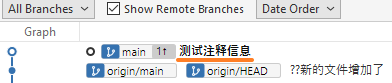
- 步骤 1 ：选择 File Status, 打勾右下角的 Amend latest commit 选项，在输入框会显示最近一次提交的信息，可直接修改
    - 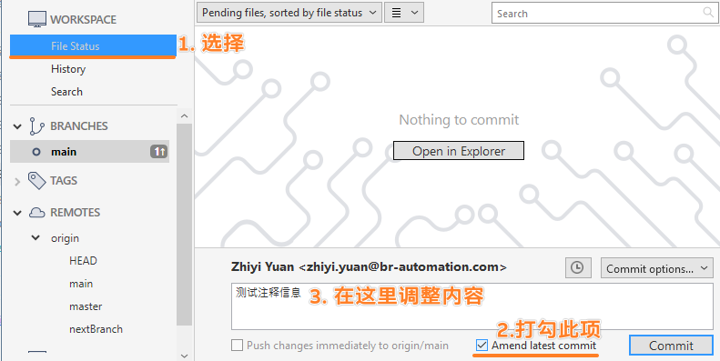
- 步骤 2 ：修改完成后，点击提交
    - 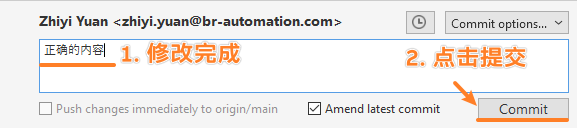
- 在 History 中可见最后一次提交的注释已被修改
    - 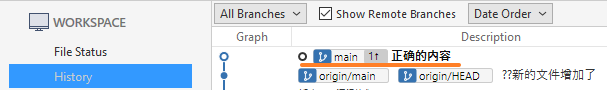

# 4 A2.修改本地最后一次提交的注释（命令行）

- 可见下图，最新的一条版本控制提交的内容的说明信息为日语，我们希望改为中文
    - 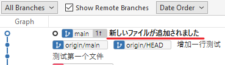
- **步骤 1** ：点击 Sourcetree 右上角的 Terminal 按钮，输入 `git commit --amend`
    - 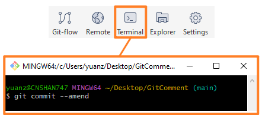
- **步骤 2** ：出现可修改的页面，此时的页面的数据修改需要使用 VI 编辑器命令进行操作
    - 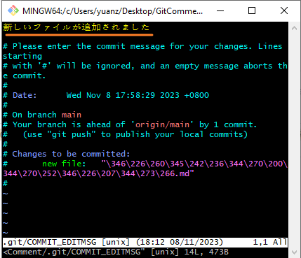
- **步骤 2-A** ： 确认输入法为英文输入法，按 `i` ，即可见屏幕最下方出现 -- INSERT -- 信息
    - 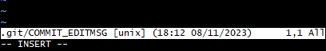
- **步骤 2-B** ：光标移动在需要修改的文字，进行信息修改
    - 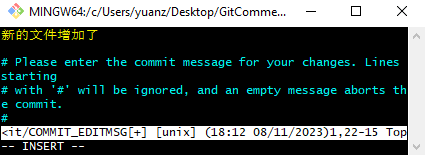
- **步骤 2-C** ： 当修改完成后，确认当前输入法在英文，按 `ESC` 按钮，即退出编辑模式，如下图所示
    - 
- **步骤 2-D**：确保输入法为英文输入模式，输入 `:wq` ,按`回车`按钮
    - 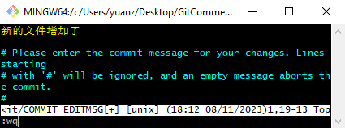
- **步骤 3**：此时已经修改完成，点击 `Fecth` 按钮刷新一下日志提交列表
    - 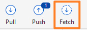
- 可见日志信息的第一行信息已经被修改成功
    - 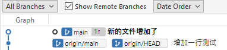

# 5 B.修改以前提交的注释

- 若想修改之前提交的 Commit 记录内容，例如下图中的第三行提交信息
    - 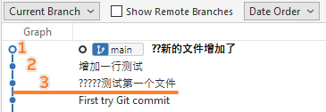

> 将 Show Remote Branches 取消打钩，可方便查看在本地的分支操作

- **步骤 1** ：点击 Sourcetree 软件的右上角 Terminal 按钮，输入 git rebase -i HEAD~3
    - 其中数字指的是倒数第 n 次提交记录的注释，可配合上图理解含义。
    - 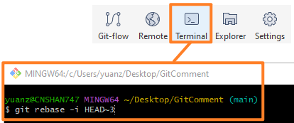
- **步骤 2** ：出现指定修改条目的窗口，编辑选择需要修改注释的记录。
    - 注意，需要修改的注释的条目，需要确保在第一行，如果不是，请参考步骤 ERROR，退出
    - 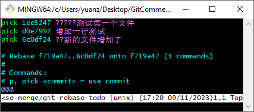
- **步骤 2-A** ：确认当前输入法为英文输入法，按 `i` ,进入编辑模式，将第一行的 **pick** 修改为 **edit**
    - 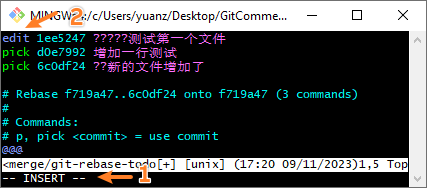
- **步骤 2-B** ：切换至英文输入法，按 ESC 退出编辑，输入 `:wq` 保存
	- 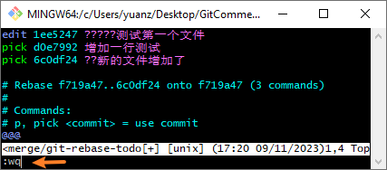
- **步骤 3** ：输入 `git commit --amend` ,进入注释修改流程，详情参考 **A.修改本地最后一次提交的注释** 章节的**步骤2**
    - 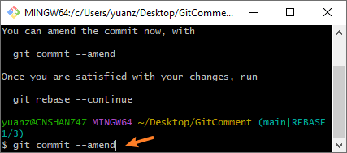
    - 修改如下图所示
    - 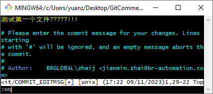
- **步骤 4** ：输入 `git rebase --continue` 退出
- 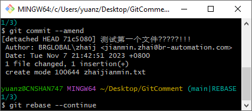

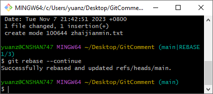

- **步骤 5**：此时已经修改完成，点击 `Fecth` 按钮刷新一下日志提交列表
    - 
    - 此时可见提交记录的注释，以前的信息已经被修改了。
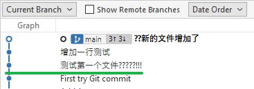
- **步骤 ERROR** : 若在步骤 2发现输入错数字，则按照以下流程退出
    - 步骤 ERROR-A ：确保自己不在编辑模式，使用英文输入法，输入 `:q`
    - 步骤 ERROR-B ：输入 `git rebase --abort` 退出

# 6 如何把历史的注释记录修改推送到远端

## 6.1 需求说明

- 当修改了历史的记录注释信息
- 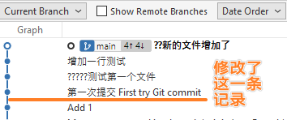
- 打开 `Show Remote Branches` ,会发现有远程云端的日志与本地的日志有较大差异。
- 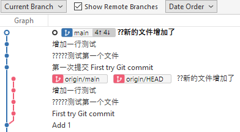

## 6.2 解决方式

- 在 Terminal 下，输入 `git push --force`
- 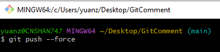
- 再次 Fetch 后发现日志信息完全一致了
- 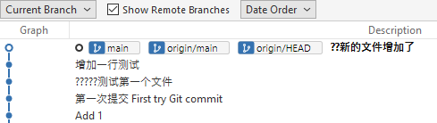
- 🛑需要确保你强制 push 之前没有人提交代码，如果在你 push 之前有人提交了新的代码到远程仓库，然后你又强制 push，那么他们在云端的提交会被你的强制更新覆盖！
