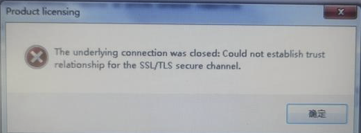
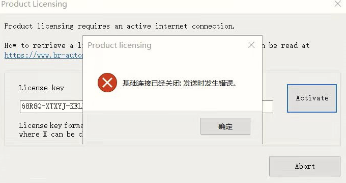
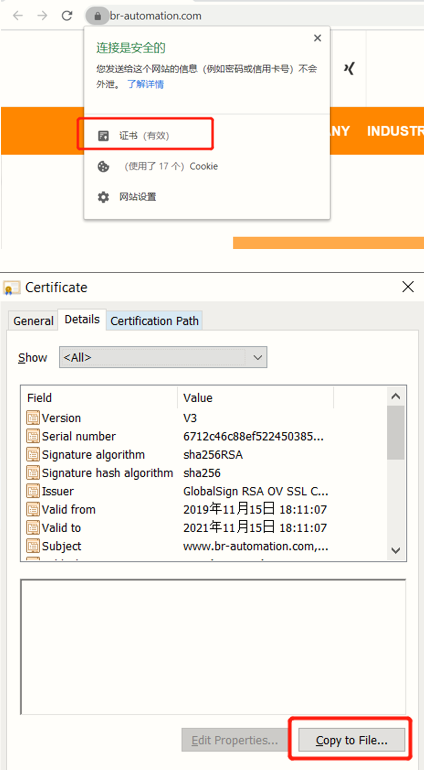
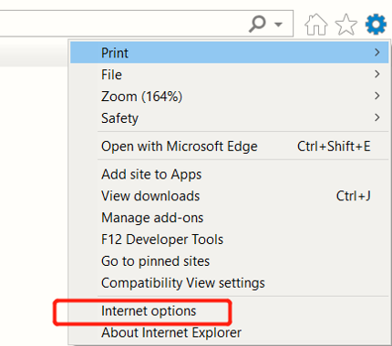
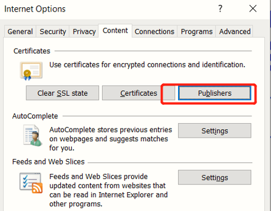

# 003AS注册遇到SSL TLS通道无法建立
## 问题描述
AS注册遇到SSL/TLS通道无法建立
The underlying connection was closed: Could not establish trust relationship for the SSL\TLS secure channel.
## 截图

## 触发原因与解决方式

| 序号 | 反馈内容 | 解决方案 |
| -- | -- | -- |
| 1 | 换手机热点一开始没成功 | 换了个时间点再注册就好了 |
| 2 | -- | 添加证书并执行exe文件 |

## 添加证书方式
- 打开贝加莱网站，选择证书
- 
- 
- 打开IE浏览器：
- 
- 
- 保存后再次尝试即可

根证书可用[以下exe](./FILES/003AS注册遇到SSLTLS通道无法建立.md/双击运行自动添加根证书.7z)快捷添加（需要首先添加官网证书）
