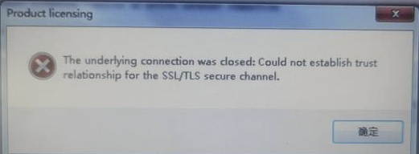

> Tags: #AS注册

- [1 003AS注册遇到SSL TLS通道无法建立](#1%20003AS%E6%B3%A8%E5%86%8C%E9%81%87%E5%88%B0SSL%20TLS%E9%80%9A%E9%81%93%E6%97%A0%E6%B3%95%E5%BB%BA%E7%AB%8B)
- [2 触发原因与解决方式](#2%20%E8%A7%A6%E5%8F%91%E5%8E%9F%E5%9B%A0%E4%B8%8E%E8%A7%A3%E5%86%B3%E6%96%B9%E5%BC%8F)
	- [2.1 使用离线注册方式](#2.1%20%E4%BD%BF%E7%94%A8%E7%A6%BB%E7%BA%BF%E6%B3%A8%E5%86%8C%E6%96%B9%E5%BC%8F)
	- [2.2 添加证书方式](#2.2%20%E6%B7%BB%E5%8A%A0%E8%AF%81%E4%B9%A6%E6%96%B9%E5%BC%8F)

# 1 003AS注册遇到SSL TLS通道无法建立

- AS注册遇到报错，The underlying connection was closed
- The underlying connection was closed: Could not establish trust relationship for the SSL/TLS secure channel.
    - 
    - 
- The underlying connection was closed: An unexpected erroroccurred on a send.
    - 

# 2 触发原因与解决方式

| 序号  | 反馈内容        | 解决方案         |
| --- | ----------- | ------------ |
| 1   |             | 使用AS离线注册方式解决 |
| 3   |             | 添加证书并执行exe文件 |
| 2   | 换手机热点一开始没成功 | 换了个时间点再注册就好了 |

## 2.1 使用离线注册方式

- [020Automation Studio离线注册方法](020Automation%20Studio离线注册方法.md)

## 2.2 添加证书方式

- 打开贝加莱网站，选择证书
    - 
    - 
- 打开IE浏览器：
    - 
    - 
- 保存后再次尝试即可
- 根证书可用 [🗃️ 以下exe（点击下载）](/C02_AS软件注册与安装问题/FILES/003AS注册遇到SSLTLS通道无法建立.md/双击运行自动添加根证书.7z ':ignore') 快捷添加（需要首先添加官网证书）
