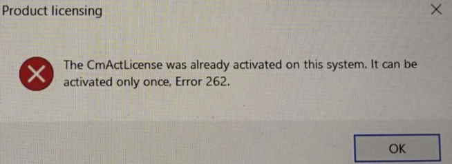

# 004AS注册90天授权报错262
## 问题描述
90天AS注册遇到问题
The CmActLicense was already activated on this system. It can be activated only once, Error 262.
## 截图

## 触发原因与解决方式
| 序号 | 反馈内容 | 解决方案 |
| -- | -- | -- |
| 1 | -- | 在C:\ProgranData\CodeMeter\CmAct下，删除注册过的文件  在codemeter control center里，看看你注册过的号，然后再文件夹里删除对应的注册文件，重启codemeter |