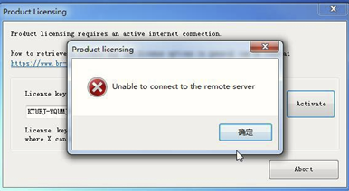

# 005unable to connect to the remote server
## 问题描述
弹窗 unable to connect to the remote server
## 截图

## 触发原因与解决方式

| 序号 | 反馈内容 | 解决方案 |
| -- | -- | -- |
| 1 | -- | 更换网络尝试 |
| 2 | 客户使用公司电脑，注册ASTarget出现无法连接远程服务器问题。  更换网络、热点、VPN、关闭防火墙、开启管理员权限仍无法解决。  使用个人电脑可以正常注册 | 按[附件](./FILES/005unableToConnectToTheRemoteServer.md/Guide_Automation%20Studio_Offline%20Licensing.pdf)方式离线激活，需准备：   1）官网申请的license   2）一台可联网的电脑    文档中写的贝加莱员工操作的地方客户自己也能操作|