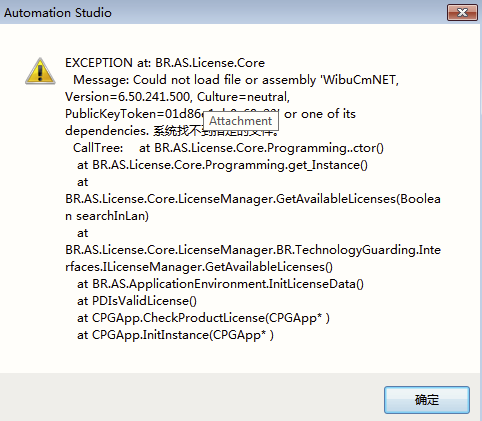
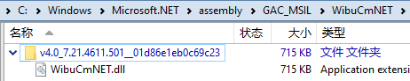

- [1 C02.006.AS打开报错CouldNotLoadFile与WibuCmNET](#_1-c02006as%E6%89%93%E5%BC%80%E6%8A%A5%E9%94%99couldnotloadfile%E4%B8%8Ewibucmnet)
- [2 问题描述](#_2-%E9%97%AE%E9%A2%98%E6%8F%8F%E8%BF%B0)
- [3 截图](#_3-%E6%88%AA%E5%9B%BE)
- [4 触发原因与解决方式](#_4-%E8%A7%A6%E5%8F%91%E5%8E%9F%E5%9B%A0%E4%B8%8E%E8%A7%A3%E5%86%B3%E6%96%B9%E5%BC%8F)

# 1 C02.006.AS打开报错CouldNotLoadFile与WibuCmNET

# 2 问题描述

- 启动报错，和Eplan导致的报错很相似。

# 3 截图

- 

# 4 触发原因与解决方式

- 将可以正常电脑中WibuCmNET.dll，考入有问题的电脑中，可以解决
- [点击下载](/C02_AS软件注册与安装问题/FILES/006AS打开报错CouldNotLoadFile与WibuCmNET/v4.0_7.21.4611.501__01d86e1eb0c69c23.zip ':ignore')
- WibuCmNET.dll的位置：
    - 
- 
