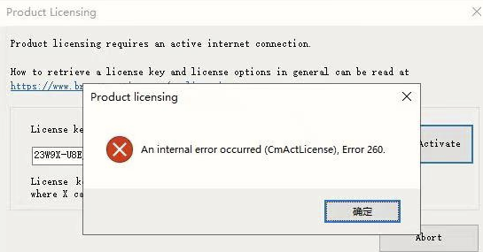
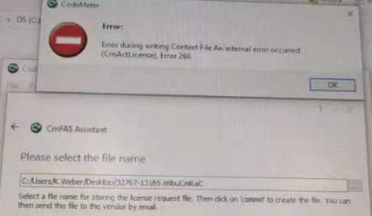
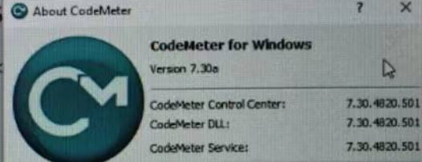
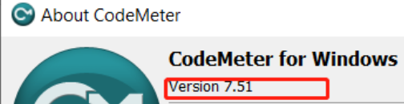

# 009AS注册提示报错260
- [问题描述](#%E9%97%AE%E9%A2%98%E6%8F%8F%E8%BF%B0)
- [截图](#%E6%88%AA%E5%9B%BE)
- [触发原因与解决方式](#%E8%A7%A6%E5%8F%91%E5%8E%9F%E5%9B%A0%E4%B8%8E%E8%A7%A3%E5%86%B3%E6%96%B9%E5%BC%8F)
	- [解法 1](#%E8%A7%A3%E6%B3%95%201)
	- [解法 2](#%E8%A7%A3%E6%B3%95%202)

## 问题描述
- AS注册遇到问题
- An internal error occurred (CmdActLicense),Error 260.
## 截图

## 触发原因与解决方式
### 解法 1
- 在解决262报错时，误将C:\ProgranData\CodeMeter\ CmAct文件夹删掉，恢复CmdAct文件夹解决。
### 解法 2
- **现象**
    - 安装 AS 4.9 软件，在填注册后，出现 260 故障，尝试按照**解法 1** 的方式去解决也未能解决
    - 尝试使用离线安装也同样报错
        - 
    - Codemeter 版本为 `7.30.a`
    - 
- 解决方式
    - 单独安装 CodeMeter 版本至最新版本例如 `7.51` 后解决。AS 软件能够顺利打开。
    - 

