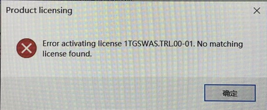

- [1 C02.010.AS注册提示Error71](#_1-c02010as%E6%B3%A8%E5%86%8C%E6%8F%90%E7%A4%BAerror71)
- [2 问题描述](#_2-%E9%97%AE%E9%A2%98%E6%8F%8F%E8%BF%B0)
- [3 截图](#_3-%E6%88%AA%E5%9B%BE)
- [4 触发原因与解决方式](#_4-%E8%A7%A6%E5%8F%91%E5%8E%9F%E5%9B%A0%E4%B8%8E%E8%A7%A3%E5%86%B3%E6%96%B9%E5%BC%8F)

# 1 C02.010.AS注册提示Error71

# 2 问题描述

- 试用版到期，重新申请注册码注册，遇到的问题

# 3 截图

- 
- 

# 4 触发原因与解决方式

| 序号  | 反馈内容 | 解决方案                                                                               |
| --- | ---- | ---------------------------------------------------------------------------------- |
| 1   | --   | 服务器问题，第二天再试就可以了，或者尝试 [020Automation Studio离线注册方法](020Automation%20Studio离线注册方法.md) |
