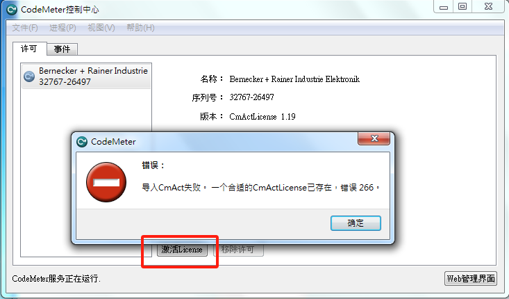

- [1 C02.011.AS注册提示266与9008](#_1-c02011as%E6%B3%A8%E5%86%8C%E6%8F%90%E7%A4%BA266%E4%B8%8E9008)
- [2 问题描述](#_2-%E9%97%AE%E9%A2%98%E6%8F%8F%E8%BF%B0)
- [3 解决方式一](#_3-%E8%A7%A3%E5%86%B3%E6%96%B9%E5%BC%8F%E4%B8%80)
- [4 解决方式二](#_4-%E8%A7%A3%E5%86%B3%E6%96%B9%E5%BC%8F%E4%BA%8C)

# 1 C02.011.AS注册提示266与9008

# 2 问题描述

- A suitable CmActLicense already exists, Error 266, ErrorCode9008

```
[10037] - Activation was not successful.(Couldn't initialize programming engine. HIP ProgrammingError (wibucmhip, CmAct license control: CM9008, A suitable CmActLicense already exists, Error 266, ErrorCode9008))
```

- 

# 3 解决方式一

- [020Automation Studio离线注册方法](020Automation%20Studio离线注册方法.md)

# 4 解决方式二

- 直接点下面的激活license，然后跟着引导操作
- 
