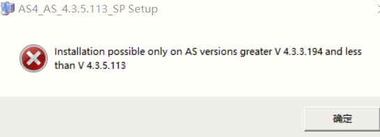
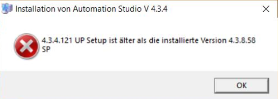
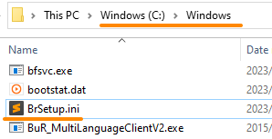
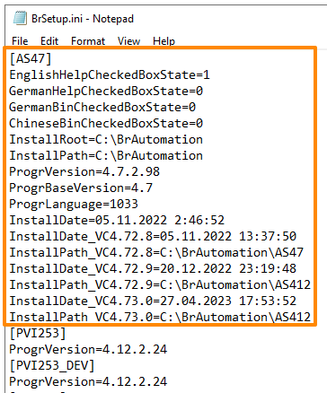
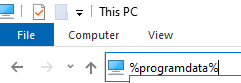
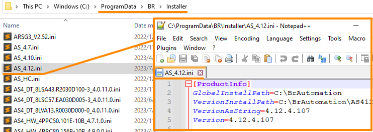

> 012AS安装软件提示当前安装版本低于已安装版本

> Tags: #AS #软件安装

- [1 问题描述](#1%20%E9%97%AE%E9%A2%98%E6%8F%8F%E8%BF%B0)
- [2 解决方式](#2%20%E8%A7%A3%E5%86%B3%E6%96%B9%E5%BC%8F)
	- [2.1 AS < 4.7.7](#2.1%20AS%20%3C%204.7.7)
	- [2.2 AS >= 4.7.7](#2.2%20AS%20%3E=%204.7.7)

# 1 问题描述

- AS4.2软件安装报错
- 4.2.10.52 UP Setup is older than installed version 4.2.10.53 SP
- 
- 

# 2 解决方式

> 以4.7版本作为分割线，版本不同，操作方式不同，

## 2.1 AS < 4.7.7

> 🔴说明：在 `C:\Windows` 文件夹外备份一份 brsetup.ini 文件，以防异常情况出现
- 1) 找到 `C:\Windows\BrSetup.ini`
    - 
- 2) 使用编辑器，用管理员权限打开（推荐使用Notepad++，或者提前用管理员权限打开Notepad软件）
- 3) 对出现冲突的版本，例如 [AS43]（不带引号）执行查找（CTRL + F）
    - 
- 4) 删除从 [AS43] 到下一行括号 [ ] 前的所有内容（包括 [AS43]）
- 5) 保存文件，关闭 NotePad
- 6) 重新尝试安装

## 2.2 AS >= 4.7.7

- 1) 打开WindowsExplorer并在地址栏中键入 `%programdata%`
    - 
- 2) 找到 `C:\ProgramData\BR\Installer`
- 3) 删除要重新安装的AS版本的 `.ini文件`（例如 `AS_4.12.ini`）
    - 
- 4) 重新尝试安装
