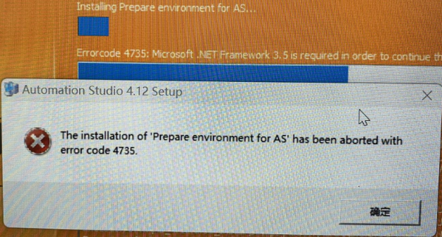
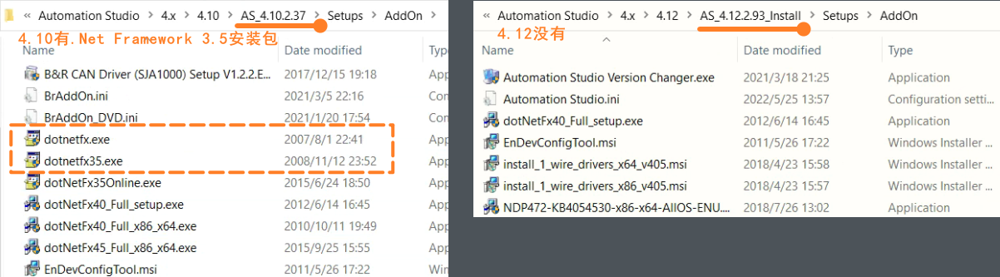

> Tags: #AS安装

- [1 016AS注册提示4735错误](#1%20016AS%E6%B3%A8%E5%86%8C%E6%8F%90%E7%A4%BA4735%E9%94%99%E8%AF%AF)
- [2 现象](#2%20%E7%8E%B0%E8%B1%A1)
- [3 原因](#3%20%E5%8E%9F%E5%9B%A0)
- [4 解决方式](#4%20%E8%A7%A3%E5%86%B3%E6%96%B9%E5%BC%8F)

# 1 016AS注册提示4735错误

# 2 现象

WIN 11安装Automation Studio 4.12，安装过程中提示中断停止，提示4735错误

# 3 原因

- AS软件安装需要依赖.Net Framework 3.5
- AS 4.12安装包默认没有.Net Framework 3.5的安装包
- 

# 4 解决方式

- 安装.Net Framework 3.5，可在AS4.10及之前的AS软件安装包的Setups/AddOn路径下中找到dotnetfx35.exe，点击安装即可。
- 亦可通过以下百度网盘链接下载
    - 链接： https://pan.baidu.com/s/17Rwn8tX_FGszEQtCMKZYUw?pwd=5ld5
