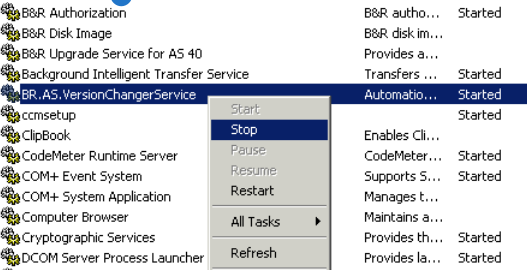
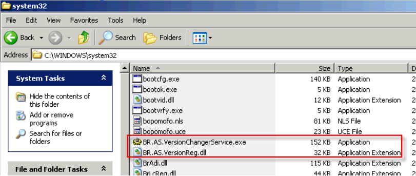
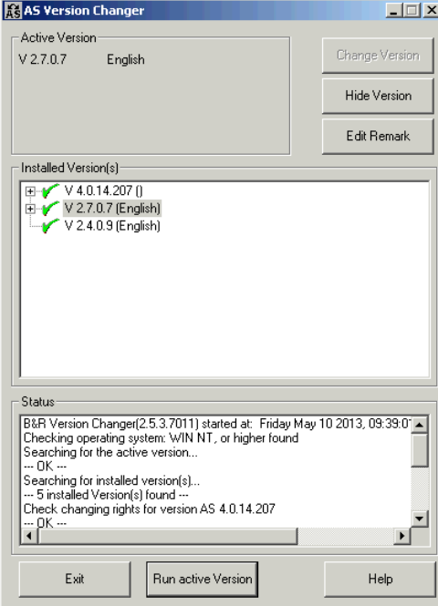

# 现象
- 现象为打开已有项目、或者新建项目在选择CPU时会弹出错误对话框导致AS关闭。

# 原因
- AS4.0中自带的Automation Studio Version Changer 2.5.3.7012这个版本在切换AS2.X时出错破坏了注册信息导致的该问题。

# 解决办法
- （已经安装AS4.0，且AS2.X无法正常运行时）
1. 卸载已被破坏的AS2.X；
2. 单独卸载Automation Studio Version Changer 2.5.3.7012；
3. Windows下Start->Run...键入services.msc，如发BR.AS.VersionChangerService正在运行，Stop it；
- 
4. 删除WINDOWS系统目录system32下的BR.AS.VersionChangerService.exe、
BR.AS.VersionReg.dll文件 
- 
5. 重新安装AS2.X即可

> 提示：例如AS2.7中自带的Automation Studio Version Changer为2.5.3.7009版本，不会对AS2造成破坏。不过其有个小问题是会在版本切换器中显示AS4：（AS3不受影响）
> 

> 注意切换版本时不要理会AS4即可（否则会产生意想不到的后果）。
